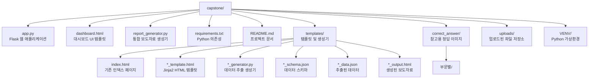

# 📊 지역경제동향 보도자료 생성 시스템

기초자료 수집표를 기반으로 지역경제동향 보도자료를 자동 생성하는 웹 애플리케이션입니다.


## ✨ 주요 기능

| 기능 | 설명 |
|------|------|
| 📁 **기초자료 업로드** | 드래그 앤 드롭 또는 클릭으로 기초자료 수집표 업로드 |
| 📅 **연도/분기 선택** | 드롭다운 메뉴로 선택, 최신 데이터 자동 감지 |
| 👁️ **미리보기** | 각 보도자료 HTML을 실시간으로 확인 |
| ◀️▶️ **페이지 네비게이션** | 이전/다음 버튼으로 보도자료 간 쉬운 이동 |
| 🔧 **유연한 순서** | 보도자료 순서를 쉽게 변경 가능 |
| ⚠️ **결측치 처리** | 누락된 데이터를 모달창에서 직접 입력 |
| ✅ **검토 시스템** | 각 페이지 검토 완료 상태 추적 |
| ✨ **전체 생성** | 모든 페이지 검토 완료 후 일괄 생성 |

## 📋 지원 보도자료 목록

| 보도자료 | 시트명 | 설명 |
|--------|--------|------|
| 🏭 광공업생산 | A 분석 | 광공업생산지수 및 증감률 |
| 🏢 서비스업생산 | B 분석 | 서비스업생산지수 및 증감률 |
| 🛒 소비동향 | C 분석 | 소매판매액지수 및 증감률 |
| 👔 고용률 | D(고용률)분석 | 고용률 및 증감 |
| 📉 실업률 | D(실업)분석 | 실업률 및 증감 |
| 💰 물가동향 | E(품목성질물가)분석 | 소비자물가지수 및 등락률 |
| 📦 수출 | G 분석 | 수출액 및 증감률 |
| 🚢 수입 | H 분석 | 수입액 및 증감률 |
| 👥 국내인구이동 | I(순인구이동)집계 | 순이동자수 현황 |

## 🚀 시작하기

### 요구사항

- Python 3.10 이상
- 가상환경 (권장)

### 설치

```bash
# 저장소 클론
git clone <repository-url>
cd capstone

# 가상환경 생성 및 활성화
python -m venv VENV
source VENV/bin/activate  # macOS/Linux
# 또는
VENV\Scripts\activate  # Windows

# 의존성 설치
pip install -r requirements.txt
```

### 실행

```bash
# 가상환경 활성화 (이미 활성화되어 있으면 생략)
source VENV/bin/activate

# 웹 서버 실행
python app.py
```

브라우저에서 **http://localhost:5050** 에 접속하세요.

## 📖 사용 방법

### 1️⃣ 엑셀 파일 업로드

좌측 상단의 "데이터 업로드" 영역에 기초자료 수집표를 드래그하거나 클릭하여 업로드합니다.

> 지원 파일 형식: `.xlsx`, `.xls`

### 2️⃣ 연도/분기 선택

업로드된 파일에서 자동으로 최신 연도/분기가 감지되며, 필요시 우측 상단의 드롭다운에서 변경할 수 있습니다.

### 3️⃣ 보도자료 미리보기

좌측 보도자료 목록에서 원하는 보도자료를 클릭하면 미리보기가 표시됩니다.

- **◀ / ▶ 버튼**: 이전/다음 보도자료로 이동
- **미리보기 버튼**: 현재 보도자료 새로고침

### 4️⃣ 결측치 처리

데이터에 결측치가 있으면 자동으로 모달창이 표시됩니다. 값을 입력하고 저장하거나 건너뛸 수 있습니다.

### 5️⃣ 검토 완료

각 보도자료 확인 후 "검토 완료" 버튼을 클릭하여 검토 상태를 표시합니다.

### 6️⃣ 전체 생성

모든 보도자료의 검토가 완료되면 "전체 생성" 버튼이 활성화됩니다. 클릭하면 모든 보도자료가 `templates/` 폴더에 HTML 파일로 저장됩니다.

## 📁 프로젝트 구조



## ⚙️ 설정

### 보도자료 순서 변경

`app.py`의 `REPORT_ORDER` 배열 순서를 변경하면 미리보기 순서가 변경됩니다:

```python
REPORT_ORDER = [
    {'id': 'manufacturing', 'name': '광공업생산', ...},
    {'id': 'service', 'name': '서비스업생산', ...},
    {'id': 'consumption', 'name': '소비동향', ...},
    # ... 원하는 순서로 재배치
]
```

### 포트 변경

`app.py` 하단의 포트 번호를 변경합니다:

```python
app.run(debug=True, host='0.0.0.0', port=5050)  # 5050 → 원하는 포트
```

## 🛠️ API 엔드포인트

| 메서드 | 엔드포인트 | 설명 |
|--------|-----------|------|
| `GET` | `/` | 대시보드 페이지 |
| `POST` | `/api/upload` | 엑셀 파일 업로드 |
| `POST` | `/api/generate-preview` | 특정 보도자료 미리보기 생성 |
| `POST` | `/api/generate-all` | 전체 보도자료 생성 |
| `GET` | `/api/report-order` | 보도자료 순서 조회 |
| `POST` | `/api/report-order` | 보도자료 순서 변경 |
| `GET` | `/api/session-info` | 현재 세션 정보 조회 |

## 📦 의존성

| 패키지 | 버전 | 용도 |
|--------|------|------|
| Flask | ≥2.3.0 | 웹 프레임워크 |
| Jinja2 | ≥3.1.0 | 템플릿 엔진 |
| pandas | ≥2.0.0 | 데이터 처리 |
| openpyxl | ≥3.1.0 | 엑셀 파일 읽기 |
| numpy | ≥1.24.0 | 수치 연산 |

## 🔧 CLI 도구

`report_generator.py`를 CLI에서 직접 실행할 수도 있습니다:

```bash
# 사용 가능한 보도자료 목록
python report_generator.py --list

# 특정 보도자료 생성
python report_generator.py -e 분석표_25년_2분기_캡스톤.xlsx -r employment

# 전체 보도자료 생성
python report_generator.py -e 분석표_25년_2분기_캡스톤.xlsx
```

## 📝 라이선스

이 프로젝트는 캡스톤 프로젝트용으로 제작되었습니다.

## 👥 기여자

- 캡스톤 프로젝트 팀

---

<div align="center">
  <sub>Built with ❤️ using Flask & Jinja2</sub>
</div>

