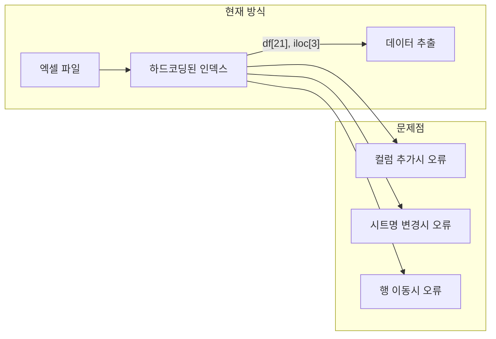
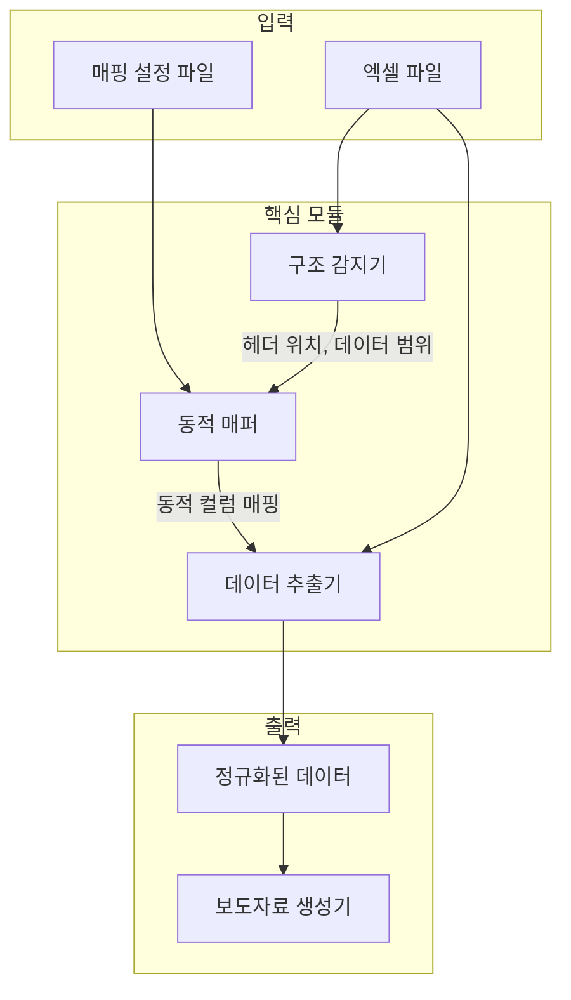

# 엑셀 구조 유연성 고도화 전략

## 개요

하드코딩된 셀 인덱스 대신 헤더 기반 동적 탐색과 설정 파일 기반 매핑 시스템을 도입하여 엑셀 구조 변화에 유연하게 대응하는 아키텍처로 개선합니다.

---

## 현재 문제점 분석



현재 `mining_manufacturing_generator.py`, `consumption_generator.py` 등에서 `df[21]`, `df.iloc[3]` 같은 하드코딩된 인덱스를 사용하여 엑셀 구조 변경에 취약합니다.

### 현재 코드 예시

**mining_manufacturing_generator.py:**
```python
# 하드코딩된 컬럼 인덱스
nationwide_total = df[(df[3] == '전국') & (df[6] == 'BCD')].iloc[0]
growth_rate = nationwide_total[21]  # 2025 2/4 증감률
contribution = row[28]  # 기여도
```

**consumption_generator.py:**
```python
# 하드코딩된 행 번호
nationwide_row = df_analysis.iloc[3]
growth_rate = round(float(nationwide_row[20]), 1)
```

---

## 고도화 아키텍처



---

## 핵심 구현 전략

### 1. 유연한 매핑 설정 시스템

`config/excel_mappings.json` 파일에 다양한 엑셀 형식을 정의:

```json
{
  "profiles": {
    "default": {
      "sheets": {
        "manufacturing": {
          "name_patterns": ["A 분석", "광공업 분석", "광공업생산"],
          "header_row": "auto",
          "columns": {
            "region": {
              "patterns": ["지역", "시도", "지역이름"],
              "fallback_index": 3
            },
            "industry_code": {
              "patterns": ["산업코드", "업종코드"],
              "fallback_index": 6
            },
            "industry_name": {
              "patterns": ["산업이름", "업종명"],
              "fallback_index": 7
            },
            "growth_rate_current": {
              "patterns": ["2025.2/4", "25.2/4", "당분기"],
              "regex": "\\d{4}\\.?\\d/4p?$",
              "fallback_index": 21
            },
            "contribution": {
              "patterns": ["기여도", "기여율"],
              "fallback_index": 28
            }
          }
        },
        "consumption": {
          "name_patterns": ["C 분석", "소비 분석", "소비동향"],
          "header_row": "auto",
          "columns": {
            "region": {
              "patterns": ["지역", "시도"],
              "fallback_index": 3
            },
            "business_type": {
              "patterns": ["업태", "업종"],
              "fallback_index": 7
            },
            "growth_rate_current": {
              "patterns": ["2025.2/4", "당분기 증감률"],
              "fallback_index": 20
            }
          }
        }
      }
    },
    "legacy_format": {
      "description": "이전 버전 엑셀 형식",
      "sheets": { }
    }
  }
}
```

### 2. 헤더 기반 동적 탐색 모듈

새로운 `utils/structure_detector.py` 모듈:

```python
class StructureDetector:
    """엑셀 구조 자동 감지"""
    
    def detect_header_row(self, df: pd.DataFrame) -> int:
        """헤더 행 자동 감지
        
        전략:
        1. 텍스트 밀도가 높은 행 찾기
        2. 다음 행부터 숫자 데이터가 시작되는지 확인
        3. 알려진 헤더 키워드 포함 여부 확인
        """
        pass
    
    def detect_data_range(self, df: pd.DataFrame) -> tuple:
        """데이터 영역 자동 감지 (시작행, 종료행)"""
        pass
    
    def find_sheet_by_pattern(self, excel_file, patterns: list) -> str:
        """패턴 매칭으로 시트 이름 찾기"""
        pass
```

### 3. 동적 매퍼 모듈

새로운 `utils/dynamic_mapper.py` 모듈:

```python
class DynamicMapper:
    """동적 컬럼 매핑"""
    
    def __init__(self, config_path: str = "config/excel_mappings.json"):
        self.config = self._load_config(config_path)
        self.column_cache = {}
    
    def find_column(self, df: pd.DataFrame, column_key: str, 
                    header_row: int = 0) -> int:
        """헤더 텍스트로 컬럼 인덱스 찾기
        
        1. 정확한 매칭 시도
        2. 패턴 매칭 시도
        3. 정규식 매칭 시도
        4. 실패시 fallback_index 사용
        """
        pass
    
    def get_value(self, row: pd.Series, column_key: str) -> any:
        """동적으로 매핑된 컬럼에서 값 추출"""
        pass
    
    def get_column_index(self, sheet_type: str, column_key: str) -> int:
        """캐시된 컬럼 인덱스 반환"""
        pass
```

### 4. 기존 Generator 리팩토링

**변경 전 (하드코딩):**
```python
class 광공업생산Generator:
    def extract_nationwide_data(self) -> dict:
        df = self.df_analysis
        nationwide_total = df[(df[3] == '전국') & (df[6] == 'BCD')].iloc[0]
        growth_rate = nationwide_total[21]
```

**변경 후 (동적 매핑):**
```python
class 광공업생산Generator:
    def __init__(self, excel_path: str):
        self.mapper = DynamicMapper()
        self.detector = StructureDetector()
        
    def extract_nationwide_data(self) -> dict:
        df = self.df_analysis
        region_col = self.mapper.find_column(df, "region")
        code_col = self.mapper.find_column(df, "industry_code")
        growth_col = self.mapper.find_column(df, "growth_rate_current")
        
        nationwide_total = df[(df[region_col] == '전국') & 
                              (df[code_col] == 'BCD')].iloc[0]
        growth_rate = nationwide_total[growth_col]
```

---

## 구현 파일 목록

| 파일 | 설명 | 상태 |
|------|------|------|
| `config/excel_mappings.json` | 엑셀 형식별 매핑 설정 | 대기 |
| `utils/structure_detector.py` | 엑셀 구조 자동 감지 | 대기 |
| `utils/dynamic_mapper.py` | 동적 매핑 핵심 모듈 | 대기 |
| `templates/mining_manufacturing_generator.py` | 동적 매퍼 적용 | 대기 |
| `templates/consumption_generator.py` | 동적 매퍼 적용 | 대기 |
| `templates/service_industry_generator.py` | 동적 매퍼 적용 | 대기 |
| (기타 generator 파일들) | 동적 매퍼 적용 | 대기 |

---

## 주요 기능

### 1. 시트 이름 패턴 매칭
```python
# 다양한 시트 이름을 하나의 타입으로 인식
patterns = ["A 분석", "광공업 분석", "광공업생산", "Manufacturing"]
sheet_name = detector.find_sheet_by_pattern(excel_file, patterns)
```

### 2. 헤더 자동 감지
```python
# 숫자 데이터 시작점 기반 헤더 행 추론
header_row = detector.detect_header_row(df)
# 결과: 2 (3행이 헤더)
```

### 3. 컬럼 퍼지 매칭
```python
# 유사한 헤더 텍스트 자동 인식
# "2025.2/4", "2025 2/4", "25.2/4p" 모두 같은 컬럼으로 인식
col_idx = mapper.find_column(df, "growth_rate_current")
```

### 4. 폴백 메커니즘
```python
# 패턴 매칭 실패시 기존 인덱스 방식으로 폴백
{
  "growth_rate_current": {
    "patterns": ["2025.2/4"],
    "fallback_index": 21  # 매칭 실패시 사용
  }
}
```

### 5. 설정 프로필
```python
# 다양한 엑셀 형식을 프로필로 관리
mapper = DynamicMapper(profile="legacy_format")
```

---

## 예상 효과

| 변경 유형 | 현재 | 고도화 후 |
|----------|------|----------|
| 컬럼 순서 변경 | 오류 발생 | 자동 대응 |
| 컬럼 추가/삭제 | 오류 발생 | 자동 대응 |
| 시트 이름 변경 | 오류 발생 | 패턴 매칭으로 인식 |
| 헤더 행 위치 변경 | 오류 발생 | 자동 감지 |
| 새 엑셀 형식 | 코드 수정 필요 | 설정 파일만 추가 |

---

## 구현 순서

1. **Phase 1**: `config/excel_mappings.json` 매핑 설정 파일 생성
2. **Phase 2**: `utils/structure_detector.py` 엑셀 구조 자동 감지 모듈 구현
3. **Phase 3**: `utils/dynamic_mapper.py` 동적 매핑 핵심 모듈 구현
4. **Phase 4**: 기존 generator 파일들을 동적 매퍼 사용하도록 리팩토링

---

## 작성일

2025년 12월 28일

