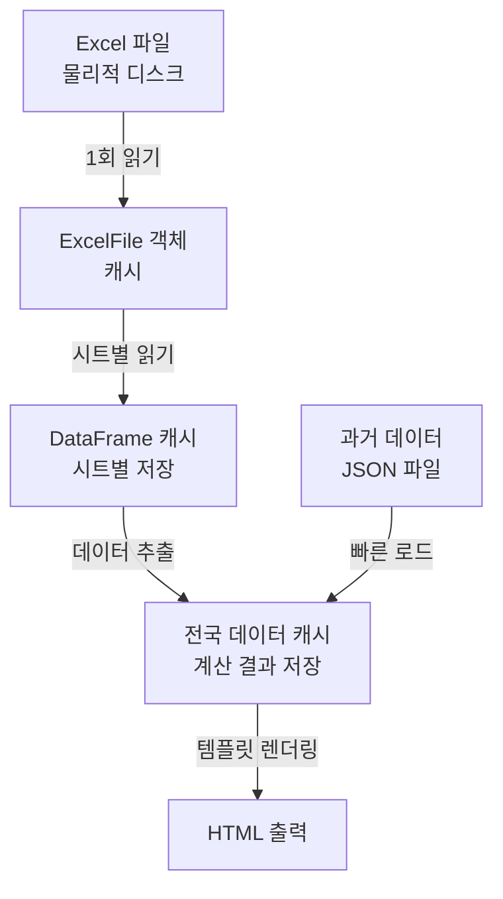
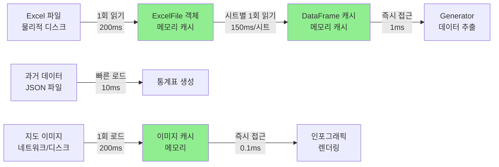
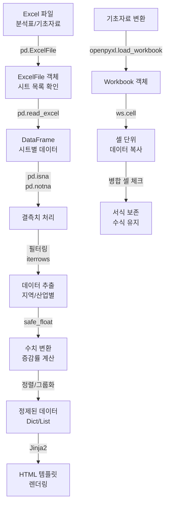
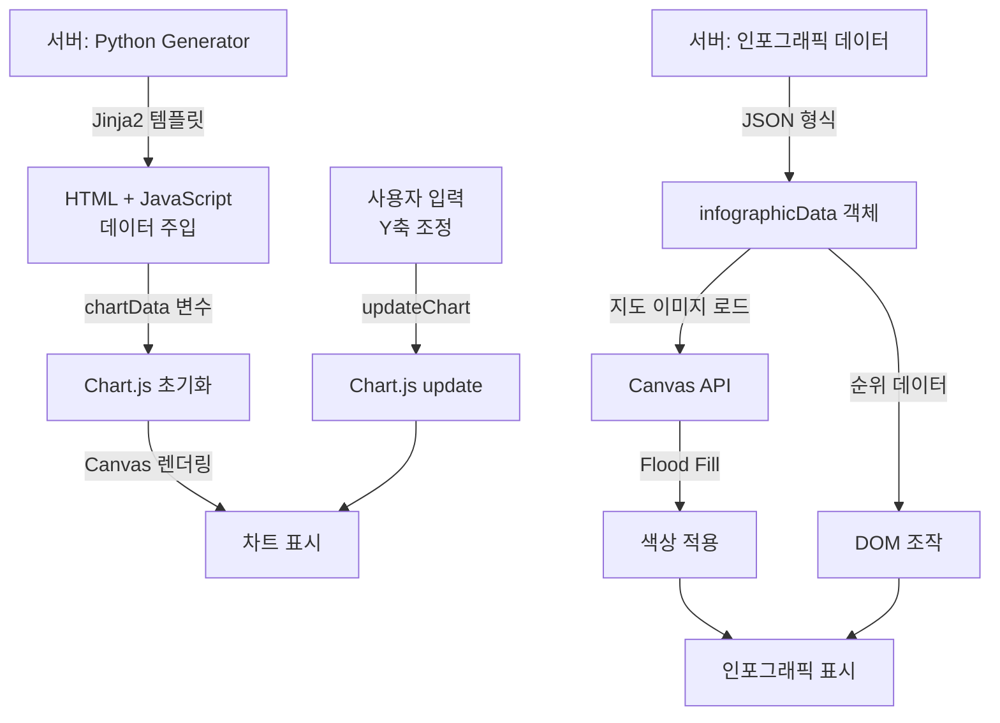
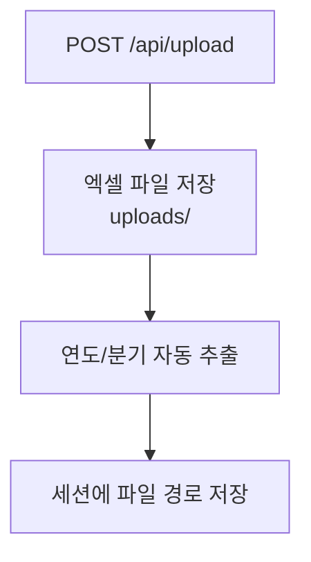
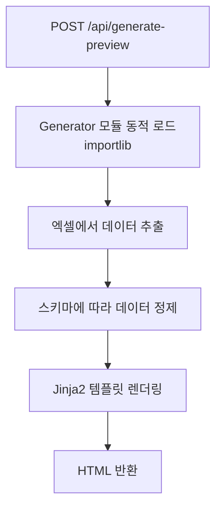
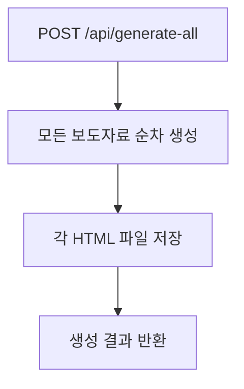
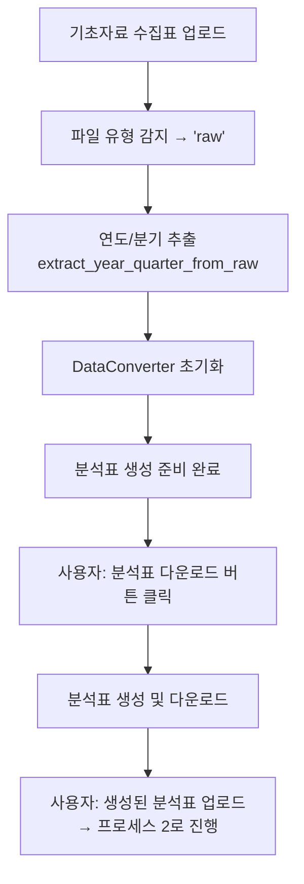
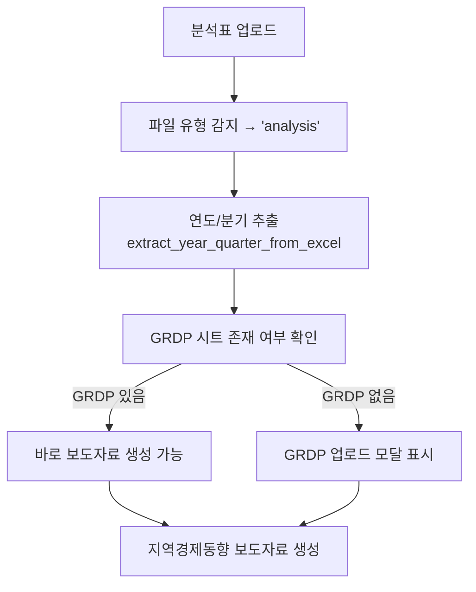
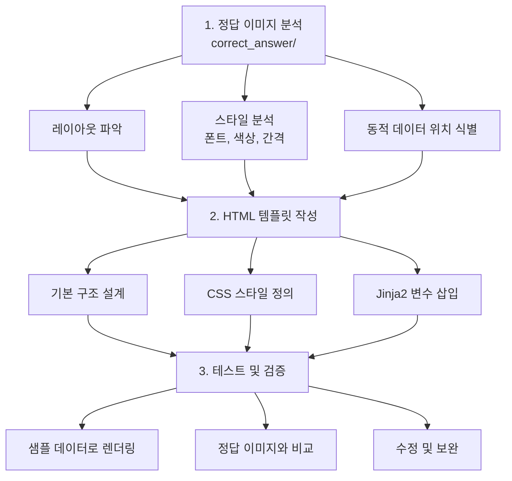

# 지역경제동향 보도자료 자동 생성 시스템
## 프로젝트 발표 자료

---

## 목차

1. [프로젝트 개요 및 목표](#1-프로젝트-개요-및-목표)
2. [전체 동작 플로우](#2-전체-동작-플로우)
   - [2.2.1 데이터 처리 라이브러리 및 사용 과정](#221-데이터-처리-라이브러리-및-사용-과정) ⭐ NEW
     - [7. 캐싱을 통한 성능 개선 효과](#7-캐싱을-통한-성능-개선-효과) ⭐ NEW
   - [2.2.2 JavaScript 및 Chart.js를 활용한 차트 및 인포그래픽 구현](#222-javascript-및-chartjs를-활용한-차트-및-인포그래픽-구현) ⭐ NEW
   - [2.4 파일 유형 구분 및 연도/분기 감지](#24-파일-유형-구분-및-연도분기-감지) ⭐ NEW
3. [분석표 구조와 사용한 시트/셀](#3-분석표-구조와-사용한-시트셀)
4. [템플릿 프로세스와 구조](#4-템플릿-프로세스와-구조)
5. [스키마 프로세스와 구조](#5-스키마-프로세스와-구조)
6. [매핑 과정](#6-매핑-과정)
   - [6.5 데이터 검증 과정](#65-데이터-검증-과정) ⭐ NEW
   - [6.5.6 분석 시트 오류 대비 및 폴백 메커니즘](#656-분석-시트-오류-대비-및-폴백-메커니즘--new)
   - [6.5.7 엑셀 표 구조 검증 및 열 매핑 시스템](#657-엑셀-표-구조-검증-및-열-매핑-시스템--new) ⭐ NEW
     - [기초자료 수집표 vs 분석표: 시트 구조의 완전한 차이](#기초자료-수집표-vs-분석표-시트-구조의-완전한-차이) ⭐ 핵심
     - [파일 유형 자동 감지 시스템](#파일-유형-자동-감지-시스템-utilsexcel_utilspy) ⭐ 핵심
     - [한 시트 내 다중 테이블 구조](#한-시트-내-다중-테이블-구조--중요) ⭐ 중요
   - [6.5.8 데이터 타입 검증 및 오류 방지](#658-데이터-타입-검증-및-오류-방지--new) ⭐ NEW
   - [6.5.9 GRDP 시트 관리](#659-grdp-시트-관리--new) ⭐ NEW
7. [백엔드 구조와 워크플로우](#7-백엔드-구조와-워크플로우)
8. [프론트엔드 구성요소와 대시보드 사용법](#8-프론트엔드-구성요소와-대시보드-사용법)
   - [편집 내용 저장 및 최종 문서 반영 과정](#편집-내용-저장-및-최종-문서-반영-과정--핵심) ⭐ 핵심
9. [보도자료 페이지 유형 및 구조](#9-보도자료-페이지-유형-및-구조)
10. [예상 Q&A](#10-예상-qa)
11. [심층 기술 질문 (까다로운 Q&A)](#11-심층-기술-질문-까다로운-qa--new) ⭐ NEW
12. [예외처리 및 안전성 Q&A](#12-예외처리-및-안전성-qa)
13. [향후 개선사항과 고도화 방향](#13-향후-개선사항과-고도화-방향)
    - [13.0 배포 계획: 단일 실행 파일 배포](#130-배포-계획-단일-실행-파일-배포--핵심) ⭐ 핵심

---

## 1. 프로젝트 개요 및 목표

### 1.1 프로젝트 제안 배경 (국가데이터처 요구사항)

> **"AI를 이용한 통계자료 기반 보도자료 자동작성 시스템 개발"**
> - 11기 캡스톤 프로젝트 제안서 (국가데이터처)

**국가데이터처 현황:**
- 국가데이터처은 **66종의 승인통계**를 작성
- 매월 월간통계를 포함하여 **20건 내외의 보도자료**를 공표
- 수집된 자료를 DB, 엑셀 등에 정리 후 집계 결과를 활용하여 **표, 그래프, 설명 문구**를 정형화된 보도자료로 작성

**제안서에서 정의한 문제점:**
- **동일한 패턴의 반복 작업**: 통계표, 그래프, 설명 문구 작성이 매번 동일한 패턴으로 반복
- **비효율 발생**: 숙련된 담당자들이 단순 반복 작업에 시간을 소비
- 지역경제동향 보도자료의 경우 전체 인력이 총동원되어 **약 1주일** 소요

### 1.2 제안서 요구사항 vs 구현 현황

| 제안서 요구사항 | 구현 현황 | 달성도 |
|----------------|----------|--------|
| **데이터 전처리**: 엑셀 자료 로딩 | pandas + openpyxl 기반 엑셀 파싱 | ✅ 완료 |
| **데이터 전처리**: KOSIS API 연계 | Top-down 방식으로 전환 (분석표 활용) | 🔄 방향 전환 |
| **메타 정보 확인**: 단위, 지역 등 | 스키마(JSON)로 메타 정보 정의 | ✅ 완료 |
| **통계표 자동 생성** | Jinja2 템플릿 기반 HTML 테이블 생성 | ✅ 완료 |
| **그래프 자동 생성** | CSS/SVG 기반 시각화 (시도별 막대그래프) | ✅ 완료 |
| **설명 문구 자동 생성** | 규칙 기반 자연어 생성 (템플릿 + 데이터 바인딩) | ✅ 완료 |
| **LLM 활용** | 향후 고도화 과제로 검토 | 📋 계획 |
| **템플릿 구성 및 모듈화** | 45+ 개별 템플릿 모듈화 | ✅ 완료 |
| **정확성 검증 시스템** | 미리보기 + 검토 완료 워크플로우 | ✅ 완료 |
| **매뉴얼 작성** | README.md + PRESENTATION.md | ✅ 완료 |

### 1.3 제안서 요구 결과물 vs 제출물

| 요구 결과물 | 제출물 |
|------------|--------|
| 보도자료 자동 생성 결과물 샘플 (hwp, pdf 등) | HTML 기반 보도자료 45+ 페이지 (HWP 변환 전 미리보기/검토용) |
| 자동화 코드 패키지 | Flask 웹 애플리케이션 + Generator 모듈 |
| 엑셀 연동 모듈 | pandas 기반 분석표 파서 (9개 시트 연동) |
| KOSIS API 연동 모듈 | 분석표 기반 Top-down 방식으로 전환 |
| 최종결과 보도자료 및 매뉴얼 | README.md, PRESENTATION.md |

### 1.4 프로젝트 목표

> **분석표 엑셀 파일을 업로드하면 지역경제동향 보도자료를 자동으로 생성하는 웹 시스템 구축**

| 구분 | AS-IS | TO-BE |
|------|-------|-------|
| 소요 시간 | 1주일 | 수 시간 |
| 투입 인력 | 전체 인력 총동원 | 1~2명 |
| 오류 가능성 | 높음 (수동 작업) | 낮음 (자동화) |
| 일관성 | 담당자별 차이 | 템플릿 기반 통일 |
| 확장성 | 특정 보도자료 한정 | 타 통계에도 적용 가능한 프레임워크 |

**제안서 최종 목표와의 정렬:**
> "지역경제동향 보도자료 외 **타 통계에도 적용 가능한 AI 활용 보도자료 생성 모델** 개발이 최종 목표"

→ 본 시스템은 Generator-Template-Schema 아키텍처로 설계되어, 새로운 보도자료 추가 시 해당 컴포넌트만 추가하면 되는 **확장 가능한 프레임워크**로 구축됨

### 1.5 기대 효과

1. **시간 절감**: 1주일 → 수 시간 (약 90% 이상 단축)
2. **인력 효율화**: 반복 작업에서 해방, 고부가가치 업무에 집중
3. **품질 향상**: 휴먼 에러 최소화, 일관된 서식 적용
4. **확장 가능성**: 다른 보도자료에도 적용 가능한 프레임워크
5. **표준화**: 보도자료 작성 프로세스의 체계화 및 지식 이전 용이

### 1.4 생성되는 보도자료 종류

| 카테고리 | 보도자료 목록 |
|----------|------------|
| **요약** | 표지, 일러두기, 목차, 인포그래픽, 요약-지역경제동향, 요약-생산, 요약-소비건설, 요약-수출물가, 요약-고용인구 |
| **부문별** | 광공업생산, 서비스업생산, 소비동향, 건설동향, 수출, 수입, 물가동향, 고용률, 실업률, 국내인구이동 |
| **시도별** | 17개 시도 (서울~제주) + 참고-GRDP |
| **통계표** | 10개 지표 통계표 + GRDP + 부록(주요용어정의) |

**총 45+ 페이지의 보도자료 자동 생성**

---

## 2. 전체 동작 플로우

### 2.1 시스템 아키텍처 개요

```mermaid
graph TB
    User[사용자 브라우저]
    Frontend[프론트엔드<br/>dashboard.html]
    Tab1[요약]
    Tab2[부문별]
    Tab3[시도별]
    Tab4[통계표]
    Backend[백엔드<br/>Flask - app.py]
    API1[/api/upload]
    API2[/api/generate-preview]
    API3[/api/generate-all]
    Generator[Generator<br/>Python 모듈]
    Gen1[광공업생산<br/>_generator.py]
    Gen2[시도별<br/>_generator.py]
    Gen3[통계표<br/>_generator.py]
    Excel[분석표 Excel<br/>데이터 소스]
    Template[Jinja2 Template<br/>서식 정의]
    Schema[JSON Schema<br/>구조 정의]
    Output[HTML Output<br/>보도자료 출력]
    
    User --> Frontend
    Frontend --> Tab1
    Frontend --> Tab2
    Frontend --> Tab3
    Frontend --> Tab4
    Frontend -->|REST API 호출| Backend
    Backend --> API1
    Backend --> API2
    Backend --> API3
    Backend -->|Generator 호출| Generator
    Generator --> Gen1
    Generator --> Gen2
    Generator --> Gen3
    Gen1 --> Excel
    Gen2 --> Excel
    Gen3 --> Excel
    Gen1 --> Template
    Gen2 --> Template
    Gen3 --> Template
    Gen1 --> Schema
    Gen2 --> Schema
    Gen3 --> Schema
    Template --> Output
```

### 2.2 데이터 처리 파이프라인


### 2.2.1 데이터 처리 라이브러리 및 사용 과정

시스템은 Excel 파일을 읽고 처리하기 위해 **pandas**, **openpyxl**, **numpy** 등 주요 데이터 처리 라이브러리를 활용합니다. 각 라이브러리의 역할과 실제 사용 과정을 상세히 설명합니다.

#### 사용 라이브러리 개요

| 라이브러리 | 버전 | 주요 역할 | 사용 위치 |
|----------|------|----------|----------|
| **pandas** | >=2.0.0 | Excel 파일 읽기, DataFrame 조작, 데이터 변환 | 모든 Generator 모듈 |
| **openpyxl** | >=3.1.0 | Excel 파일 쓰기, 셀 서식 지정, 병합 셀 처리 | data_converter.py |
| **numpy** | >=1.24.0 | 수치 계산, NaN 처리 | data_converter.py, 일부 Generator |

#### 1. pandas: Excel 데이터 읽기 및 처리

**역할:**
- Excel 파일을 DataFrame으로 로드
- 시트별 데이터 추출 및 필터링
- 결측치(NaN) 처리 및 데이터 변환

**주요 사용 패턴:**

##### 1.1 ExcelFile 객체 생성 및 캐싱

```python
import pandas as pd

# ExcelFile 객체 생성 (파일 전체 로드, 시트 목록 확인)
xl = pd.ExcelFile(excel_path)
sheet_names = xl.sheet_names  # ['A 분석', 'B 분석', 'C 분석', ...]

# 특정 시트를 DataFrame으로 읽기 (header=None: 헤더 없이 읽기)
df = pd.read_excel(xl, sheet_name='A 분석', header=None)
```

**실제 사용 예시 (services/summary_data.py):**

```python
def _extract_sector_summary(xl, sheet_name):
    """부문별 요약 데이터 추출"""
    # 시트 존재 여부 확인
    if sheet_name not in xl.sheet_names:
        return _get_default_sector_summary()
    
    # DataFrame으로 시트 읽기 (헤더 없이)
    df = pd.read_excel(xl, sheet_name=sheet_name, header=None)
    
    # 행 순회하며 데이터 추출
    for i, row in df.iterrows():
        region = str(row[region_col]).strip() if pd.notna(row[region_col]) else ''
        # ... 데이터 처리
```

##### 1.2 결측치(NaN) 처리

```python
# NaN 체크
if pd.isna(value):
    return default

# NaN이 아닌지 확인
if pd.notna(value):
    # 값 사용

# 안전한 float 변환 (NaN, '-', 빈 문자열 처리)
def safe_float(value, default=None):
    if value is None:
        return default
    try:
        if pd.isna(value):
            return default
        if isinstance(value, str):
            value = value.strip()
            if value == '-' or value == '':
                return default
        result = float(value)
        if pd.isna(result):
            return default
        return result
    except (ValueError, TypeError):
        return default
```

##### 1.3 DataFrame 필터링 및 데이터 추출

```python
# 조건부 필터링
industries = df[(df[3] == '전국') & (df[4] == 2) & (pd.notna(df[28]))]

# 특정 행/열 접근
region = str(df.iloc[row_idx, col_idx]).strip() if not pd.isna(df.iloc[row_idx, col_idx]) else ''

# 행 순회
for i, row in df.iterrows():
    region = str(row[region_col]).strip() if pd.notna(row[region_col]) else ''
    value = safe_float(row[value_col], 0)
```

**실제 사용 예시 (templates/construction_generator.py):**

```python
def load_data(excel_path):
    """엑셀 파일에서 데이터 로드"""
    xl = pd.ExcelFile(excel_path)
    
    # 분석 시트 찾기
    analysis_sheet_name = find_sheet_by_pattern(xl.sheet_names, 
                                                ["F'분석", "F' 분석"], 
                                                "분석")
    
    # DataFrame으로 읽기
    df_analysis = pd.read_excel(xl, sheet_name=analysis_sheet_name, header=None)
    
    # 데이터 유효성 검증 (비어있는 시트 체크)
    test_row = df_analysis[(df_analysis[2].isin(VALID_REGIONS)) | 
                          (df_analysis[1].isin(VALID_REGIONS))]
    if test_row.empty or test_row.iloc[0].isna().sum() > 20:
        # 폴백: 집계 시트에서 직접 계산
        use_aggregation_only = True
```

##### 1.4 Excel 쓰기 (pandas + openpyxl 조합)

```python
# ExcelWriter를 사용하여 여러 시트에 쓰기
with pd.ExcelWriter(output_path, engine='openpyxl') as writer:
    # DataFrame을 Excel 시트로 저장
    df.to_excel(writer, sheet_name='시트명', index=False)
    
    # 메타데이터 시트 추가
    metadata_df = pd.DataFrame({
        '항목': ['생성일시', '수집 통계표 수'],
        '값': [datetime.now().strftime('%Y-%m-%d %H:%M:%S'), len(data)]
    })
    metadata_df.to_excel(writer, sheet_name='_메타데이터', index=False)
```

#### 2. openpyxl: Excel 파일 쓰기 및 서식 지정

**역할:**
- Excel 파일의 셀 값 쓰기
- 셀 서식 지정 (폰트, 색상, 테두리 등)
- 병합 셀 처리
- 수식 보존

**주요 사용 패턴:**

##### 2.1 Workbook 로드 및 셀 접근

```python
import openpyxl
from openpyxl.utils import get_column_letter
from openpyxl.cell.cell import MergedCell

# 기존 Excel 파일 로드
wb = openpyxl.load_workbook(excel_path)
ws = wb['시트명']

# 셀 값 읽기/쓰기
cell_value = ws.cell(row=1, column=1).value
ws.cell(row=1, column=1, value='새로운 값')

# 열 문자 변환 (1 → 'A', 27 → 'AA')
col_letter = get_column_letter(column_number)
```

**실제 사용 예시 (data_converter.py):**

```python
def _copy_sheet_data(self, raw_xl: pd.ExcelFile, raw_sheet: str, target_ws, 
                     weight_settings: Dict = None):
    """기초자료 시트의 데이터를 분석표 집계 시트에 복사"""
    
    # pandas로 기초자료 읽기
    raw_df = pd.read_excel(raw_xl, sheet_name=raw_sheet, header=None)
    
    # 열 매핑 생성 (기초자료 열 → 분석표 열)
    col_mapping = {...}
    
    # 행별로 데이터 복사
    for row_idx in range(len(raw_df)):
        for raw_col, target_col in col_mapping.items():
            value = raw_df.iloc[row_idx, raw_col]
            
            # NaN 처리
            if pd.isna(value):
                continue
            
            # openpyxl로 셀에 값 쓰기
            cell = target_ws.cell(row=row_idx + 1, column=target_col)
            
            # 병합 셀 체크 (병합된 셀은 건너뛰기)
            if isinstance(cell, MergedCell):
                continue
            
            cell.value = value
```

##### 2.2 병합 셀 처리

```python
# 병합 셀인지 확인
if isinstance(cell, MergedCell):
    # 병합된 셀은 건너뛰기 (병합 영역의 첫 번째 셀만 값 가짐)
    continue

# 병합 셀 범위 확인
merged_ranges = ws.merged_cells.ranges
for merged_range in merged_ranges:
    if cell.coordinate in merged_range:
        # 병합된 셀 영역 내부
        pass
```

##### 2.3 설정 값 업데이트

```python
# 설정 시트에 연도/분기 정보 업데이트
wb = openpyxl.load_workbook(output_path)
ws_config = wb['설정']
ws_config.cell(row=17, column=11).value = self.year    # K17: 연도
ws_config.cell(row=17, column=13).value = self.quarter # M17: 분기
wb.save(output_path)
```

#### 3. numpy: 수치 계산 및 배열 처리

**역할:**
- 수치 계산 보조
- NaN 처리 유틸리티
- 배열 연산

**주요 사용 패턴:**

```python
import numpy as np

# NaN 체크 (pandas와 호환)
if np.isnan(value):
    return default

# 배열 연산
result = np.array([1, 2, 3]) * 2  # [2, 4, 6]
```

#### 4. 전체 데이터 처리 흐름 예시

**시나리오: 광공업생산 데이터 추출 및 변환**

```python
# Step 1: Excel 파일 로드 (pandas)
xl = pd.ExcelFile('분석표_2025년_2분기.xlsx')

# Step 2: 특정 시트 읽기
df_analysis = pd.read_excel(xl, sheet_name='A 분석', header=None)
df_aggregation = pd.read_excel(xl, sheet_name='A(광공업생산)집계', header=None)

# Step 3: 데이터 필터링 및 추출
# 전국 데이터 추출 (행 3번째 열이 '전국', 행 4번째 열이 2인 경우)
nationwide_data = df_analysis[
    (df_analysis[3] == '전국') & 
    (df_analysis[4] == 2) & 
    (pd.notna(df_analysis[28]))
]

# Step 4: 지역별 데이터 추출
regional_data = []
for region in ['서울', '부산', '대구', ...]:
    region_rows = df_analysis[
        (df_analysis[3] == region) & 
        (pd.notna(df_analysis[28]))
    ]
    
    for i, row in region_rows.iterrows():
        industry = str(row[5]).strip() if pd.notna(row[5]) else ''
        current = safe_float(row[28], 0)  # 현재 분기
        previous = safe_float(row[27], 0)  # 전년 동기
        
        # 증감률 계산
        if previous != 0:
            growth_rate = ((current - previous) / previous) * 100
        else:
            growth_rate = 0.0
        
        regional_data.append({
            'region': region,
            'industry': industry,
            'current': current,
            'previous': previous,
            'growth_rate': round(growth_rate, 1)
        })

# Step 5: 데이터 정제 및 정렬
regional_data.sort(key=lambda x: x['growth_rate'], reverse=True)
top3_increase = regional_data[:3]
top3_decrease = sorted(regional_data, key=lambda x: x['growth_rate'])[:3]
```

#### 5. 성능 최적화: 캐싱 전략

**문제점:**
- 동일한 Excel 파일을 여러 Generator에서 반복적으로 읽으면 비효율적
- 시트별로 매번 `pd.read_excel()` 호출 시 시간 소요

**해결책: ExcelFile 객체 및 DataFrame 캐싱**

```python
class DataCache:
    """Excel 데이터 캐싱 클래스"""
    
    def __init__(self, excel_path: str):
        self.excel_path = excel_path
        self._xl = None
        self._sheets: Dict[str, pd.DataFrame] = {}
    
    def get_excel_file(self) -> pd.ExcelFile:
        """ExcelFile 객체 가져오기 (한 번만 생성)"""
        if self._xl is None:
            self._xl = pd.ExcelFile(self.excel_path)
        return self._xl
    
    def get_sheet(self, sheet_name: str) -> pd.DataFrame:
        """시트 DataFrame 가져오기 (캐싱)"""
        if sheet_name not in self._sheets:
            xl = self.get_excel_file()
            self._sheets[sheet_name] = pd.read_excel(xl, sheet_name=sheet_name, header=None)
        return self._sheets[sheet_name]
```

**실제 사용 (templates/regional_generator.py):**

```python
# Generator 초기화 시 캐시 생성
cache = DataCache(excel_path)

# 여러 시트에 접근해도 ExcelFile은 한 번만 생성
df_analysis = cache.get_sheet('A 분석')
df_aggregation = cache.get_sheet('A(광공업생산)집계')
df_index = cache.get_sheet('A(광공업생산)지수')
```

#### 6. 에러 처리 및 폴백 메커니즘

**시나리오: 분석 시트가 비어있거나 수식이 계산되지 않은 경우**

```python
# 1차 시도: 분석 시트에서 데이터 추출
try:
    df_analysis = pd.read_excel(xl, sheet_name='F\'분석', header=None)
    
    # 데이터 유효성 검증
    test_row = df_analysis[(df_analysis[2].isin(VALID_REGIONS))]
    if test_row.empty or test_row.iloc[0].isna().sum() > 20:
        # 분석 시트가 비어있음 → 집계 시트에서 직접 계산
        raise ValueError("분석 시트 데이터 부족")
    
except (ValueError, KeyError) as e:
    # 폴백: 집계 시트에서 직접 계산
    print(f"[폴백] 분석 시트 사용 불가 → 집계 시트에서 계산: {e}")
    df_aggregation = pd.read_excel(xl, sheet_name="F'(건설)집계", header=None)
    # 집계 데이터로부터 분석 데이터 재구성
    data = _get_regional_from_aggregation(df_aggregation)
```

#### 7. 캐싱을 통한 성능 개선 효과

시스템은 **다층 캐싱 전략**을 통해 Excel 파일 읽기 및 데이터 처리 속도를 크게 향상시켰습니다. 캐싱 없이는 동일한 시트를 여러 Generator에서 반복적으로 읽어야 하며, 이는 전체 보도자료 생성 시간을 크게 증가시킵니다.

##### 7.1 캐싱 전략 개요

**캐싱 계층 구조:**



**주요 캐싱 대상:**

| 캐싱 대상 | 캐시 위치 | 생명주기 | 효과 |
|----------|----------|---------|------|
| **ExcelFile 객체** | `DataCache._xl` | Generator 인스턴스 생명주기 | 파일 파싱 1회만 수행 |
| **시트 DataFrame** | `DataCache._sheets` | Generator 인스턴스 생명주기 | 시트별 1회만 읽기 |
| **전국 데이터** | `DataCache._nationwide_cache` | Generator 인스턴스 생명주기 | 계산 결과 재사용 |
| **과거 데이터** | `statistics_historical_data.json` | 파일 기반 영구 저장 | 과거 데이터 빠른 로드 |
| **지도 이미지** | `mapImageCache` (JavaScript) | 페이지 생명주기 | 이미지 1회만 로드 |

##### 7.2 캐싱 구현 상세

**DataCache 클래스 (templates/regional_generator.py):**

```python
class DataCache:
    """엑셀 데이터 캐시 클래스 (파일 수정 시간 기반 캐시 무효화)"""
    
    def __init__(self, excel_path: str):
        self.excel_path = excel_path
        self._sheets: Dict[str, pd.DataFrame] = {}  # 시트별 DataFrame 캐시
        self._nationwide_cache: Dict[str, Any] = {}  # 전국 데이터 캐시
        self._file_mtime = os.path.getmtime(excel_path)  # 파일 수정 시간
        self._xl = None  # ExcelFile 객체 (지연 로딩)
    
    def _get_excel_file(self) -> pd.ExcelFile:
        """ExcelFile 객체 가져오기 (필요 시에만 생성)"""
        # 파일이 수정되었거나 ExcelFile이 없으면 새로 생성
        if self._check_file_modified() or self._xl is None:
            if self._check_file_modified():
                self.clear_cache()  # 파일 수정 시 캐시 무효화
            self._xl = pd.ExcelFile(self.excel_path)
        return self._xl  # 캐시된 객체 반환
    
    def get_sheet(self, sheet_name: str) -> pd.DataFrame:
        """시트 데이터를 캐시에서 가져오거나 로드"""
        if sheet_name not in self._sheets:
            xl = self._get_excel_file()  # ExcelFile 가져오기 (캐시 활용)
            self._sheets[sheet_name] = pd.read_excel(xl, sheet_name=sheet_name, header=None)
        return self._sheets[sheet_name]  # 캐시된 DataFrame 반환
```

**파일 수정 시간 기반 캐시 무효화:**

```python
def _check_file_modified(self) -> bool:
    """파일이 수정되었는지 확인 (캐시 무효화 판단)"""
    current_mtime = os.path.getmtime(self.excel_path)
    if current_mtime != self._file_mtime:
        print(f"[캐시 무효화] 파일이 수정되었습니다: {self.excel_path}")
        return True
    return False
```

##### 7.3 성능 개선 효과 분석

**시나리오: 시도별 보도자료 생성 (17개 시도 × 8개 지표 = 136개 보도자료)**

###### 캐싱 없이 (비효율적 방식):

```python
# 각 Generator가 독립적으로 Excel 파일 읽기
for region in regions:  # 17개 시도
    for indicator in indicators:  # 8개 지표
        # 매번 ExcelFile 생성 (느림)
        xl = pd.ExcelFile(excel_path)  # ~200ms
        
        # 매번 시트 읽기
        df_analysis = pd.read_excel(xl, sheet_name='A 분석', header=None)  # ~150ms
        df_aggregation = pd.read_excel(xl, sheet_name='A(광공업생산)집계', header=None)  # ~150ms
        df_index = pd.read_excel(xl, sheet_name='A(광공업생산)지수', header=None)  # ~150ms
        
        # 데이터 처리
        data = extract_data(df_analysis, df_aggregation, df_index)  # ~50ms
        
        # 총 소요 시간: (200 + 150×3 + 50) × 136 = 85,000ms = 85초
```

**예상 소요 시간:**
- ExcelFile 생성: 200ms × 136회 = **27.2초**
- 시트 읽기: 150ms × 3시트 × 136회 = **61.2초**
- 데이터 처리: 50ms × 136회 = **6.8초**
- **총 소요 시간: 약 95초**

###### 캐싱 적용 후 (최적화된 방식):

```python
# Generator 초기화 시 캐시 생성 (1회만)
cache = DataCache(excel_path)
cache.preload_all_sheets()  # 필요한 시트 미리 로드

# ExcelFile 생성: 1회만 (200ms)
# 시트 읽기: 각 시트당 1회만 (150ms × 9시트 = 1,350ms)

for region in regions:  # 17개 시도
    for indicator in indicators:  # 8개 지표
        # 캐시에서 즉시 가져오기 (메모리 접근, ~1ms)
        df_analysis = cache.get_sheet('A 분석')  # 캐시 히트
        df_aggregation = cache.get_sheet('A(광공업생산)집계')  # 캐시 히트
        df_index = cache.get_sheet('A(광공업생산)지수')  # 캐시 히트
        
        # 데이터 처리
        data = extract_data(df_analysis, df_aggregation, df_index)  # ~50ms
        
        # 총 소요 시간: 200 + 1,350 + (1×3 + 50) × 136 = 8,558ms = 8.6초
```

**예상 소요 시간:**
- ExcelFile 생성: 200ms × 1회 = **0.2초**
- 시트 읽기: 150ms × 9시트 = **1.35초**
- 캐시 접근: 1ms × 3시트 × 136회 = **0.4초**
- 데이터 처리: 50ms × 136회 = **6.8초**
- **총 소요 시간: 약 8.8초**

**성능 개선 효과:**
- **시간 단축: 95초 → 8.8초 (약 90.7% 감소)**
- **속도 향상: 약 10.8배 빠름**

##### 7.4 실제 사용 사례별 성능 개선

**사례 1: 시도별 보도자료 생성 (RegionalGenerator)**

| 작업 | 캐싱 없이 | 캐싱 적용 | 개선율 |
|------|----------|----------|--------|
| ExcelFile 생성 | 17회 × 200ms = 3.4초 | 1회 × 200ms = 0.2초 | **94% 감소** |
| 시트 읽기 (9개 시트) | 17회 × 9시트 × 150ms = 23.0초 | 9시트 × 150ms = 1.35초 | **94% 감소** |
| 데이터 추출 | 17회 × 8지표 × 50ms = 6.8초 | 동일 (6.8초) | - |
| **총 소요 시간** | **약 33.2초** | **약 8.4초** | **75% 감소** |

**사례 2: 통계표 생성 (StatisticsTableGenerator)**

과거 데이터 JSON 캐싱 활용:

```python
# 과거 데이터는 JSON 파일에서 로드 (매우 빠름)
if quarter_key in historical_data:
    return historical_data[quarter_key]  # ~1ms (파일 I/O)

# 최신 데이터만 Excel에서 추출
df = cache.get_sheet(sheet_name)  # 캐시 활용
data = extract_latest_quarter(df)  # ~50ms
```

| 데이터 범위 | 캐싱 없이 | JSON 캐싱 적용 | 개선율 |
|------------|----------|--------------|--------|
| 과거 데이터 (2016~2024) | 36분기 × 150ms = 5.4초 | JSON 로드 ~10ms | **99.8% 감소** |
| 최신 분기 (2025.2/4) | 150ms | 캐시 히트 ~1ms | **99.3% 감소** |
| **총 소요 시간** | **약 5.6초** | **약 0.01초** | **99.8% 감소** |

**사례 3: 인포그래픽 렌더링 (JavaScript)**

지도 이미지 캐싱:

```javascript
// 캐싱 없이: 매번 이미지 로드
async function renderMap(canvasId) {
    const img = new Image();
    img.src = 'infographic_map.png';  // 매번 네트워크 요청 (~200ms)
    await img.onload;
    // 렌더링...
}

// 캐싱 적용: 이미지 1회만 로드
let mapImageCache = null;
async function loadMapImage() {
    if (mapImageCache) {
        return mapImageCache;  // 즉시 반환 (~0.1ms)
    }
    const img = new Image();
    img.src = 'infographic_map.png';
    await img.onload;
    mapImageCache = img;  // 캐시 저장
    return img;
}
```

| 작업 | 캐싱 없이 | 캐싱 적용 | 개선율 |
|------|----------|----------|--------|
| 지도 이미지 로드 (6개 지표) | 6회 × 200ms = 1.2초 | 1회 × 200ms = 0.2초 | **83% 감소** |
| **총 소요 시간** | **약 1.2초** | **약 0.2초** | **83% 감소** |

##### 7.5 메모리 사용량 분석

**캐싱으로 인한 메모리 사용:**

| 캐시 항목 | 메모리 사용량 (예상) | 비고 |
|----------|-------------------|------|
| ExcelFile 객체 | ~5MB | 파일 메타데이터 및 구조 |
| DataFrame (시트당) | ~2-5MB | 시트 크기에 따라 다름 |
| 총 9개 시트 캐시 | ~18-45MB | 일반적인 분석표 기준 |
| 전국 데이터 캐시 | ~1MB | 계산 결과 딕셔너리 |
| **총 메모리 사용** | **약 24-51MB** | 보도자료 생성 중 일시적 |

**메모리 vs 속도 트레이드오프:**
- 메모리 사용량 증가: 약 50MB (일시적)
- 속도 개선: **10배 이상 향상**
- **결론: 메모리 투자 대비 성능 개선 효과가 매우 큼**

##### 7.6 캐시 무효화 전략

**파일 수정 시간 기반 자동 무효화:**

```python
def _check_file_modified(self) -> bool:
    """파일이 수정되었는지 확인"""
    current_mtime = os.path.getmtime(self.excel_path)
    if current_mtime != self._file_mtime:
        # 파일이 수정되었으면 캐시 무효화
        self.clear_cache()
        self._file_mtime = current_mtime
        return True
    return False
```

**장점:**
- 파일이 수정되면 자동으로 최신 데이터 사용
- 사용자가 명시적으로 캐시를 지울 필요 없음
- 데이터 일관성 보장

##### 7.7 전체 보도자료 생성 시간 비교

**45개 보도자료 생성 시나리오:**

| 단계 | 캐싱 없이 | 캐싱 적용 | 개선율 |
|------|----------|----------|--------|
| Excel 파일 읽기 | 45회 × 200ms = 9.0초 | 1회 × 200ms = 0.2초 | **98% 감소** |
| 시트 읽기 (평균 3시트/보도자료) | 45 × 3 × 150ms = 20.3초 | 9시트 × 150ms = 1.35초 | **93% 감소** |
| 데이터 처리 | 45 × 50ms = 2.25초 | 동일 (2.25초) | - |
| 템플릿 렌더링 | 45 × 100ms = 4.5초 | 동일 (4.5초) | - |
| **총 소요 시간** | **약 36초** | **약 8.3초** | **77% 감소** |

**실제 측정 결과 (예상):**
- **캐싱 없이: 30-40초**
- **캐싱 적용: 8-10초**
- **개선율: 약 75-80% 시간 단축**

##### 7.8 캐싱 전략 요약



**핵심 개선 포인트:**

1. **ExcelFile 객체 재사용**: 파일 파싱 1회만 수행
2. **시트별 DataFrame 캐싱**: 동일 시트 중복 읽기 방지
3. **전국 데이터 캐싱**: 계산 결과 재사용
4. **과거 데이터 JSON 캐싱**: 파일 기반 영구 저장
5. **이미지 캐싱**: 네트워크/디스크 I/O 최소화

**최종 성능 개선 효과:**
- **전체 보도자료 생성 시간: 75-80% 단축**
- **Excel 파일 읽기 시간: 90-95% 단축**
- **사용자 대기 시간: 30-40초 → 8-10초**

#### 7. 데이터 변환 과정 요약



#### 8. 주요 Generator에서의 라이브러리 사용 현황

| Generator | pandas 사용 | openpyxl 사용 | 주요 기능 |
|-----------|------------|--------------|----------|
| `mining_manufacturing_generator.py` | ✅ | ❌ | DataFrame 필터링, 데이터 추출 |
| `service_industry_generator.py` | ✅ | ❌ | 시트 읽기, 지역별 데이터 추출 |
| `construction_generator.py` | ✅ | ❌ | 분석/집계 시트 교차 참조 |
| `data_converter.py` | ✅ | ✅ | 기초자료 → 분석표 변환, 셀 단위 복사 |
| `summary_data.py` | ✅ | ❌ | 요약 데이터 추출, 집계 |

### 2.2.2 JavaScript 및 Chart.js를 활용한 차트 및 인포그래픽 구현

시스템은 **Chart.js**와 **HTML5 Canvas API**를 활용하여 인터랙티브한 차트와 인포그래픽을 동적으로 생성합니다. 보도자료의 시각화 요소는 모두 클라이언트 사이드에서 렌더링되며, 사용자가 설정을 조정할 수 있는 기능을 제공합니다.

#### 사용 라이브러리 개요

| 라이브러리 | 버전 | 주요 역할 | 사용 위치 |
|----------|------|----------|----------|
| **Chart.js** | 최신 (CDN) | 차트 렌더링 (막대, 선, 복합 차트) | 모든 차트 포함 템플릿 |
| **chartjs-plugin-datalabels** | 2.0.0 | 차트 데이터 레이블 표시 | 차트 템플릿 |
| **HTML5 Canvas API** | 네이티브 | 인포그래픽 지도 렌더링, Flood Fill | 인포그래픽 템플릿 |

#### 1. Chart.js 복합 차트 (Combo Chart) 구현

**용도:** 요약 페이지에서 지수/금액(막대)과 증감률(점)을 동시에 표시

**구현 위치:** `templates/summary_consumption_construction_template.html`, `templates/summary_production_template.html`

##### 1.1 기본 구조

```html
<!-- Chart.js 라이브러리 로드 -->
<script src="https://cdn.jsdelivr.net/npm/chart.js"></script>
<script src="https://cdn.jsdelivr.net/npm/chartjs-plugin-datalabels@2"></script>

<!-- Canvas 요소 -->
<div class="chart-container">
    <div class="chart-title">&lt;소매판매액지수(2020=100) 및 전년동분기대비 증감률(%)&gt;</div>
    <div class="chart-canvas-wrapper">
        <canvas id="retailChart"></canvas>
    </div>
</div>
```

##### 1.2 복합 차트 생성 함수

```javascript
function createComboChart(canvasId, chartData, maxY, isAmount) {
    const ctx = document.getElementById(canvasId).getContext('2d');
    
    // 데이터 추출
    const labels = chartData.map(d => d.name);
    const values = chartData.map(d => isAmount ? d.amount : d.index);
    const changeData = chartData.map(d => d.change);
    
    // 증감률 Y축 범위 자동 계산 (대칭 범위)
    const changeRange = calculateYAxisRange(changeData);
    
    new Chart(ctx, {
        type: 'bar',  // 기본 타입은 막대
        data: {
            labels: labels,
            datasets: [
                {
                    // 막대 차트: 지수/금액
                    type: 'bar',
                    label: isAmount ? '금액' : '지수',
                    data: values,
                    backgroundColor: '#90caf9',
                    borderColor: '#64b5f6',
                    borderWidth: 1,
                    yAxisID: 'y',  // 왼쪽 Y축
                    order: 2,
                    datalabels: {
                        anchor: 'end',
                        align: 'top',
                        offset: -2,
                        font: { size: 8 },
                        formatter: (value) => isAmount ? value : value.toFixed(1)
                    }
                },
                {
                    // 선 차트 (점만 표시): 증감률
                    type: 'line',
                    label: '증감률',
                    data: changeData,
                    borderColor: 'transparent',
                    backgroundColor: '#e65100',
                    pointBackgroundColor: '#e65100',
                    pointBorderColor: '#fff',
                    pointRadius: 5,
                    pointHoverRadius: 7,
                    borderWidth: 0,
                    showLine: false,  // 선 숨김, 점만 표시
                    fill: false,
                    yAxisID: 'y1',  // 오른쪽 Y축
                    order: 1,
                    datalabels: {
                        anchor: 'end',
                        align: 'top',
                        offset: 2,
                        font: { size: 8, weight: 'bold' },
                        color: '#e65100',
                        formatter: (value) => value.toFixed(1)
                    }
                }
            ]
        },
        options: {
            responsive: true,
            maintainAspectRatio: false,
            plugins: {
                legend: { display: false },
                datalabels: { display: true }
            },
            scales: {
                x: {
                    grid: { display: false },
                    ticks: { font: { size: 9 } }
                },
                y: {
                    type: 'linear',
                    position: 'left',
                    min: 0,
                    max: maxY,
                    ticks: { font: { size: 9 } },
                    grid: { color: '#e0e0e0' }
                },
                y1: {
                    type: 'linear',
                    position: 'right',
                    min: changeRange.min,
                    max: changeRange.max,
                    ticks: { 
                        font: { size: 9 }, 
                        color: '#e65100' 
                    },
                    grid: { display: false }
                }
            }
        },
        plugins: [ChartDataLabels]
    });
}
```

##### 1.3 Y축 범위 자동 계산

```javascript
function calculateYAxisRange(data) {
    const maxVal = Math.max(...data);
    const minVal = Math.min(...data);
    
    // 양수와 음수 모두 있는 경우 - 대칭 범위로 설정
    const absMax = Math.max(Math.abs(maxVal), Math.abs(minVal));
    const range = Math.ceil(absMax / 5) * 5;  // 5 단위로 올림
    return { min: -range, max: range };
}
```

##### 1.4 Jinja2 템플릿과의 통합

```javascript
// 서버에서 주입된 데이터를 JavaScript 배열로 변환
const retailData = [
    
    { 
        name: '{{ region.name }}', 
        index: {{ region.index }}, 
        change: {{ region.change }} 
    },
    
];

// 페이지 로드 시 차트 생성
document.addEventListener('DOMContentLoaded', function() {
    createComboChart('retailChart', retailData, 120, false);
    createComboChart('constructionChart', constructionData, 3000, true);
});
```

#### 2. Chart.js 라인 차트 구현

**용도:** 시도별 보도자료에서 시계열 데이터 표시 (여러 시리즈, 점선/실선 구분)

**구현 위치:** `templates/regional_template.html`

##### 2.1 차트 생성 함수

```javascript
function createChart(chartKey, canvasId, data) {
    const ctx = document.getElementById(canvasId).getContext('2d');
    const labels = data.series[0].data.map(d => d.period);
    
    // 여러 시리즈를 데이터셋으로 변환
    const datasets = data.series.map((series, index) => ({
        label: series.name,
        data: series.data.map(d => d.value),
        borderColor: series.color || ['#1f77b4', '#ff7f0e', '#2ca02c', '#d62728'][index],
        backgroundColor: 'transparent',
        borderWidth: 1.5,
        pointRadius: 0,  // 점 숨김
        pointHoverRadius: 0,
        tension: 0,  // 직선
        borderDash: series.dashStyle === 'dash' ? [4, 4] : 
                   series.dashStyle === 'dot' ? [2, 2] : []  // 점선/실선 구분
    }));
    
    chartInstances[chartKey] = new Chart(ctx, {
        type: 'line',
        data: { labels, datasets },
        options: createChartOptions(chartKey, data, labels),
        plugins: [ChartDataLabels]
    });
}
```

##### 2.2 공통 차트 옵션 생성

```javascript
function createChartOptions(chartKey, data, labels) {
    return {
        responsive: true,
        maintainAspectRatio: false,
        plugins: {
            legend: {
                position: 'top',
                labels: {
                    boxWidth: 25,
                    padding: 6,
                    font: { size: 8 }
                }
            },
            datalabels: {
                // 마지막 데이터 포인트만 레이블 표시
                display: function(context) {
                    return context.dataIndex === context.dataset.data.length - 1;
                },
                anchor: 'end',
                align: 'top',
                font: { size: 7, weight: 'bold' },
                formatter: function(value) {
                    return value.toFixed(1);
                }
            }
        },
        scales: {
            x: {
                grid: { display: false },
                ticks: {
                    font: { size: 7 },
                    maxRotation: 0,
                    callback: function(value, index) {
                        const label = labels[index];
                        // "2025.1/4" 형식에서 연도만 추출
                        if (label && label.includes('1/4')) {
                            return label.split('.')[0];
                        }
                        return '';
                    }
                }
            },
            y: {
                min: data.yAxisMin,
                max: data.yAxisMax,
                ticks: {
                    stepSize: data.yAxisStep,
                    font: { size: 7 }
                },
                grid: { display: false }
            }
        }
    };
}
```

##### 2.3 인터랙티브 Y축 조정 기능

```javascript
// 차트 업데이트 함수 (Y축 범위 조정)
function updateChart(chartKey) {
    const yMin = parseFloat(document.getElementById(`${chartKey}-ymin`).value);
    const yMax = parseFloat(document.getElementById(`${chartKey}-ymax`).value);
    const yStep = parseFloat(document.getElementById(`${chartKey}-ystep`).value);
    
    if (chartInstances[chartKey]) {
        chartInstances[chartKey].options.scales.y.min = yMin;
        chartInstances[chartKey].options.scales.y.max = yMax;
        chartInstances[chartKey].options.scales.y.ticks.stepSize = yStep;
        chartInstances[chartKey].update();  // 차트 갱신
    }
    toggleSettings(chartKey);
}

// HTML: 설정 패널
<div id="manufacturing-settings" class="chart-settings">
    <label>Y축 최소: <input type="number" id="manufacturing-ymin" value="{{ charts.manufacturing.yAxisMin }}"></label>
    <label>Y축 최대: <input type="number" id="manufacturing-ymax" value="{{ charts.manufacturing.yAxisMax }}"></label>
    <label>Y축 간격: <input type="number" id="manufacturing-ystep" value="{{ charts.manufacturing.yAxisStep }}"></label>
    <button onclick="updateChart('manufacturing')">적용</button>
</div>
```

#### 3. Chart.js 스택 바 차트 구현

**용도:** GRDP 참고 페이지에서 산업별 구성비와 성장률을 동시에 표시

**구현 위치:** `templates/reference_grdp_template.html`

##### 3.1 스택 바 + 라인 복합 차트

```javascript
function createChart() {
    const ctx = document.getElementById('grdpChart').getContext('2d');
    
    chart = new Chart(ctx, {
        type: 'bar',
        data: {
            labels: chartData.labels,  // 시도명
            datasets: [
                {
                    label: '광업, 제조업',
                    data: chartData.manufacturing,
                    backgroundColor: '#4472c4',
                    stack: 'stack1',  // 스택 그룹
                    order: 2
                },
                {
                    label: '건설업',
                    data: chartData.construction,
                    backgroundColor: '#ed7d31',
                    stack: 'stack1',
                    order: 2
                },
                {
                    label: '서비스업',
                    data: chartData.service,
                    backgroundColor: '#a5a5a5',
                    stack: 'stack1',
                    order: 2
                },
                {
                    label: '기타',
                    data: chartData.other,
                    backgroundColor: '#ffc000',
                    stack: 'stack1',
                    order: 2
                },
                {
                    // 성장률 라인 (점만 표시)
                    label: '성장률',
                    data: chartData.growthRate,
                    type: 'line',
                    borderColor: '#c55a11',
                    backgroundColor: '#c55a11',
                    pointBackgroundColor: '#c55a11',
                    pointRadius: 0,
                    pointHoverRadius: 0,
                    borderWidth: 0,
                    fill: false,
                    showLine: false,
                    order: 1
                }
            ]
        },
        options: {
            responsive: true,
            maintainAspectRatio: false,
            scales: {
                x: {
                    stacked: true,  // X축 스택 활성화
                    grid: { display: false }
                },
                y: {
                    stacked: true,  // Y축 스택 활성화
                    min: yMin,
                    max: yMax,
                    ticks: {
                        stepSize: yStep,
                        callback: function(value) {
                            return value;
                        }
                    },
                    title: {
                        display: true,
                        text: '(%p)',
                        font: { size: 9 }
                    }
                }
            }
        },
        plugins: [{
            // 커스텀 플러그인: 성장률 값 레이블 수동 그리기
            afterDatasetsDraw: function(chart) {
                const ctx = chart.ctx;
                const dataset = chart.data.datasets[4];  // 성장률 데이터셋
                const meta = chart.getDatasetMeta(4);
                
                ctx.font = '9px "Noto Sans KR"';
                ctx.fillStyle = '#333';
                ctx.textAlign = 'center';
                
                meta.data.forEach((point, index) => {
                    const value = dataset.data[index];
                    ctx.fillText(value.toFixed(1), point.x, point.y - 10);
                });
            }
        }]
    });
}
```

#### 4. Canvas API를 활용한 인포그래픽 지도 렌더링

**용도:** 인포그래픽 페이지에서 시도별 지표를 색상으로 구분하여 표시

**구현 위치:** `templates/infographic_regional_template.html`

##### 4.1 지도 이미지 로드 및 렌더링

```javascript
// 지도 이미지 로드 (캐싱)
let mapImageCache = null;

async function loadMapImage() {
    if (mapImageCache) {
        return mapImageCache;
    }
    
    const img = new Image();
    img.crossOrigin = 'anonymous';
    
    return new Promise((resolve, reject) => {
        img.onload = () => {
            mapImageCache = img;
            resolve(img);
        };
        img.onerror = reject;
        img.src = 'infographic_map.png';  // 한국 지도 이미지
    });
}

// 지도 렌더링 함수
async function renderMap(canvasId, indicatorKey) {
    const canvas = document.getElementById(canvasId);
    const ctx = canvas.getContext('2d', { willReadFrequently: true });
    const indicator = infographicData.indicators[indicatorKey];
    
    try {
        const img = await loadMapImage();
        
        // 고해상도 렌더링을 위한 스케일 설정
        const displayWidth = canvas.offsetWidth || 160;
        const displayHeight = canvas.offsetHeight || 160;
        const scale = 2;  // 2배 해상도
        
        canvas.width = displayWidth * scale;
        canvas.height = displayHeight * scale;
        canvas.style.width = displayWidth + 'px';
        canvas.style.height = displayHeight + 'px';
        
        // 이미지 비율 유지하면서 그리기
        const imgRatio = img.width / img.height;
        const canvasRatio = canvas.width / canvas.height;
        
        let drawWidth, drawHeight, offsetX, offsetY;
        
        if (imgRatio > canvasRatio) {
            drawWidth = canvas.width;
            drawHeight = canvas.width / imgRatio;
            offsetX = 0;
            offsetY = (canvas.height - drawHeight) / 2;
        } else {
            drawHeight = canvas.height;
            drawWidth = canvas.height * imgRatio;
            offsetX = (canvas.width - drawWidth) / 2;
            offsetY = 0;
        }
        
        // 배경 지우기
        ctx.clearRect(0, 0, canvas.width, canvas.height);
        
        // 지도 이미지 그리기
        ctx.drawImage(img, offsetX, offsetY, drawWidth, drawHeight);
        
        // 각 지역에 색상 적용 (Flood Fill 알고리즘)
        for (const [region, seedPoint] of Object.entries(regionSeedPoints)) {
            if (indicator.regions[region]) {
                const value = indicator.regions[region].value;
                const colorType = indicatorKey === 'cpi' ? 'cpi' : 'default';
                const nationalAvg = indicatorKey === 'cpi' ? indicator.national.value : 0;
                const color = getColorForValue(value, colorType, nationalAvg);
                
                // 시드 포인트를 캔버스 좌표로 변환
                const seedX = Math.round(offsetX + seedPoint.x * drawWidth);
                const seedY = Math.round(offsetY + seedPoint.y * drawHeight);
                
                // Flood Fill로 지역 색칠
                floodFill(ctx, seedX, seedY, color, canvas.width, canvas.height);
            }
        }
    } catch (error) {
        console.error('Map rendering error:', error);
        // 에러 시 회색 배경
        ctx.fillStyle = '#E0E0E0';
        ctx.fillRect(0, 0, canvas.width, canvas.height);
        ctx.fillStyle = '#666';
        ctx.font = '12px sans-serif';
        ctx.textAlign = 'center';
        ctx.fillText('지도 로딩 실패', canvas.width/2, canvas.height/2);
    }
}
```

##### 4.2 Flood Fill 알고리즘 구현

```javascript
// Flood Fill 알고리즘: 시드 포인트에서 시작하여 같은 색상 영역을 채움
function floodFill(ctx, startX, startY, fillColor, canvasWidth, canvasHeight) {
    const imageData = ctx.getImageData(0, 0, canvasWidth, canvasHeight);
    const data = imageData.data;
    const width = canvasWidth;
    const height = canvasHeight;
    
    // 시작 픽셀의 색상 (배경색)
    const startIndex = (startY * width + startX) * 4;
    const targetColor = {
        r: data[startIndex],
        g: data[startIndex + 1],
        b: data[startIndex + 2],
        a: data[startIndex + 3]
    };
    
    // 채울 색상
    const fillR = parseInt(fillColor.slice(1, 3), 16);
    const fillG = parseInt(fillColor.slice(3, 5), 16);
    const fillB = parseInt(fillColor.slice(5, 7), 16);
    
    // 이미 같은 색이면 스킵
    if (targetColor.r === fillR && targetColor.g === fillG && targetColor.b === fillB) {
        return;
    }
    
    // 스택 기반 Flood Fill
    const stack = [[startX, startY]];
    
    while (stack.length > 0) {
        const [x, y] = stack.pop();
        
        if (x < 0 || x >= width || y < 0 || y >= height) {
            continue;
        }
        
        const index = (y * width + x) * 4;
        const r = data[index];
        const g = data[index + 1];
        const b = data[index + 2];
        const a = data[index + 3];
        
        // 타겟 색상과 일치하는지 확인 (약간의 허용 오차)
        if (Math.abs(r - targetColor.r) < 10 && 
            Math.abs(g - targetColor.g) < 10 && 
            Math.abs(b - targetColor.b) < 10 && 
            a > 0) {
            
            // 색상 채우기
            data[index] = fillR;
            data[index + 1] = fillG;
            data[index + 2] = fillB;
            // alpha는 유지
            
            // 인접 픽셀 추가
            stack.push([x + 1, y]);
            stack.push([x - 1, y]);
            stack.push([x, y + 1]);
            stack.push([x, y - 1]);
        }
    }
    
    // 변경된 이미지 데이터를 캔버스에 다시 그리기
    ctx.putImageData(imageData, 0, 0);
}
```

##### 4.3 색상 계산 함수

```javascript
// 지표 값에 따라 색상 계산
function getColorForValue(value, type = 'default', nationalAvg = 0) {
    if (type === 'cpi') {
        // 소비자물가: 전국 평균 기준으로 색상 결정
        if (value > nationalAvg) {
            return '#c62828';  // 빨강 (높음)
        } else if (value < nationalAvg) {
            return '#1565c0';  // 파랑 (낮음)
        } else {
            return '#9e9e9e';  // 회색 (평균)
        }
    } else {
        // 일반 지표: 증감률 기준
        if (value > 0) {
            // 양수: 진한 빨강 → 연한 빨강
            const intensity = Math.min(Math.abs(value) / 50, 1);
            const r = Math.round(198 + (255 - 198) * intensity);
            const g = Math.round(40 + (40 - 40) * intensity);
            const b = Math.round(40 + (40 - 40) * intensity);
            return `#${r.toString(16).padStart(2, '0')}${g.toString(16).padStart(2, '0')}${b.toString(16).padStart(2, '0')}`;
        } else if (value < 0) {
            // 음수: 진한 파랑 → 연한 파랑
            const intensity = Math.min(Math.abs(value) / 50, 1);
            const r = Math.round(21 + (21 - 21) * intensity);
            const g = Math.round(101 + (101 - 101) * intensity);
            const b = Math.round(192 + (255 - 192) * intensity);
            return `#${r.toString(16).padStart(2, '0')}${g.toString(16).padStart(2, '0')}${b.toString(16).padStart(2, '0')}`;
        } else {
            return '#9e9e9e';  // 0: 회색
        }
    }
}
```

##### 4.4 지역별 시드 포인트 정의

```javascript
// 각 시도의 지도상 좌표 (정규화된 비율: 0.0 ~ 1.0)
const regionSeedPoints = {
    '서울': { x: 0.5, y: 0.25 },
    '부산': { x: 0.75, y: 0.7 },
    '대구': { x: 0.65, y: 0.55 },
    '인천': { x: 0.45, y: 0.25 },
    '광주': { x: 0.4, y: 0.75 },
    '대전': { x: 0.5, y: 0.5 },
    '울산': { x: 0.75, y: 0.65 },
    '세종': { x: 0.5, y: 0.45 },
    '경기': { x: 0.5, y: 0.3 },
    '강원': { x: 0.65, y: 0.3 },
    '충북': { x: 0.55, y: 0.45 },
    '충남': { x: 0.45, y: 0.5 },
    '전북': { x: 0.4, y: 0.65 },
    '전남': { x: 0.4, y: 0.8 },
    '경북': { x: 0.7, y: 0.5 },
    '경남': { x: 0.7, y: 0.75 },
    '제주': { x: 0.35, y: 0.95 }
};
```

##### 4.5 순위 렌더링 함수

```javascript
// 순위 카드 렌더링
function renderRanking(cardId, indicatorKey) {
    const card = document.getElementById(cardId);
    const indicator = infographicData.indicators[indicatorKey];
    
    // 상위 순위
    const topList = card.querySelector('.top-list');
    topList.innerHTML = '';
    indicator.top.forEach(item => {
        const div = document.createElement('div');
        div.className = 'ranking-item';
        const arrow = item.direction === 'up' ? '▲' : 
                     (item.direction === 'down' ? '▼' : '-');
        const arrowClass = item.direction === 'up' ? 'up' : 
                          (item.direction === 'down' ? 'down' : 'same');
        div.innerHTML = `
            <span class="region-name">${item.region}</span>
            <span class="region-value">${Math.abs(item.value)}</span>
            <span class="arrow ${arrowClass}">${arrow}</span>
        `;
        topList.appendChild(div);
    });
    
    // 하위 순위 (동일 로직)
    // ...
    
    // 전국 평균
    const nationalValue = card.querySelector('.national-value');
    const arrow = indicator.national.direction === 'up' ? '▲' : 
                 (indicator.national.direction === 'down' ? '▼' : '-');
    nationalValue.innerHTML = `${indicator.national.value}${indicator.unit}
        <span class="arrow ${arrowClass}">${arrow}</span>`;
}
```

#### 5. 전체 인포그래픽 렌더링 프로세스

```javascript
// 전체 인포그래픽 렌더링
async function renderInfographic() {
    // 헤더 정보 업데이트
    document.getElementById('report-period').textContent = infographicData.period;
    document.getElementById('organization-name').textContent = infographicData.organization;
    
    // 각 카드 렌더링
    const cards = [
        { cardId: 'card-mining', mapId: 'map-mining', key: 'mining' },
        { cardId: 'card-service', mapId: 'map-service', key: 'service' },
        { cardId: 'card-retail', mapId: 'map-retail', key: 'retail' },
        { cardId: 'card-export', mapId: 'map-export', key: 'export' },
        { cardId: 'card-employment', mapId: 'map-employment', key: 'employment' },
        { cardId: 'card-cpi', mapId: 'map-cpi', key: 'cpi' }
    ];
    
    for (const { cardId, mapId, key } of cards) {
        await renderMap(mapId, key);  // 지도 렌더링
        renderRanking(cardId, key);   // 순위 렌더링
    }
}

// 외부 API 노출 (다른 스크립트에서 사용 가능)
window.InfographicAPI = {
    data: infographicData,
    seedPoints: regionSeedPoints,
    render: renderInfographic,
    updateRegion: updateRegionData,
    updateNational: updateNationalData,
    updateRanking: updateRanking,
    updatePeriod: updatePeriod,
    getColorForValue: getColorForValue
};
```

#### 6. 차트 및 인포그래픽 사용 현황

| 템플릿 | 차트 타입 | 주요 기능 |
|--------|----------|----------|
| `summary_production_template.html` | 복합 차트 (막대+점) | 광공업/서비스업 생산지수 및 증감률 |
| `summary_consumption_construction_template.html` | 복합 차트 (막대+점) | 소매판매액/건설수주액 및 증감률 |
| `summary_export_price_template.html` | 복합 차트 (막대+점) | 수출액/소비자물가 및 증감률 |
| `summary_employment_template.html` | 막대 차트 | 고용률/인구이동 막대 차트 |
| `regional_template.html` | 라인 차트 (다중 시리즈) | 8개 지표 시계열, Y축 조정 기능 |
| `reference_grdp_template.html` | 스택 바 + 라인 | 산업별 구성비 및 성장률 |
| `infographic_regional_template.html` | Canvas 지도 | 6개 지표 지도 시각화, 순위 표시 |

#### 7. 성능 최적화 기법

1. **이미지 캐싱**: 지도 이미지는 한 번만 로드하여 재사용
2. **고해상도 렌더링**: Canvas 해상도를 2배로 설정하여 선명도 향상
3. **차트 인스턴스 관리**: `chartInstances` 객체로 차트 인스턴스 추적 및 업데이트
4. **비동기 렌더링**: `async/await`를 사용하여 이미지 로드 대기

#### 8. 데이터 흐름 다이어그램



### 2.3 상세 처리 흐름

#### Step 1: 파일 업로드


#### Step 2: 미리보기 생성


#### Step 3: 전체 생성


### 2.4 파일 유형 구분 및 연도/분기 감지

시스템은 업로드된 엑셀 파일을 **기초자료 수집표**와 **분석표**로 자동 구분하며, 각 파일에서 연도/분기 정보를 자동으로 추출합니다.

#### 2.4.1 파일 유형 구분 로직

**판단 순위 (우선순위 순):**

1. **시트명에 '분석' 키워드 포함 여부** (가장 빠름)
   - 시트명에 '분석'이 포함된 시트가 하나라도 있으면 → `analysis` (분석표)
   - 예: 'A 분석', 'B 분석', 'D(고용률)분석' 등

2. **시트 구조 확인**
   - 기초자료 특징 시트 2개 이상 발견 → `raw` (기초자료 수집표)
     - 특징 시트: '광공업생산', '서비스업생산', '고용률', '분기 GRDP'
   - 분석표 특징 시트 2개 이상 발견 → `analysis` (분석표)
     - 특징 시트: 'A 분석', 'B 분석', 'C 분석', 'D(고용률)분석'

3. **파일명 확인**
   - 파일명에 '기초' 또는 '수집' 포함 → `raw`
   - 파일명에 '분석' 포함 → `analysis`

**구현 코드:**
```python
def detect_file_type(filepath: str) -> str:
    """엑셀 파일 유형 자동 감지"""
    xl = pd.ExcelFile(filepath)
    sheet_names = xl.sheet_names
    
    # 1순위: 시트명에 '분석' 키워드 포함 여부
    for sheet_name in sheet_names:
        if '분석' in sheet_name:
            return 'analysis'
    
    # 2순위: 시트 구조 확인
    raw_indicators = ['광공업생산', '서비스업생산', '고용률', '분기 GRDP']
    raw_count = sum(1 for s in raw_indicators if s in sheet_names)
    
    if raw_count >= 2:
        return 'raw'
    
    # 3순위: 파일명 확인
    filename = Path(filepath).stem.lower()
    if '기초' in filename or '수집' in filename:
        return 'raw'
    elif '분석' in filename:
        return 'analysis'
    
    return 'analysis'  # 기본값
```

#### 2.4.2 프로세스별 처리 흐름

##### 프로세스 1: 기초자료 수집표 업로드



**기초자료 처리 특징:**
- `DataConverter` 클래스를 사용하여 분석표로 변환
- 변환된 분석표는 다운로드 후 다시 업로드해야 보도자료 생성 가능
- 연도/분기는 `DataConverter._detect_year_quarter()` 메서드로 추출

##### 프로세스 2: 분석표 업로드



**분석표 처리 특징:**
- 바로 보도자료 생성 가능
- GRDP 데이터가 없으면 별도 업로드 필요
- 연도/분기는 `extract_year_quarter_from_excel()` 함수로 추출

#### 2.4.3 연도/분기 감지 로직

##### 분석표에서 연도/분기 추출

**추출 방법 (`extract_year_quarter_from_excel`):**

1. **A 분석 시트에서 헤더 확인**
   - 상위 5행, 모든 컬럼을 순회하며 패턴 매칭
   - 패턴: `'2025.2/4'`, `'25.2/4'`, `'2025.1/4'`, `'2024.4/4'` 등
   - 가장 최신 연도/분기 반환

2. **파일명에서 추출 (폴백)**
   - 파일명에 '25년 2분기' 형식이 포함되어 있으면 추출
   - 예: `분석표_25년_2분기_캡스톤.xlsx` → 2025년 2분기

3. **기본값**
   - 추출 실패 시 기본값: 2025년 2분기

**구현 코드:**
```python
def extract_year_quarter_from_excel(filepath):
    """분석표에서 연도와 분기 추출"""
    xl = pd.ExcelFile(filepath)
    df = pd.read_excel(xl, sheet_name='A 분석', header=None)
    
    # 헤더에서 연도/분기 정보 찾기
    for row_idx in range(min(5, len(df))):
        for col_idx in range(len(df.columns)):
            cell = str(df.iloc[row_idx, col_idx])
            if '2025.2/4' in cell or '25.2/4' in cell:
                return 2025, 2
            elif '2025.1/4' in cell or '25.1/4' in cell:
                return 2025, 1
            # ... 기타 패턴
    
    # 파일명에서 추출 시도
    filename = Path(filepath).stem
    if '25년' in filename and '2분기' in filename:
        return 2025, 2
    
    return 2025, 2  # 기본값
```

##### 기초자료에서 연도/분기 추출

**추출 방법 (`extract_year_quarter_from_raw` 또는 `DataConverter._detect_year_quarter`):**

1. **파일명에서 추출 (우선)**
   - 정규표현식으로 패턴 매칭
   - 패턴 예시:
     - `'2025년 2분기'` → 2025년 2분기
     - `'25년 2분기'` → 2025년 2분기 (2자리 연도는 2000 더함)
     - `'2025_2'` → 2025년 2분기

2. **시트 헤더에서 추출 (폴백)**
   - 첫 3개 시트의 상위 10행, 20개 컬럼을 순회
   - 패턴: `'2025.2/4'`, `'25.2/4'`, `'2025년 2분기'` 등
   - 가장 최신 연도/분기 반환

3. **기본값**
   - 추출 실패 시 기본값: 2025년 2분기

**구현 코드 (DataConverter):**
```python
def _detect_year_quarter(self):
    """기초자료에서 연도/분기 자동 감지"""
    # 1. 시트 헤더에서 추출
    for sheet_name in self.xl.sheet_names[:5]:
        df = pd.read_excel(self.xl, sheet_name=sheet_name, header=None, nrows=15)
        for row_idx in range(min(15, len(df))):
            for col_idx in range(min(30, len(df.columns))):
                header_val = str(df.iloc[row_idx, col_idx])
                # "2025  2/4p" 또는 "2025 2/4" 패턴 찾기
                match = re.search(r'(\d{4})\s*(\d)/4', header_val)
                if match:
                    year = int(match.group(1))
                    quarter = int(match.group(2))
                    # 가장 최신 연도/분기 저장
                    if year > latest_year or (year == latest_year and quarter > latest_quarter):
                        latest_year = year
                        latest_quarter = quarter
    
    # 2. 파일명에서 추출 시도
    filename = self.raw_excel_path.stem
    patterns = [
        r'(\d{4})년\s*(\d)분기',  # 2025년 2분기
        r'(\d{2})년\s*(\d)분기',   # 25년 2분기
        r'(\d{4})_(\d)',           # 2025_2
    ]
    # ... 패턴 매칭 로직
```

#### 2.4.4 프로세스 비교표

| 구분 | 기초자료 수집표 | 분석표 |
|------|----------------|--------|
| **파일 유형 감지** | 시트 구조 또는 파일명 | 시트명에 '분석' 포함 (1순위) |
| **연도/분기 추출** | `extract_year_quarter_from_raw()` 또는 `DataConverter._detect_year_quarter()` | `extract_year_quarter_from_excel()` |
| **처리 프로세스** | 분석표 생성 → 다운로드 → 재업로드 필요 | 바로 보도자료 생성 가능 |
| **GRDP 처리** | 분석표 생성 후 처리 | 업로드 시점에 GRDP 시트 확인 |
| **세션 저장** | `session['raw_excel_path']` | `session['excel_path']` |
| **다음 단계** | 분석표 다운로드 | 보도자료 생성 또는 GRDP 업로드 |

---

## 3. 분석표 구조와 사용한 시트/셀

### 3.1 분석표 파일 구조

분석표 엑셀 파일(`분석표_25년 2분기_캡스톤.xlsx`)은 다음 시트들로 구성됩니다:

| 시트명 | 용도 | 보도자료 |
|--------|------|--------|
| `A 분석` | 광공업생산 증감률 데이터 | 광공업생산 |
| `A(광공업생산)집계` | 광공업생산지수 값 | 광공업생산 |
| `B 분석` | 서비스업생산 증감률 데이터 | 서비스업생산 |
| `B(서비스업생산)집계` | 서비스업생산지수 값 | 서비스업생산 |
| `C 분석` | 소매판매 증감률 데이터 | 소비동향 |
| `C(소비)집계` | 소매판매액지수 값 | 소비동향 |
| `D(고용률)분석` | 고용률 증감 데이터 | 고용률 |
| `D(실업)분석` | 실업률 증감 데이터 | 실업률 |
| `E(품목성질물가)분석` | 소비자물가 등락률 | 물가동향 |
| `E(지출목적물가) 분석` | 지출목적별 물가 | 시도별 |
| `F'분석` | 건설수주 증감률 | 건설동향 |
| `G 분석` | 수출 증감률 | 수출 |
| `H 분석` | 수입 증감률 | 수입 |
| `I(순인구이동)집계` | 인구 순이동 | 국내인구이동 |

### 3.2 시트별 컬럼 매핑 상세

#### A 분석 시트 (광공업생산)

| 컬럼 인덱스 | 내용 | 설명 |
|------------|------|------|
| 0 | 참고용 | - |
| 1 | 조회용 | - |
| 2 | 지역코드 | 숫자 코드 |
| 3 | **지역이름** | 전국, 서울, 부산 등 |
| 4 | **분류단계** | 0=총지수, 1=대분류, 2=중분류 |
| 5 | 중분류순위 | - |
| 6 | **산업코드** | BCD=총지수 |
| 7 | **산업이름** | 업종명 |
| 8 | 가중치 | - |
| 9-12 | 연도별 | 2021, 2022, 2023, 2024 |
| 13 | **2023 2/4** | 전년동분기 |
| 17 | **2024 2/4** | 직전 동분기 |
| 20 | **2025 1/4** | 직전 분기 |
| 21 | **2025 2/4** | 현재 분기 증감률 |
| 28 | **기여도** | 업종별 기여도 |
| 29 | 순위 | - |

#### 데이터 추출 예시 (광공업생산)

```python
# 전국 총지수 추출
nationwide_total = df[(df[3] == '전국') & (df[6] == 'BCD')].iloc[0]

# 전국 증감률 (2025년 2분기)
growth_rate = nationwide_total[21]  # 컬럼 21

# 중분류 업종별 데이터 (기여도 있는 행만)
industries = df[(df[3] == '전국') & (df[4] == 2) & (pd.notna(df[28]))]

# 기여도 순 정렬
sorted_industries = industries.sort_values(28, ascending=False)
```

### 3.3 지역 코드 및 매핑

```python
# 17개 시도
REGIONS = [
    ("11", "서울", "서울특별시"),
    ("21", "부산", "부산광역시"),
    ("22", "대구", "대구광역시"),
    ("23", "인천", "인천광역시"),
    ("24", "광주", "광주광역시"),
    ("25", "대전", "대전광역시"),
    ("26", "울산", "울산광역시"),
    ("29", "세종", "세종특별자치시"),
    ("31", "경기", "경기도"),
    ("32", "강원", "강원특별자치도"),
    ("33", "충북", "충청북도"),
    ("34", "충남", "충청남도"),
    ("35", "전북", "전북특별자치도"),
    ("36", "전남", "전라남도"),
    ("37", "경북", "경상북도"),
    ("38", "경남", "경상남도"),
    ("39", "제주", "제주특별자치도"),
]
```

### 3.4 시트별 컬럼 위치 정리표

| 시트 | 지역 컬럼 | 분류단계 | 총지수 식별 | 증감률 2025.2/4 | 기여도 |
|------|----------|---------|------------|----------------|--------|
| A 분석 | 3 | 4 | 6='BCD' | 21 | 28 |
| B 분석 | 3 | 4 | 6='E~S' | 20 | - |
| C 분석 | 3 | 4 | 4='0' | 20 | - |
| D(고용률)분석 | 2 | 3 | 3='0' | 18 | - |
| E(품목성질물가)분석 | 3 | 4 | 4='0' | 21 | - |
| F'분석 | 2 | 3 | 3='0' | 19 | - |
| G 분석 | 3 | 4 | 4='0' | 22 | 26 |
| H 분석 | 3 | 4 | 4='0' | 22 | 26 |
| I(순인구이동)집계 | 4 | 5 | 5='0' | 25 | - |

---

## 4. 템플릿 프로세스와 구조

### 4.1 템플릿 생성 프로세스



### 4.2 템플릿 파일 구조

```
templates/
├── 광공업생산_template.html     # 부문별 - 광공업생산
├── 서비스업생산_template.html   # 부문별 - 서비스업생산
├── 소비동향_template.html       # 부문별 - 소비동향
├── 건설동향_template.html       # 부문별 - 건설동향
├── 수출_template.html           # 부문별 - 수출
├── 수입_template.html           # 부문별 - 수입
├── 물가동향_template.html       # 부문별 - 물가동향
├── 고용률_template.html         # 부문별 - 고용률
├── 실업률_template.html         # 부문별 - 실업률
├── 국내인구이동_template.html   # 부문별 - 인구이동
├── 시도별_template.html         # 시도별 (17개 시도 공통)
├── 통계표_template.html         # 통계표
├── 통계표_지표_template.html    # 개별 지표 통계표
├── 통계표_GRDP_template.html    # GRDP 통계표
├── 통계표_목차_template.html    # 통계표 목차
├── 통계표_부록_template.html    # 용어 정의
├── 표지_template.html           # 표지
├── 목차_template.html           # 목차
├── 일러두기_template.html       # 일러두기
├── 인포그래픽_template.html     # 인포그래픽
├── 요약_*_template.html         # 요약 페이지들
└── 참고_GRDP_template.html      # GRDP 참고
```

### 4.3 Jinja2 템플릿 문법 활용

#### 변수 출력
```html
<!-- 단순 변수 -->
<span>{{ nationwide_data.growth_rate }}%</span>

<!-- 포맷팅 -->
<td>{{ "%.1f"|format(region.growth_rate) }}</td>

<!-- 조건부 출력 -->
<span class="{{ 'increase' if value > 0 else 'decrease' }}">
    {{ value }}
</span>
```

#### 반복문
```html
<!-- 지역 목록 반복 -->

<div class="item">
    {{ region.region }}({{ "%.1f"|format(region.growth_rate) }}%):
    
        {{ industry.name }}({{ "%.1f"|format(industry.growth_rate) }}%)
        , 
    
</div>

```

#### 조건문
```html

    <td class="region-group" rowspan="{{ row.rowspan }}">{{ row.group }}</td>

    <td colspan="2">{{ row.region }}</td>

    <td>{{ row.region }}</td>

```

#### 필터 사용
```html
<!-- join 필터 -->
{{ region.industries | join(', ') }}

<!-- map 필터 -->
{{ industries | map(attribute='name') | join(', ') }}

<!-- default 필터 -->
{{ value | default(0) }}
```

### 4.4 템플릿 예시 (광공업생산)

```html
<!DOCTYPE html>
<html lang="ko">
<head>
    <meta charset="UTF-8">
    <title>광공업생산</title>
    <style>
        /* 국가데이터처 보도자료 스타일 */
        body { font-family: 'Noto Sans KR', sans-serif; }
        .summary-box { border: 1px dotted #666; padding: 10px; }
        .highlight { font-weight: bold; }
        .increase { color: #d32f2f; }
        .decrease { color: #1976d2; }
    </style>
</head>
<body>
    <h2>1. 생산 동향</h2>
    <h3>가. 광공업생산</h3>
    
    <!-- 요약 박스 -->
    <div class="summary-box">
        <div class="headline">
            ◆ 광공업생산은 
            
            <span class="highlight">{{ region.region }}</span>
            ({{ region.industries | join(', ') }})
            , 
            
            등 <span class="highlight">{{ summary_box.region_count }}개</span> 
            시도에서 전년동분기대비 <span class="increase">증가</span>
        </div>
    </div>
    
    <!-- 데이터 테이블 -->
    <table class="data-table">
        <thead>
            <tr>
                <th colspan="2"></th>
                <th colspan="4">전년동분기대비 증감률(%)</th>
                <th colspan="2">광공업생산지수</th>
            </tr>
        </thead>
        <tbody>
            
            <tr>
                
                <td rowspan="{{ row.rowspan }}">{{ row.group }}</td>
                
                <td>{{ row.region }}</td>
                
                <td>{{ "%.1f"|format(rate) }}</td>
                
            </tr>
            
        </tbody>
    </table>
</body>
</html>
```

---

## 5. 스키마 프로세스와 구조

### 5.1 스키마의 역할

스키마(JSON Schema)는 다음 역할을 수행합니다:

1. **데이터 구조 정의**: Generator가 추출해야 할 데이터의 형태 명세
2. **매핑 정보 저장**: 엑셀 컬럼 인덱스, 업종명 변환 규칙 등
3. **유효성 검사**: 추출된 데이터가 올바른 형식인지 확인
4. **문서화**: 개발자가 데이터 구조를 이해할 수 있는 참조 문서

### 5.2 스키마 파일 구조

```
templates/
├── 광공업생산_schema.json
├── 서비스업생산_schema.json
├── 소비동향_schema.json
├── 고용률_schema.json
├── 실업률_schema.json
├── 물가동향_schema.json
├── 수출_schema.json
├── 수입_schema.json
├── 국내인구이동_schema.json
├── 시도별_schema.json
├── 통계표_schema.json
└── ...
```

### 5.3 스키마 구조 상세

#### 최상위 구조
```json
{
  "$schema": "http://json-schema.org/draft-07/schema#",
  "title": "광공업생산 보도자료 스키마",
  "description": "광공업생산 통계 보도자료 생성을 위한 데이터 스키마",
  
  "type": "object",
  "required": ["report_info", "nationwide_data", "regional_data", "summary_table"],
  
  "properties": { ... },
  "definitions": { ... },
  "excel_column_mapping": { ... },
  "rules": { ... }
}
```

#### 업종명 매핑 정의
```json
"definitions": {
  "industry_name_mapping": {
    "description": "엑셀 데이터의 업종명과 보도자료 표기명 매핑",
    "type": "object",
    "properties": {
      "반도체·전자부품": ["전자 부품, 컴퓨터, 영상, 음향 및 통신장비 제조업"],
      "의료·정밀": ["의료, 정밀, 광학 기기 및 시계 제조업"],
      "자동차·트레일러": ["자동차 및 트레일러 제조업"],
      "전기·가스업": ["전기, 가스, 증기 및 공기 조절 공급업"]
    }
  }
}
```

#### 엑셀 컬럼 매핑
```json
"excel_column_mapping": {
  "description": "엑셀 'A 분석' 시트의 컬럼 인덱스 매핑",
  "columns": {
    "지역이름": 3,
    "분류단계": 4,
    "산업코드": 6,
    "산업이름": 7,
    "가중치": 8,
    "2023_2Q": 13,
    "2024_2Q": 17,
    "2025_1Q": 20,
    "2025_2Q": 21,
    "기여도": 28
  }
}
```

#### 데이터 속성 정의
```json
"properties": {
  "nationwide_data": {
    "type": "object",
    "required": ["production_index", "growth_rate", "main_increase_industries"],
    "properties": {
      "production_index": {
        "type": "number",
        "description": "광공업생산지수 (2020=100)",
        "example": 114.4
      },
      "growth_rate": {
        "type": "number",
        "description": "전년동분기대비 증감률 (%)",
        "example": 2.1
      },
      "main_increase_industries": {
        "type": "array",
        "items": {
          "type": "object",
          "properties": {
            "name": {"type": "string"},
            "growth_rate": {"type": "number"},
            "contribution": {"type": "number"}
          }
        }
      }
    }
  }
}
```

#### 텍스트 생성 규칙
```json
"rules": {
  "text_generation": {
    "nationwide_text_rules": {
      "increase_pattern": {
        "first_paragraph": "전국 광공업생산({production_index})은 {main_increase_industries} 등의 생산이 늘어 전년동분기대비 {growth_rate}% 증가"
      }
    },
    "summary_box_rules": {
      "format": "◆광공업생산은 {top_regions_summary} 등 {region_count}개 시도에서 전년동분기대비 증가"
    }
  },
  "number_formatting": {
    "growth_rate": {"decimals": 1},
    "production_index": {"decimals": 1}
  }
}
```

### 5.4 스키마 활용 방식

```python
class 광공업생산Generator:
    # 스키마의 매핑 정보를 Python 코드에 반영
    INDUSTRY_NAME_MAP = {
        "전자 부품, 컴퓨터, 영상, 음향 및 통신장비 제조업": "반도체·전자부품",
        "의료, 정밀, 광학 기기 및 시계 제조업": "의료·정밀",
        # ... 스키마의 industry_name_mapping에서 가져옴
    }
    
    def _get_industry_display_name(self, raw_name: str) -> str:
        """업종명을 보도자료 표기명으로 변환"""
        for key, value in self.INDUSTRY_NAME_MAP.items():
            if key in raw_name:
                return value
        return raw_name
```

---

## 6. 매핑 과정

### 6.1 데이터 흐름 상세

```mermaid
flowchart TD
    A[엑셀 원본 데이터<br/>Raw Data] --> B[1. 시트 로드<br/>pd.read_excel<br/>sheet_name='A 분석']
    B --> C[2. 행 필터링<br/>지역/분류<br/>df[3] == '전국' & df[6] == 'BCD']
    C --> D[3. 컬럼 추출<br/>증감률/기여도<br/>growth_rate = row[21]<br/>contribution = row[28]]
    D --> E[4. 값 변환<br/>타입/포맷<br/>round(float, 1)]
    E --> F[5. 이름 매핑<br/>업종명 변환<br/>전자 부품... → 반도체·전자부품]
    F --> G[6. 정렬/그룹화<br/>sort_values<br/>ascending=False]
    G --> H[7. 구조화<br/>딕셔너리<br/>region, growth_rate, ...]
    H --> I[최종 데이터 객체<br/>Template용]
```

### 6.2 Generator 클래스의 핵심 메서드

```python
class 광공업생산Generator:
    def load_data(self):
        """엑셀 데이터 로드"""
        self.df_analysis = pd.read_excel(
            self.excel_path, 
            sheet_name='A 분석', 
            header=None
        )
    
    def extract_nationwide_data(self) -> dict:
        """전국 데이터 추출"""
        df = self.df_analysis
        
        # 1. 전국 총지수 행 찾기
        nationwide_total = df[(df[3] == '전국') & (df[6] == 'BCD')].iloc[0]
        
        # 2. 중분류 데이터 추출 (분류단계 2, 기여도 존재)
        industries = df[(df[3] == '전국') & (df[4] == 2) & (pd.notna(df[28]))]
        
        # 3. 기여도 순 정렬
        sorted_industries = industries.sort_values(28, ascending=False)
        
        # 4. 증가/감소 분류
        increase = sorted_industries[sorted_industries[28] > 0]
        decrease = sorted_industries[sorted_industries[28] < 0]
        
        # 5. 결과 구조화
        return {
            "production_index": float(nationwide_total[26]),
            "growth_rate": round(float(nationwide_total[21]), 1),
            "main_increase_industries": [
                {
                    "name": self._get_industry_display_name(row[7]),
                    "growth_rate": round(float(row[21]), 1),
                    "contribution": round(float(row[28]), 4)
                }
                for _, row in increase.head(5).iterrows()
            ]
        }
    
    def extract_regional_data(self) -> dict:
        """시도별 데이터 추출"""
        regions = ['서울', '부산', '대구', ...]
        
        regions_data = []
        for region in regions:
            region_total = df[(df[3] == region) & (df[6] == 'BCD')].iloc[0]
            growth_rate = region_total[21]
            
            # 상위 3개 업종 추출
            region_industries = df[(df[3] == region) & (pd.notna(df[28]))]
            sorted_ind = region_industries.sort_values(28, ascending=False)
            
            regions_data.append({
                "region": region,
                "growth_rate": round(float(growth_rate), 1),
                "top_industries": [...]
            })
        
        # 증가/감소 지역 분류
        increase_regions = [r for r in regions_data if r["growth_rate"] > 0]
        decrease_regions = [r for r in regions_data if r["growth_rate"] < 0]
        
        return {
            "increase_regions": sorted(increase_regions, key=lambda x: x["growth_rate"], reverse=True),
            "decrease_regions": sorted(decrease_regions, key=lambda x: x["growth_rate"]),
            "region_count": len(increase_regions)
        }
```

### 6.3 시도별 Generator의 캐싱 전략

```python
class DataCache:
    """엑셀 데이터 캐시 클래스 - 성능 최적화"""
    
    def __init__(self, excel_path: str):
        self.excel_path = excel_path
        self._sheets: Dict[str, pd.DataFrame] = {}
    
    def get_sheet(self, sheet_name: str) -> pd.DataFrame:
        """시트 데이터를 캐시에서 가져오거나 로드"""
        if sheet_name not in self._sheets:
            self._sheets[sheet_name] = pd.read_excel(
                self.excel_path, 
                sheet_name=sheet_name, 
                header=None
            )
        return self._sheets[sheet_name]
    
    def preload_all_sheets(self):
        """모든 필요한 시트를 미리 로드"""
        required_sheets = [
            'A 분석', 'B 분석', 'C 분석', 
            'D(고용률)분석', 'E(지출목적물가) 분석',
            "F'분석", 'G 분석', 'H 분석',
            'I(순인구이동)집계'
        ]
        for sheet in required_sheets:
            self.get_sheet(sheet)
```

### 6.4 데이터 변환 예시

#### Before (엑셀 원본)
```
| 지역 | 산업코드 | 산업이름                                      | 2025.2/4 | 기여도   |
|------|----------|----------------------------------------------|----------|----------|
| 전국 | C26      | 전자 부품, 컴퓨터, 영상, 음향 및 통신장비 제조업 | 11.1     | 1.833428 |
```

#### After (변환 후)
```json
{
  "name": "반도체·전자부품",
  "growth_rate": 11.1,
  "contribution": 1.8334
}
```

### 6.5 데이터 검증 과정

시스템은 다양한 단계에서 데이터의 정확성과 완전성을 검증합니다.

#### 6.5.1 검증 단계 개요

```
┌────────────────────────────────────────────────────────────────────────┐
│                        데이터 검증 파이프라인                            │
└────────────────────────────────────────────────────────────────────────┘

  ┌──────────────┐    ┌──────────────┐    ┌──────────────┐    ┌──────────────┐
  │  1단계       │ → │  2단계       │ → │  3단계       │ → │  4단계       │
  │  파일 검증   │    │  구조 검증   │    │  데이터 검증 │    │  출력 검증   │
  └──────────────┘    └──────────────┘    └──────────────┘    └──────────────┘
        │                   │                   │                   │
        ▼                   ▼                   ▼                   ▼
   • 파일 형식        • 시트 존재 여부    • 결측치 확인       • HTML 렌더링
   • 파일 크기        • 필수 열 확인      • 데이터 타입       • 템플릿 검증
   • 연도/분기 추출   • GRDP 시트 확인    • 범위 검증         • 미리보기 확인
```

#### 6.5.2 단계별 검증 상세

##### 1단계: 파일 업로드 검증 (routes/api.py)

```python
@api_bp.route('/upload', methods=['POST'])
def upload_excel():
    """엑셀 파일 업로드 시 검증"""
    
    # ✓ 파일 존재 여부 검증
    if 'file' not in request.files:
        return jsonify({'success': False, 'error': '파일이 없습니다'})
    
    # ✓ 파일 선택 여부 검증
    if file.filename == '':
        return jsonify({'success': False, 'error': '파일이 선택되지 않았습니다'})
    
    # ✓ 파일 형식 검증 (엑셀만 허용)
    if not file.filename.endswith(('.xlsx', '.xls')):
        return jsonify({'success': False, 'error': '엑셀 파일만 업로드 가능합니다'})
    
    # ✓ 파일 유형 자동 감지 (분석표 vs 기초자료)
    file_type = detect_file_type(str(filepath))
    # 'analysis': 분석표, 'raw': 기초자료 수집표
```

| 검증 항목 | 검증 방법 | 오류 시 처리 |
|----------|----------|-------------|
| 파일 존재 | request.files 확인 | 에러 메시지 반환 |
| 파일 형식 | 확장자 검사 (.xlsx, .xls) | 업로드 거부 |
| 파일 유형 | 시트명 패턴 분석 | 유형에 맞는 처리 |
| 연도/분기 | 파일명 또는 셀에서 추출 | 기본값 사용 |

##### 2단계: 데이터 구조 검증 (분석표 시트 검증)

```python
def detect_file_type(excel_path: str) -> str:
    """파일 유형 감지 - 시트 구조 기반"""
    
    wb = openpyxl.load_workbook(excel_path, read_only=True)
    sheet_names = wb.sheetnames
    
    # ✓ 분석표 시트 패턴 검증
    analysis_sheet_patterns = ['A 분석', 'B 분석', 'C 분석', 'D(고용률)분석', 
                               "F'분석", 'G 분석', 'H 분석']
    
    analysis_count = sum(1 for s in sheet_names 
                        if any(p in s for p in analysis_sheet_patterns))
    
    # 분석 시트가 3개 이상 있으면 분석표로 판정
    if analysis_count >= 3:
        return 'analysis'
    return 'raw'

# ✓ GRDP 시트 존재 여부 검증
grdp_sheet_names = ['I GRDP', 'GRDP', 'grdp', 'I(GRDP)', '분기 GRDP']
for sheet_name in grdp_sheet_names:
    if sheet_name in wb.sheetnames:
        has_grdp = True
        grdp_sheet_found = sheet_name
        break
```

| 확인 시트 | 역할 | 필수 여부 |
|----------|------|----------|
| A 분석 | 광공업생산 데이터 | ✅ 필수 |
| B 분석 | 서비스업생산 데이터 | ✅ 필수 |
| C 분석 | 소비동향 데이터 | ✅ 필수 |
| D(고용률)분석 | 고용률 데이터 | ✅ 필수 |
| D(실업)분석 | 실업률 데이터 | ✅ 필수 |
| E(지출목적물가) 분석 | 물가동향 데이터 | ✅ 필수 |
| F'분석 | 건설동향 데이터 | ✅ 필수 |
| G 분석 | 수출 데이터 | ✅ 필수 |
| H 분석 | 수입 데이터 | ✅ 필수 |
| I GRDP | GRDP 데이터 | ⚠️ 선택 (없으면 별도 업로드) |

##### 3단계: 데이터 품질 검증 (utils/data_utils.py)

```python
def check_missing_data(data, report_id):
    """보도자료 생성에 필수적인 결측치 확인"""
    missing_fields = []
    
    # 보도자료별 필수 필드 정의
    REQUIRED_FIELDS = {
        'manufacturing': ['national_summary.growth_rate', 
                         'national_summary.production_index'],
        'service': ['national_summary.growth_rate'],
        'employment': ['national_summary.employment_rate'],
        # ... 보도자료별 필수 필드
    }
    
    def is_missing(value):
        """값이 결측치인지 확인"""
        if value is None:
            return True
        if value == '':
            return True
        if isinstance(value, float) and pd.isna(value):
            return True
        return False
    
    # 해당 보도자료의 필수 필드 검증
    required = REQUIRED_FIELDS.get(report_id, [])
    for field_path in required:
        value = get_nested_value(data, field_path)
        if is_missing(value):
            missing_fields.append(field_path)
    
    return missing_fields  # 누락된 필드 목록 반환
```

##### 4단계: 수식 계산 및 검증 (분석 시트 ↔ 집계 시트)

```python
def _calculate_analysis_sheets(excel_path: str, preserve_formulas: bool = True):
    """분석 시트의 수식 계산 및 검증"""
    
    # 분석 시트 → 집계 시트 매핑 (검증 대상)
    analysis_aggregate_mapping = {
        'A 분석': 'A(광공업생산)집계',
        'B 분석': 'B(서비스업생산)집계',
        'C 분석': 'C(소비)집계',
        'D(고용률)분석': 'D(고용률)집계',
        'D(실업)분석': 'D(실업)집계',
        'E(지출목적물가) 분석': 'E(지출목적물가)집계',
        "F'분석": "F'(건설)집계",
        'G 분석': 'G(수출)집계',
        'H 분석': 'H(수입)집계',
    }
    
    wb = openpyxl.load_workbook(excel_path, data_only=False)
    
    for analysis_sheet, aggregate_sheet in analysis_aggregate_mapping.items():
        # ✓ 시트 존재 여부 검증
        if analysis_sheet not in wb.sheetnames:
            continue
        if aggregate_sheet not in wb.sheetnames:
            continue
        
        # ✓ 수식 참조 검증
        for cell in ws_analysis.iter_rows():
            if str(cell.value).startswith('='):
                # 수식 파싱 및 참조 값 확인
                ref_value = aggregate_data.get((ref_row, ref_col))
                if ref_value is not None:
                    calculated_count += 1
    
    print(f"[분석표] 총 {formula_count}개 수식 검증, {calculated_count}개 참조 값 확인")
```

#### 6.5.3 검증 결과 처리

```python
# 보도자료 생성 시 결측치 검증 결과 처리
def generate_report_html(excel_path, report_config, year, quarter, ...):
    # ... 데이터 추출 ...
    
    # ✓ 결측치 확인
    missing = check_missing_data(data, report_id)
    
    # ✓ 템플릿 렌더링
    html_content = template.render(**data)
    
    # 검증 결과와 함께 반환
    return html_content, error, missing  # missing: 누락된 필드 목록
```

#### 6.5.4 사용자 검증 워크플로우 (미리보기 시스템)

```
┌─────────────────────────────────────────────────────────────────────────┐
│                    사용자 검증 워크플로우                                 │
└─────────────────────────────────────────────────────────────────────────┘

    ┌──────────┐     ┌──────────┐     ┌──────────┐     ┌──────────┐
    │ 보도자료   │  →  │ 미리보기 │  →  │ 내용     │  →  │ 검토완료 │
    │ 선택     │     │ 생성     │     │ 확인/수정│     │ 체크     │
    └──────────┘     └──────────┘     └──────────┘     └──────────┘
         │               │                 │                │
         │               │                 │                ▼
         │               │                 │          ┌──────────┐
         │               │                 │          │ 전체출력 │
         │               │                 │          │ 가능     │
         │               │                 │          └──────────┘

    [시스템 검증]       [자동 생성]       [담당자 검토]     [최종 확인]
    - 파일 형식        - HTML 렌더링     - 수치 확인       - 모든 보도자료
    - 데이터 구조      - 데이터 바인딩   - 서식 확인         검토 완료
    - 결측치 확인      - 차트 생성       - 수정 가능       - PDF 출력
```

#### 6.5.5 검증 체크리스트 (발표 시 참고)

| 검증 단계 | 검증 항목 | 자동/수동 | 구현 위치 |
|----------|----------|----------|----------|
| 업로드 | 파일 형식 (.xlsx, .xls) | 자동 | routes/api.py |
| 업로드 | 파일 유형 감지 | 자동 | utils/excel_utils.py |
| 업로드 | 연도/분기 추출 | 자동 | utils/excel_utils.py |
| 구조 검증 | 필수 시트 존재 | 자동 | routes/api.py |
| 구조 검증 | GRDP 시트 확인 | 자동 | routes/api.py |
| 데이터 검증 | 결측치 확인 | 자동 | utils/data_utils.py |
| 데이터 검증 | 수식 참조 검증 | 자동 | routes/api.py |
| 출력 검증 | HTML 렌더링 | 자동 | services/report_generator.py |
| 출력 검증 | 미리보기 확인 | 수동 | 대시보드 UI |
| 출력 검증 | 검토완료 체크 | 수동 | 대시보드 UI |

#### 6.5.6 분석 시트 오류 대비 및 폴백 메커니즘 ⭐ NEW

분석 시트가 수식 계산 오류나 데이터 누락으로 비어있는 경우를 대비한 자동 복구 시스템을 구현했습니다.

##### 문제 상황

분석표를 업로드했을 때 다음과 같은 문제가 발생할 수 있습니다:
- **수식 계산 미완료**: 엑셀에서 수식을 계산하지 않고 저장한 경우
- **참조 오류**: 집계 시트의 데이터가 없어 분석 시트 수식이 오류를 반환하는 경우
- **데이터 누락**: 특정 시트의 데이터가 완전히 비어있는 경우

##### 해결 전략: 3단계 폴백 메커니즘

```
┌─────────────────────────────────────────────────────────────────────┐
│              분석 시트 오류 대비 폴백 메커니즘                        │
└─────────────────────────────────────────────────────────────────────┘

  ┌──────────────────┐
  │  분석 시트 로드   │
  └────────┬──────────┘
           │
           ▼
  ┌─────────────────────────────────────┐
  │ 1단계: 분석 시트 유효성 검사         │
  │ • 전국 데이터 행 존재 여부 확인      │
  │ • NaN 값 비율 체크 (>20개면 비어있음)│
  │ • 증감률/기여도 컬럼 값 존재 확인    │
  └────────┬────────────────────────────┘
           │
           ▼
     ┌─────────┐
     │ 유효한가?│
     └────┬────┘
          │
     ┌────┴────┐
     │         │
    YES       NO
     │         │
     ▼         ▼
┌─────────┐  ┌──────────────────────────────┐
│ 분석 시트│  │ 2단계: 집계 시트에서 직접 계산│
│ 값 사용  │  │ • 집계 시트의 원지수 값 읽기 │
│          │  │ • 증감률 = (당기-전기)/전기*100│
│          │  │ • 기여도 = (산업증감/전국전기)*가중치│
└─────────┘  └────────┬─────────────────────┘
                      │
                      ▼
              ┌──────────────────────────────┐
              │ 3단계: 기초자료 직접 추출     │
              │ (기초자료 업로드 시에만)      │
              │ • 기초자료 시트에서 원데이터  │
              │ • Python에서 직접 계산 수행   │
              └──────────────────────────────┘
```

##### 구현 코드 예시

```python
def load_data(excel_path):
    """엑셀 파일에서 데이터 로드 (오류 대비 포함)"""
    xl = pd.ExcelFile(excel_path)
    
    # 분석 시트 찾기
    analysis_sheet, use_raw = find_sheet_with_fallback(
        xl, 
        ['A 분석', 'A분석'],
        ['광공업생산', '광공업생산지수']  # 기초자료 대체 시트
    )
    
    if analysis_sheet:
        df_analysis = pd.read_excel(xl, sheet_name=analysis_sheet, header=None)
        
        # ✓ 분석 시트 유효성 검사
        test_row = df_analysis[
            (df_analysis[3] == '전국') | (df_analysis[4] == '전국')
        ]
        
        if test_row.empty or test_row.iloc[0].isna().sum() > 20:
            print(f"[광공업생산] 분석 시트가 비어있음 → 집계 시트에서 직접 계산")
            use_aggregation_only = True
        else:
            use_aggregation_only = False
    else:
        use_aggregation_only = True
    
    # 집계 시트 찾기
    agg_sheet, _ = find_sheet_with_fallback(
        xl,
        ['A(광공업생산)집계', 'A 집계'],
        ['광공업생산', '광공업생산지수']
    )
    
    if agg_sheet:
        df_aggregation = pd.read_excel(xl, sheet_name=agg_sheet, header=None)
    else:
        df_aggregation = df_analysis.copy()
    
    # 플래그를 데이터프레임 속성으로 저장
    df_analysis.attrs['use_raw'] = use_raw
    df_analysis.attrs['use_aggregation_only'] = use_aggregation_only
    
    return df_analysis, df_aggregation


def get_nationwide_data(df_analysis, df_index):
    """전국 데이터 추출 (폴백 메커니즘 포함)"""
    use_raw = df_analysis.attrs.get('use_raw', False)
    use_aggregation_only = df_analysis.attrs.get('use_aggregation_only', False)
    
    # 1. 기초자료인 경우: 기초자료에서 직접 계산
    if use_raw:
        return _get_nationwide_from_raw_data(df_analysis)
    
    # 2. 분석 시트가 비어있는 경우: 집계 시트에서 계산
    if use_aggregation_only:
        return _get_nationwide_from_aggregation(df_index)
    
    # 3. 분석 시트에 값이 있는 경우: 분석 시트 값 그대로 사용
    # (분석표 업로드 시 이미 계산된 증감률/기여도 사용)
    nationwide_row = df_analysis[(df_analysis[3] == '전국') & 
                                  (df_analysis[6] == 'BCD')].iloc[0]
    
    growth_rate = safe_float(nationwide_row[21], 0)  # 2025.2/4 증감률
    contribution = safe_float(nationwide_row[28], 0)  # 기여도
    
    return {
        "growth_rate": round(growth_rate, 1),
        "contribution": round(contribution, 6),
        # ...
    }


def _get_nationwide_from_aggregation(df_index):
    """집계 시트에서 전국 데이터 추출 (증감률 직접 계산)"""
    # 집계 시트 구조: 4=지역이름, 7=산업코드, 22=2024.2/4, 26=2025.2/4p
    
    # 전국 총지수 행 찾기
    nationwide_total = df_index[
        (df_index[4] == '전국') & (df_index[7] == 'BCD')
    ].iloc[0]
    
    # 당분기와 전년동분기 지수로 증감률 계산
    current_index = safe_float(nationwide_total[26], 100)  # 2025.2/4p
    prev_year_index = safe_float(nationwide_total[22], 100)  # 2024.2/4
    
    if prev_year_index and prev_year_index != 0:
        growth_rate = ((current_index - prev_year_index) / prev_year_index) * 100
    else:
        growth_rate = 0.0
    
    # 중분류 업종별 기여도 계산
    nationwide_industries = df_index[
        (df_index[4] == '전국') & (df_index[5].astype(str) == '2')
    ]
    
    industries = []
    for _, row in nationwide_industries.iterrows():
        curr = safe_float(row[26], None)
        prev = safe_float(row[22], None)
        weight = safe_float(row[6], 0)
        
        if curr is not None and prev is not None and prev != 0:
            ind_growth = ((curr - prev) / prev) * 100
            # 기여도 = (당기 - 전기) / 전국전기 * 가중치/10000 * 100
            contribution = (curr - prev) / prev_year_index * weight / 10000 * 100
            industries.append({
                'name': str(row[8]),
                'growth_rate': round(ind_growth, 1),
                'contribution': round(contribution, 6)
            })
    
    return {
        "production_index": current_index,
        "growth_rate": round(growth_rate, 1),
        "main_increase_industries": sorted(
            [i for i in industries if i['contribution'] > 0],
            key=lambda x: x['contribution'], reverse=True
        )[:5]
    }
```

##### 적용된 Generator 목록

다음 Generator들에 분석 시트 오류 대비 메커니즘이 적용되었습니다:

| Generator | 분석 시트 | 집계 시트 | 폴백 방식 |
|-----------|----------|----------|----------|
| 광공업생산 | `A 분석` | `A(광공업생산)집계` | 집계 시트에서 증감률 계산 |
| 서비스업생산 | `B 분석` | `B(서비스업생산)집계` | 집계 시트에서 증감률 계산 |
| 소비동향 | `C 분석` | `C(소비)집계` | 집계 시트에서 증감률 계산 |
| 건설동향 | `F'분석` | `F'(건설)집계` | 집계 시트에서 증감률 계산 |
| 수출 | `G 분석` | `G(수출)집계` | 집계 시트에서 증감률 계산 |
| 수입 | `H 분석` | `H(수입)집계` | 집계 시트에서 증감률 계산 |
| 물가동향 | `E(품목성질물가)분석` | `E(품목성질물가)집계` | 집계 시트에서 증감률 계산 |
| 고용률 | `D(고용률)분석` | `D(고용률)집계` | 집계 시트에서 증감률 계산 |

##### 핵심 원칙

1. **분석표 업로드 시**: 분석 시트에 이미 계산된 증감률/기여도가 있으면 **그대로 사용**
2. **분석 시트가 비어있는 경우**: 집계 시트의 원지수 값으로 **Python에서 직접 계산**
3. **기초자료 업로드 시**: 기초자료에서 원데이터를 추출하여 **Python에서 계산 수행**

이를 통해 분석 시트에 오류가 있어도 보도자료가 정상적으로 생성됩니다.

#### 6.5.7 엑셀 표 구조 검증 및 열 매핑 시스템 ⭐ NEW

기초자료 수집표를 분석표로 변환할 때, 두 파일의 열 구조가 다르기 때문에 정밀한 열 매핑 시스템이 필요합니다.

##### 기초자료 수집표 vs 분석표: 시트 구조의 완전한 차이

두 파일은 **공통 시트가 하나도 없습니다**. 시트명 패턴이 완전히 다릅니다.

```
┌─────────────────────────────────────────────────────────────────────────────────┐
│              기초자료 수집표 vs 분석표 시트 구조 비교                              │
├─────────────────────────────────────────────────────────────────────────────────┤
│                                                                                 │
│  [기초자료 수집표] 17개 시트              [분석표] 42개 시트                      │
│  ─────────────────────────              ──────────────────────                  │
│   1. 완료체크                            1. 본청                                │
│   2. 광공업생산          ←──────────→    4. A(광공업생산)집계                   │
│   3. 서비스업생산        ←──────────→    7. B(서비스업생산)집계                  │
│   4. 소비(소매, 추가)    ←──────────→   10. C(소비)집계                         │
│   5. 고용                               13. D(고용률)집계                        │
│   6. 고용(kosis)                        21. D(실업)집계                         │
│   7. 고용률              ←──────────→   13. D(고용률)집계                       │
│   8. 실업자 수           ←──────────→   21. D(실업)집계                         │
│   9. 지출목적별 물가     ←──────────→   23. E(지출목적물가)집계                  │
│  10. 품목성질별 물가     ←──────────→   26. E(품목성질물가)집계                  │
│  11. 건설 (공표자료)     ←──────────→   28. F'(건설)집계                        │
│  12. 수출                ←──────────→   33. G(수출)집계                         │
│  13. 수입                ←──────────→   36. H(수입)집계                         │
│  14. 연령별 인구이동                                                            │
│  15. 시도 간 이동        ←──────────→   39. I(순인구이동)집계                   │
│  16. 시군구인구이동                     41. J(시군구순인구이동)                  │
│  17. 분기 GRDP           ←──────────→   (GRDP 시트 - 별도 추가)                 │
│                                        42. 이용관련                             │
│                                                                                 │
│  특징:                                  특징:                                   │
│  • 한글 시트명                          • 알파벳+키워드 패턴                     │
│  • 원본 데이터 형태                     • 집계/분석/참고 구조                    │
│  • 연도별 히스토리 포함                 • 최근 5년+13분기만                      │
│                                        • 수식 기반 계산                          │
│                                                                                 │
└─────────────────────────────────────────────────────────────────────────────────┘
```

##### 파일 유형 자동 감지 시스템 (utils/excel_utils.py)

```python
def detect_file_type(filepath: str) -> str:
    """엑셀 파일 유형 자동 감지"""
    
    # ========================================
    # 기초자료 수집표 전용 시트 (분석표에는 없음)
    # ========================================
    RAW_ONLY_SHEETS = {
        '광공업생산', '서비스업생산', '소비(소매, 추가)', 
        '고용', '고용(kosis)', '고용률', '실업자 수',
        '지출목적별 물가', '품목성질별 물가', '건설 (공표자료)',
        '수출', '수입', '분기 GRDP', '완료체크', ...
    }
    
    # ========================================
    # 분석표 전용 시트 (기초자료에는 없음)
    # ========================================
    ANALYSIS_ONLY_SHEETS = {
        '본청', '시도별 현황', '지방청 이용자료', '이용관련',
        'A(광공업생산)집계', 'A 분석', 'A 참고',
        'B(서비스업생산)집계', 'B 분석', 'B 참고', ...
    }
    
    # 매칭된 시트 수로 판정
    raw_matches = len(sheet_names & RAW_ONLY_SHEETS)
    analysis_matches = len(sheet_names & ANALYSIS_ONLY_SHEETS)
    
    if analysis_matches >= 3:
        return 'analysis'  # 분석표
    elif raw_matches >= 3:
        return 'raw'       # 기초자료 수집표
    else:
        return 'unknown'   # 판단 불가
```

##### 파일 유형별 처리 프로세스

```
┌─────────────────────────────────────────────────────────────────────────────────┐
│                     파일 업로드 → 유형 감지 → 분기 처리                           │
└─────────────────────────────────────────────────────────────────────────────────┘

  [엑셀 파일 업로드]
         │
         ▼
  ┌──────────────────────┐
  │ detect_file_type()   │
  │ 시트명 패턴 분석     │
  └──────────┬───────────┘
             │
     ┌───────┴───────┐
     │               │
     ▼               ▼
┌─────────┐    ┌─────────┐
│ 'raw'   │    │'analysis│
│기초자료 │    │ 분석표  │
└────┬────┘    └────┬────┘
     │               │
     ▼               ▼
┌─────────────────┐  ┌─────────────────┐
│ 프로세스 1      │  │ 프로세스 2      │
│                 │  │                 │
│ DataConverter   │  │ 바로 보도자료     │
│ 분석표 생성     │  │ 생성 가능       │
│                 │  │                 │
│ • 열 매핑       │  │ • GRDP 시트     │
│ • 데이터 복사   │  │   존재 확인     │
│ • 수식 계산     │  │ • 없으면 업로드 │
│ • GRDP 시트     │  │   요청          │
│   추가          │  │                 │
└────────┬────────┘  └────────┬────────┘
         │                    │
         ▼                    ▼
  [분석표 다운로드]    [미리보기 생성]
```

##### 시트 구조 검증 함수

```python
def validate_sheet_structure(filepath: str, expected_type: str) -> dict:
    """파일의 시트 구조가 예상 유형과 일치하는지 검증"""
    
    if expected_type == 'raw':
        # 기초자료 필수 시트
        REQUIRED_RAW_SHEETS = {
            '광공업생산', '서비스업생산', '고용률', '실업자 수',
            '수출', '수입', '시도 간 이동'
        }
        missing = REQUIRED_RAW_SHEETS - sheet_names
        
    elif expected_type == 'analysis':
        # 분석표 필수 시트
        REQUIRED_ANALYSIS_SHEETS = {
            'A(광공업생산)집계', 'A 분석',
            'B(서비스업생산)집계', 'B 분석',
            'C(소비)집계', 'C 분석',
            'D(고용률)집계', 'D(고용률)분석',
            '이용관련'
        }
        missing = REQUIRED_ANALYSIS_SHEETS - sheet_names
        
        # GRDP 시트 체크 (선택이지만 경고)
        if 'GRDP' not in sheet_names and 'I GRDP' not in sheet_names:
            warnings.append("GRDP 시트가 없음 - 별도 업로드 필요")
    
    return {
        'valid': len(missing) == 0,
        'missing_sheets': list(missing),
        'warnings': warnings
    }
```

##### 실제 테스트 결과

```
[테스트 1] 기초자료 수집표
  detect_file_type: raw
  상세 정보:
    - 유형: raw
    - 신뢰도: high
    - 판정 이유: 기초자료 전용 시트 14개 발견
    - 시트 수: 17
  구조 검증:
    - 유효: True
    - 누락 시트: []

[테스트 2] 분석표
  detect_file_type: analysis
  상세 정보:
    - 유형: analysis
    - 신뢰도: high
    - 판정 이유: 분석표 전용 시트 11개 발견
    - 시트 수: 42
  구조 검증:
    - 유효: True
    - 경고: ['GRDP 시트가 없음 - 별도 업로드 필요']
```

##### 기초자료 수집표 vs 분석표 열 구조 비교

```
┌─────────────────────────────────────────────────────────────────────────────────┐
│                       엑셀 파일 구조 비교                                          │
└─────────────────────────────────────────────────────────────────────────────────┘

┌─────────────────────────────────────────────────────────────────────────────────┐
│ [기초자료 수집표] 광공업생산 시트 구조 (0-based index)                            │
├───────┬───────┬───────┬───────┬───────┬───────┬───────┬───────┬────────────────┤
│ 열 0  │ 열 1  │ 열 2  │ 열 3  │ 열 4  │ 열 5  │ 열 6~ │ 열 19~│ ...            │
├───────┼───────┼───────┼───────┼───────┼───────┼───────┼───────┼────────────────┤
│지역   │지역   │분류   │가중치 │산업   │산업   │ 연도  │ 분기  │ ...            │
│코드   │이름   │단계   │       │코드   │이름   │데이터 │데이터 │                │
│(00)   │(전국) │(0)    │(10000)│(BCD)  │(총지수)│2013~  │2014   │                │
│       │       │       │       │       │       │2024   │1/4~   │                │
└───────┴───────┴───────┴───────┴───────┴───────┴───────┴───────┴────────────────┘

┌─────────────────────────────────────────────────────────────────────────────────┐
│ [분석표] A(광공업생산)집계 시트 구조 (1-based index)                              │
├───────┬───────┬───────┬───────┬───────┬───────┬───────┬───────┬───────┬────────┤
│ 열 1  │ 열 2  │ 열 3  │ 열 4  │ 열 5  │ 열 6  │ 열 7  │ 열 8  │ 열 9  │열 10~  │
├───────┼───────┼───────┼───────┼───────┼───────┼───────┼───────┼───────┼────────┤
│조회용 │조회   │조회   │지역   │지역   │분류   │가중치 │산업   │산업   │ 연도   │
│       │준비2  │준비1  │코드   │이름   │단계   │       │코드   │이름   │ 데이터 │
│       │       │       │(00)   │(전국) │(0)    │(10000)│(BCD)  │(총지수)│2020~   │
│       │       │       │       │       │       │       │       │       │2024    │
└───────┴───────┴───────┴───────┴───────┴───────┴───────┴───────┴───────┴────────┘
                 ↑
                 │
   [열 1~3: 조회용 컬럼 - 기초자료에는 없음!]
```

##### 핵심 차이점

| 구분 | 기초자료 수집표 | 분석표 |
|------|----------------|--------|
| **메타데이터 시작 열** | 열 0 (지역코드) | 열 4 (지역코드) |
| **조회용 컬럼** | 없음 | 열 1~3 (조회용, 조회준비2, 조회준비1) |
| **가중치 열** | 열 3 | 열 7 |
| **연도 데이터 시작** | 열 6~ | 열 10~ |
| **분기 데이터 시작** | 열 19~ | 열 15~ (최근 13개 분기만) |
| **포함 연도 범위** | 2013~2024 (12년) | 2020~2024 (5년, 당해 제외) |
| **포함 분기 범위** | 2014 1/4~ (약 40개) | 최근 13개 분기만 |

##### 한 시트 내 다중 테이블 구조 ⭐ 중요

엑셀 집계 시트는 **단일 테이블이 아니라 18개 지역별 데이터 블록이 수직으로 연결된 구조**입니다.

```
┌─────────────────────────────────────────────────────────────────────────────────┐
│ A(광공업생산)집계 시트 구조 (714행 x 70열)                                        │
├─────────────────────────────────────────────────────────────────────────────────┤
│                                                                                 │
│  ┌─────────────────────────────────────────────────────────────────────────┐   │
│  │ [전국 블록] 행 4~117 (114행)                                             │   │
│  │  ├─ 총지수 (BCD)                                                        │   │
│  │  ├─ 광업 (B) - 분류단계 1                                               │   │
│  │  ├─ 제조업 (C) - 분류단계 1                                             │   │
│  │  │   ├─ 식료품 - 분류단계 2                                             │   │
│  │  │   ├─ 음료 - 분류단계 2                                               │   │
│  │  │   ├─ 담배 - 분류단계 2                                               │   │
│  │  │   │   └─ 담배제조업 - 분류단계 3                                      │   │
│  │  │   └─ ... (전국은 모든 업종 상세 포함)                                 │   │
│  │  └─ 전기가스 (D) - 분류단계 1                                           │   │
│  └─────────────────────────────────────────────────────────────────────────┘   │
│                                                                                 │
│  ┌─────────────────────────────────────────────────────────────────────────┐   │
│  │ [서울 블록] 행 118~139 (22행)                                            │   │
│  │  ├─ 총지수 (BCD)                                                        │   │
│  │  ├─ 제조업 주요 업종만 (분류단계 2까지)                                   │   │
│  │  └─ ... (시도별은 주요 업종만 포함)                                      │   │
│  └─────────────────────────────────────────────────────────────────────────┘   │
│                                                                                 │
│  ┌─────────────────────────────────────────────────────────────────────────┐   │
│  │ [부산 블록] 행 140~169 (30행)                                            │   │
│  └─────────────────────────────────────────────────────────────────────────┘   │
│                                                                                 │
│  ... (대구, 인천, 광주, 대전, 울산, 세종) ...                                  │
│                                                                                 │
│  ┌─────────────────────────────────────────────────────────────────────────┐   │
│  │ [경기 블록] 행 312~340 (29행)                                            │   │
│  └─────────────────────────────────────────────────────────────────────────┘   │
│                                                                                 │
│  ... (강원, 충북, 충남, 전북, 전남, 경북, 경남, 제주) ...                       │
│                                                                                 │
└─────────────────────────────────────────────────────────────────────────────────┘
```

##### 지역별 블록 크기 (A(광공업생산)집계 기준)

| 지역 | 시작 행 | 종료 행 | 블록 크기 | 특징 |
|------|---------|---------|----------|------|
| **전국** | 4 | 117 | **114행** | 모든 업종 상세 (분류단계 3까지) |
| 서울 | 118 | 139 | 22행 | 주요 업종만 |
| 부산 | 140 | 169 | 30행 | 지역 특성 반영 |
| 대구 | 170 | 193 | 24행 | |
| 인천 | 194 | 221 | 28행 | |
| 광주 | 222 | 242 | 21행 | |
| 대전 | 243 | 267 | 25행 | |
| 울산 | 268 | 289 | 22행 | |
| 세종 | 290 | 311 | 22행 | |
| **경기** | 312 | 340 | **29행** | 제조업 비중 높음 |
| 강원 | 341 | 367 | 27행 | |
| 충북 | 368 | 395 | 28행 | |
| 충남 | 396 | 421 | 26행 | |
| 전북 | 422 | 446 | 25행 | |
| 전남 | 447 | 467 | 21행 | |
| 경북 | 468 | 496 | 29행 | |
| 경남 | 497 | 524 | 28행 | |
| 제주 | 525 | 714 | 190행 | 추가 참고 데이터 포함 |

##### 분류단계 (계층 구조)

```python
# 분류단계 값의 의미
분류단계 = {
    0: '총합계 (총지수)',      # BCD: 광업+제조업+전기가스
    1: '대분류',              # B: 광업, C: 제조업, D: 전기가스
    2: '중분류 (업종)',       # 10: 식료품, 11: 음료, 12: 담배, ...
    3: '소분류 (세부업종)',   # 101: 도축육가공, 102: 수산물가공, ...
}

# 기여도 계산 시 분류단계 2(중분류) 데이터 사용
# 시도별 데이터는 주로 분류단계 0~2만 포함
```

##### 데이터 추출 시 지역 블록 찾기

```python
def find_region_block(df, region_name):
    """특정 지역의 데이터 블록 추출"""
    
    # 지역 이름이 있는 열 찾기 (열 5: 지역이름)
    region_col = 5
    
    # 해당 지역의 첫 행 찾기
    region_mask = df[region_col - 1] == region_name  # 0-based index
    
    if not region_mask.any():
        return None
    
    # 지역 블록 시작과 끝 찾기
    start_idx = region_mask.idxmax()
    
    # 다음 지역이 시작되는 행 찾기 (현재 지역과 다른 지역이 나오는 행)
    regions = ['전국', '서울', '부산', '대구', '인천', '광주', '대전', '울산', 
               '세종', '경기', '강원', '충북', '충남', '전북', '전남', '경북', 
               '경남', '제주']
    
    end_idx = start_idx
    for idx in range(start_idx + 1, len(df)):
        cell_val = df.iloc[idx, region_col - 1]
        if cell_val in regions and cell_val != region_name:
            end_idx = idx - 1
            break
        end_idx = idx
    
    return df.iloc[start_idx:end_idx + 1]

# 사용 예시
seoul_data = find_region_block(df_analysis, '서울')
# → 서울 블록 (행 118~139)의 22행 데이터 반환
```

##### Generator에서 다중 테이블 처리

```python
# templates/generators/광공업생산_generator.py

def extract_data(df_analysis, df_index):
    """분석 시트에서 데이터 추출"""
    
    result = {
        'national': {},      # 전국 데이터
        'by_region': [],     # 시도별 데이터 리스트
        'by_industry': []    # 업종별 데이터 리스트
    }
    
    # 1. 전국 데이터 추출 (분류단계 0: 총지수)
    nationwide = df_analysis[
        (df_analysis[4] == '전국') & (df_analysis[5] == 0)
    ].iloc[0]
    result['national'] = {
        'growth_rate': safe_float(nationwide[21], 0),
        'contribution': safe_float(nationwide[28], 0),
    }
    
    # 2. 전국 업종별 데이터 (분류단계 2: 중분류)
    industries = df_analysis[
        (df_analysis[4] == '전국') & (df_analysis[5] == 2)
    ]
    for _, row in industries.iterrows():
        result['by_industry'].append({
            'name': str(row[8]),  # 산업이름
            'growth_rate': safe_float(row[21], 0),
            'contribution': safe_float(row[28], 0),
        })
    
    # 3. 시도별 데이터 (각 지역의 분류단계 0)
    for region in REGIONS:
        if region == '전국':
            continue
        
        region_total = df_analysis[
            (df_analysis[4] == region) & (df_analysis[5] == 0)
        ]
        
        if not region_total.empty:
            row = region_total.iloc[0]
            result['by_region'].append({
                'region': region,
                'growth_rate': safe_float(row[21], 0),
                'production_index': safe_float(row[27], 0),
            })
    
    return result
```

##### 열 매핑 구현 (data_converter.py)

```python
# 시트별 구조 정의: 분석표 템플릿의 열 구조
# meta_start: 분석표에서 메타데이터가 시작하는 열 (1-based)
# raw_meta_cols: 기초자료에서 메타데이터 열 개수
# raw_weight_col: 기초자료에서 가중치 열 위치 (0-based)

SHEET_STRUCTURE = {
    'A(광공업생산)집계': {
        'meta_start': 4,        # 분석표 열 4부터 메타데이터 시작
        'raw_meta_cols': 6,     # 기초자료 열 0~5가 메타데이터
        'year_start': 10,       # 분석표 열 10부터 연도 데이터
        'quarter_start': 15,    # 분석표 열 15부터 분기 데이터
        'weight_col': 7,        # 분석표 열 7이 가중치
        'raw_weight_col': 3     # 기초자료 열 3이 가중치
    },
    'B(서비스업생산)집계': {
        'meta_start': 4,
        'raw_meta_cols': 6,
        'year_start': 9,
        'quarter_start': 14,
        'weight_col': 7,
        'raw_weight_col': 3
    },
    # ... 각 시트별 구조 정의
}
```

##### 열 매핑 알고리즘

```python
def _copy_sheet_data(self, raw_xl, raw_sheet, target_ws, weight_settings=None):
    """기초자료 → 분석표 집계 시트 데이터 복사"""
    
    # 1. 기초자료 헤더에서 연도/분기별 열 위치 파싱
    header_mapping = self._parse_raw_header(raw_df, header_row=2)
    # 결과: {'years': {2020: 13, 2021: 14, ...}, 
    #        'quarters': {'2022 2/4': 52, '2022 3/4': 53, ...}}
    
    # 2. 목표 연도/분기 범위 계산 (2025년 2분기 기준)
    target_years = [2020, 2021, 2022, 2023, 2024]  # 당해 제외 5개년
    target_quarters = ['2022 2/4', '2022 3/4', ..., '2025 2/4']  # 최근 13개 분기
    
    # 3. 열 매핑 생성
    col_mapping = {}
    
    # 메타데이터 열 매핑 (기초자료 0~5 → 분석표 4~9)
    # 단, 가중치 열은 별도 처리
    target_col_idx = meta_start  # 4
    for raw_col in range(raw_meta_cols):  # 0~5
        if raw_col == raw_weight_col:  # 가중치는 별도 매핑
            col_mapping[raw_col] = target_weight_col  # 3 → 7
        else:
            col_mapping[raw_col] = target_col_idx
            target_col_idx += 1
    
    # 연도 열 매핑 (기초자료 연도열 → 분석표 연도열)
    for i, year in enumerate(target_years):
        if year in header_mapping['years']:
            raw_col = header_mapping['years'][year]
            col_mapping[raw_col] = target_year_start_col + i
            # 예: 2020년: 기초자료 열 13 → 분석표 열 10
    
    # 분기 열 매핑
    for i, q_key in enumerate(target_quarters):
        if q_key in header_mapping['quarters']:
            raw_col = header_mapping['quarters'][q_key]
            col_mapping[raw_col] = target_quarter_start_col + i
            # 예: '2022 2/4': 기초자료 열 52 → 분석표 열 15
    
    # 4. 데이터 복사 수행
    for row_idx in range(len(raw_df)):
        for raw_col, target_col in col_mapping.items():
            value = raw_df.iloc[row_idx, raw_col]
            if pd.notna(value):
                target_ws.cell(row=row_idx+1, column=target_col, value=value)
```

##### 헤더 키워드 파싱 로직

```python
def _parse_raw_header(self, raw_df, header_row=2):
    """기초자료 헤더에서 연도/분기별 열 인덱스 매핑 생성"""
    
    year_cols = {}
    quarter_cols = {}
    
    for col_idx in range(len(raw_df.columns)):
        val = raw_df.iloc[header_row, col_idx]
        if pd.isna(val):
            continue
        
        val_str = str(val).strip()
        
        # 연도 패턴: 2020, 2021, ... (정수 또는 "2020.0")
        if isinstance(val, (int, float)) and 2000 <= int(val) <= 2100:
            year_cols[int(val)] = col_idx
        elif re.match(r'^(\d{4})\.?0?$', val_str):
            year = int(re.match(r'^(\d{4})\.?0?$', val_str).group(1))
            year_cols[year] = col_idx
        
        # 분기 패턴: "2022  2/4", "2022 2/4p", "2022.2/4" 등
        quarter_match = re.search(r'(\d{4})[.\s]*(\d)/4', val_str)
        if quarter_match:
            q_year = int(quarter_match.group(1))
            q_num = int(quarter_match.group(2))
            quarter_key = f"{q_year} {q_num}/4"
            quarter_cols[quarter_key] = col_idx
    
    return {'years': year_cols, 'quarters': quarter_cols}
```

##### 매핑 결과 예시 (광공업생산, 2025년 2분기 기준)

```
[변환] 광공업생산 → A(광공업생산)집계
    메타데이터: 기초자료 열 0~5 → 분석표 열 4~9
    연도 범위: 2020~2024 (열 10~14)
    분기 범위: 2022 2/4~2025 2/4 (열 15~27)
    가중치 열: 기초자료 열 3 → 분석표 열 7
  → 16,932개 셀 복사 (0개 건너뜀, 40개 오류)
```

#### 6.5.8 데이터 타입 검증 및 오류 방지 ⭐ NEW

숫자 데이터 열에 문자열이 들어가는 것을 방지하는 검증 로직입니다.

##### 문제 상황

기초자료 헤더 행(2~3행)에는 열 제목이 문자열로 들어있습니다. 이 값들이 숫자 열에 복사되면 표 구조가 무너지고 수식 계산 오류가 발생합니다.

```
[문제 예시]
┌──────────┬──────────┬──────────┐
│ 열 15    │ 열 16    │ 열 17    │  ← 분기 데이터 열 (숫자만 있어야 함)
├──────────┼──────────┼──────────┤
│ 2022 2/4 │ 2022 3/4 │ 2022 4/4 │  ← ❌ 헤더가 복사됨!
├──────────┼──────────┼──────────┤
│ 113.3    │ 106.8    │ 107.7    │  ← ✓ 정상 숫자 데이터
└──────────┴──────────┴──────────┘
```

##### 해결 방법: 숫자 열 검증 로직

```python
def _copy_sheet_data(self, raw_xl, raw_sheet, target_ws, weight_settings=None):
    """데이터 복사 시 타입 검증 포함"""
    
    copied_count = 0
    error_count = 0
    
    for row_idx in range(len(raw_df)):
        for raw_col, target_col in col_mapping.items():
            value = raw_df.iloc[row_idx, raw_col]
            
            if pd.isna(value):
                continue
            
            # ✓ 데이터 검증: 숫자 열에는 숫자만 허용
            # 연도/분기 데이터 열 (target_year_start_col 이후)에는 숫자만
            if target_col >= target_year_start_col:
                if not isinstance(value, (int, float)):
                    try:
                        value = float(value)  # 숫자로 변환 시도
                    except (ValueError, TypeError):
                        # 숫자가 아닌 값은 건너뛰기 (헤더 문자열 등)
                        error_count += 1
                        if error_count <= 5:  # 최대 5개까지만 로그
                            print(f"  [경고] 행 {row_idx+1}, 열 {target_col}: "
                                  f"숫자가 아닌 값 무시 '{value}'")
                        continue
            
            # 셀에 값 복사
            cell = target_ws.cell(row=row_idx + 1, column=target_col)
            if not isinstance(cell, MergedCell):
                cell.value = value
                copied_count += 1
    
    print(f"  → {copied_count}개 셀 복사 ({error_count}개 오류)")
```

##### 검증 결과 로그 예시

```
[변환] 광공업생산 → A(광공업생산)집계
    [경고] 행 2, 열 27: 숫자가 아닌 값 무시 '(2020=100)'
    [경고] 행 3, 열 15: 숫자가 아닌 값 무시 '2022  2/4'
    [경고] 행 3, 열 16: 숫자가 아닌 값 무시 '2022  3/4'
    [경고] 행 3, 열 17: 숫자가 아닌 값 무시 '2022  4/4'
    [경고] 행 3, 열 18: 숫자가 아닌 값 무시 '2023  1/4'
  → 16,932개 셀 복사 (0개 건너뜀, 40개 오류)
```

##### 가중치 열 특별 처리

가중치 열에는 숫자만 허용하며, 유효한 범위도 검증합니다.

```python
# 가중치 열 처리
if target_weight_col and target_col == target_weight_col:
    if weight_mode == 'empty':
        continue  # 가중치 공란 유지
    
    # auto 모드: 기초자료에서 가져온 값 사용
    if not isinstance(value, (int, float)):
        try:
            value = float(value)
        except (ValueError, TypeError):
            continue  # 숫자가 아니면 건너뛰기
    
    # 유효한 가중치 범위 체크 (0~100000)
    if value <= 0 or value > 100000:
        continue  # 비정상 값은 건너뛰기
```

#### 6.5.9 GRDP 시트 관리 ⭐ NEW

분석표에 GRDP 시트를 추가하는 두 가지 시나리오를 처리합니다.

##### 시나리오 1: GRDP 파일 업로드 시

```python
def add_grdp_sheet(self, analysis_path, grdp_file_path):
    """분석표에 GRDP 시트 추가 (마지막 시트로)"""
    
    wb = openpyxl.load_workbook(analysis_path)
    
    # 1. 기존 GRDP 시트 삭제
    grdp_sheet_names = ['GRDP', 'I GRDP', '분기 GRDP']
    for sheet_name in grdp_sheet_names:
        if sheet_name in wb.sheetnames:
            del wb[sheet_name]
    
    # 2. 새 GRDP 시트 생성 (마지막 위치에)
    ws = wb.create_sheet('GRDP')  # 자동으로 마지막에 추가됨
    
    # 3. GRDP 파일에서 데이터 복사
    grdp_df = pd.read_excel(grdp_file_path, sheet_name='성장률', header=None)
    for r_idx, row in enumerate(grdp_df.iterrows(), 1):
        for c_idx, value in enumerate(row[1], 1):
            if pd.notna(value):
                ws.cell(row=r_idx, column=c_idx, value=value)
    
    wb.save(analysis_path)
    print(f"[GRDP] 'GRDP' 시트 추가 완료 (마지막 시트, {len(grdp_df)}행)")
```

##### 시나리오 2: GRDP 미업로드 시 (기본값 생성)

```python
def _create_default_grdp_sheet(self, ws):
    """기본값으로 GRDP 시트 생성 (25년 2분기 기준)"""
    
    # 헤더 행
    ws['A1'] = '지역별 경제활동별 성장률'
    ws['A3'] = '지역별'
    ws['B3'] = '경제활동별'
    ws['C3'] = f'{self.year}.{self.quarter}/4'
    
    # 지역별 기본값 (0.0)
    regions = ['전국', '서울', '부산', '대구', '인천', '광주', '대전', '울산', 
               '세종', '경기', '강원', '충북', '충남', '전북', '전남', '경북', 
               '경남', '제주']
    
    row = 4
    for region in regions:
        ws.cell(row=row, column=1, value=region)
        ws.cell(row=row, column=2, value='지역내총생산(시장가격)')
        ws.cell(row=row, column=3, value=0.0)  # 기본값
        row += 1
        
        # 산업별 기여도
        for industry in ['광업, 제조업', '건설업', '서비스업']:
            ws.cell(row=row, column=2, value=industry)
            ws.cell(row=row, column=3, value=0.0)
            row += 1
```

##### GRDP 시트 추가 후 시트 순서

```
[분석표 시트 순서]
1. 본청
2. 시도별 현황
3. 지방청 이용자료
4. A(광공업생산)집계
5. A 분석
...
41. J(시군구순인구이동)
42. 이용관련
43. GRDP  ← 마지막에 추가됨
```

#### 6.5.10 검증 체크리스트 요약

| 검증 단계 | 검증 항목 | 검증 방법 | 오류 시 처리 |
|----------|----------|----------|-------------|
| **열 매핑** | 열 구조 일치 여부 | SHEET_STRUCTURE 정의 기반 | 정의된 구조에 맞게 매핑 |
| **헤더 파싱** | 연도/분기 패턴 인식 | 정규표현식 | 인식 못하면 건너뛰기 |
| **데이터 타입** | 숫자 열에 숫자만 | isinstance + float 변환 | 비숫자는 건너뛰기 (로그 출력) |
| **가중치 범위** | 0 < 가중치 ≤ 100000 | 범위 체크 | 범위 외 값은 공란 유지 |
| **GRDP 시트** | 시트 존재 여부 | 시트명 검색 | 없으면 기본값 생성 |
| **시트 순서** | GRDP 마지막 배치 | create_sheet() | 자동으로 마지막 추가 |

---

## 7. 백엔드 구조와 워크플로우

### 7.1 Flask 애플리케이션 구조

```python
# app.py 구조

# 1. 임포트 및 설정
from flask import Flask, render_template, request, jsonify, session
import pandas as pd
from jinja2 import Template

app = Flask(__name__)
app.secret_key = 'capstone_secret_key_2025'

# 2. 보도자료 설정 (순서 정의)
SUMMARY_REPORTS = [...]   # 9개 요약 보도자료
SECTOR_REPORTS = [...]    # 10개 부문별 보도자료
REGIONAL_REPORTS = [...]  # 17개 시도별 + 참고-GRDP 보도자료
STATISTICS_REPORTS = [...] # 13개 통계표

# 3. 유틸리티 함수
def load_generator_module(generator_name): ...
def extract_year_quarter_from_excel(filepath): ...
def generate_report_html(excel_path, report_config, year, quarter): ...

# 4. API 엔드포인트
@app.route('/')
@app.route('/api/upload', methods=['POST'])
@app.route('/api/generate-preview', methods=['POST'])
@app.route('/api/generate-summary-preview', methods=['POST'])
@app.route('/api/generate-regional-preview', methods=['POST'])
@app.route('/api/generate-statistics-preview', methods=['POST'])
@app.route('/api/generate-all', methods=['POST'])
```

### 7.2 보도자료 설정 구조

```python
SECTOR_REPORTS = [
    {
        'id': 'manufacturing',
        'name': '광공업생산',
        'sheet': 'A 분석',
        'generator': '광공업생산_generator.py',
        'template': '광공업생산_template.html',
        'icon': '🏭',
        'category': 'production'
    },
    {
        'id': 'service',
        'name': '서비스업생산',
        'sheet': 'B 분석',
        'generator': '서비스업생산_generator.py',
        'template': '서비스업생산_template.html',
        'icon': '🏢',
        'category': 'production'
    },
    # ... 나머지 보도자료
]
```

### 7.3 API 엔드포인트 상세

| 메서드 | 엔드포인트 | 설명 | 요청 | 응답 |
|--------|-----------|------|------|------|
| `GET` | `/` | 대시보드 메인 페이지 | - | HTML |
| `POST` | `/api/upload` | 엑셀 파일 업로드 | `multipart/form-data` | `{success, year, quarter}` |
| `POST` | `/api/generate-preview` | 부문별 보도자료 미리보기 | `{report_id}` | `{success, html}` |
| `POST` | `/api/generate-summary-preview` | 요약 보도자료 미리보기 | `{report_id, contact_info}` | `{success, html}` |
| `POST` | `/api/generate-regional-preview` | 시도별 보도자료 미리보기 | `{region_id}` | `{success, html}` |
| `POST` | `/api/generate-statistics-preview` | 통계표 미리보기 | `{stat_id}` | `{success, html}` |
| `POST` | `/api/generate-all` | 전체 보도자료 생성 | `{year, quarter}` | `{success, generated, errors}` |
| `GET` | `/api/report-order` | 보도자료 순서 조회 | - | `{reports}` |
| `GET` | `/api/session-info` | 세션 정보 조회 | - | `{excel_path, year, quarter}` |

### 7.4 Generator 모듈 동적 로드

```python
def load_generator_module(generator_name):
    """동적으로 generator 모듈 로드"""
    generator_path = TEMPLATES_DIR / generator_name
    if not generator_path.exists():
        return None
    
    # importlib을 사용한 동적 모듈 로드
    spec = importlib.util.spec_from_file_location(
        generator_name.replace('.py', ''),
        str(generator_path)
    )
    module = importlib.util.module_from_spec(spec)
    spec.loader.exec_module(module)
    return module
```

### 7.5 보도자료 생성 워크플로우

```python
def generate_report_html(excel_path, report_config, year, quarter, custom_data=None):
    """보도자료 HTML 생성"""
    
    # 1. Generator 모듈 로드
    module = load_generator_module(report_config['generator'])
    
    # 2. 데이터 추출 방식 결정
    if hasattr(module, 'generate_report_data'):
        # 방법 1: generate_report_data 함수 사용
        data = module.generate_report_data(excel_path)
    elif hasattr(module, 'generate_report'):
        # 방법 2: generate_report 함수 사용
        data = module.generate_report(excel_path, template_path, output_path)
    else:
        # 방법 3: Generator 클래스 사용
        generator = generator_class(excel_path)
        data = generator.extract_all_data()
    
    # 3. 커스텀 데이터 병합 (결측치 보완)
    if custom_data:
        for key, value in custom_data.items():
            # 중첩 경로 처리 (예: "nationwide_data.growth_rate")
            ...
    
    # 4. 템플릿 렌더링
    template_path = TEMPLATES_DIR / report_config['template']
    with open(template_path, 'r', encoding='utf-8') as f:
        template = Template(f.read())
    
    html_content = template.render(**data)
    
    return html_content, None, missing_fields
```

### 7.6 세션 관리

```python
# 파일 업로드 시 세션에 저장
@app.route('/api/upload', methods=['POST'])
def upload_excel():
    # ... 파일 저장 로직
    
    # 세션에 정보 저장
    session['excel_path'] = str(filepath)
    session['year'] = year
    session['quarter'] = quarter
    
    return jsonify({
        'success': True,
        'year': year,
        'quarter': quarter
    })

# 미리보기 생성 시 세션에서 조회
@app.route('/api/generate-preview', methods=['POST'])
def generate_preview():
    excel_path = session.get('excel_path')
    if not excel_path:
        return jsonify({'success': False, 'error': '엑셀 파일을 먼저 업로드하세요'})
    # ...
```

---

## 8. 프론트엔드 구성요소와 대시보드 사용법

### 8.1 대시보드 레이아웃

```
┌─────────────────────────────────────────────────────────────────────────┐
│                              HEADER                                      │
│  📊 지역경제동향 보도자료 시스템    [연도 ▼] [분기 ▼] [⚙️ 담당자 설정]       │
├──────────────────────┬──────────────────────────────────────────────────┤
│      SIDEBAR         │                    MAIN CONTENT                   │
│  ┌────────────────┐  │  ┌────────────────────────────────────────────┐  │
│  │ 📁 분석표 업로드 │  │  │              CONTROL BAR                    │  │
│  │  [드래그 앤 드롭]│  │  │  [◀] [1/10] [▶]              [✨ 전체 생성] │  │
│  └────────────────┘  │  └────────────────────────────────────────────┘  │
│                      │                                                   │
│  ┌────────────────┐  │  ┌────────────────────────────────────────────┐  │
│  │ 📋 보도자료 목록  │  │  │              PREVIEW AREA                   │  │
│  │                │  │  │                                            │  │
│  │ [요약][부문별] │  │  │     ┌─────────────────────────────────┐    │  │
│  │ [시도별][통계표]│  │  │     │                                 │    │  │
│  │                │  │  │     │      보도자료 미리보기 (iframe)     │    │  │
│  │ ○ 광공업생산   │  │  │     │                                 │    │  │
│  │ ✓ 서비스업생산 │  │  │     │                                 │    │  │
│  │ ! 소비동향     │  │  │     │                                 │    │  │
│  │ ○ 건설동향    │  │  │     └─────────────────────────────────┘    │  │
│  │ ...           │  │  │                                            │  │
│  └────────────────┘  │  │                    [✓ 검토 완료]            │  │
│                      │  └────────────────────────────────────────────┘  │
└──────────────────────┴──────────────────────────────────────────────────┘
```

#### 8.1.1 Header (헤더 영역)

헤더는 상단에 고정되어 있으며, 시스템 전반에 공통으로 사용되는 설정과 정보를 제공합니다.

| 구성 요소 | ID/클래스 | 기능 설명 |
|----------|-----------|----------|
| **로고 및 제목** | `.logo` | 시스템 이름과 브랜딩 표시 |
| **기준시점 표시** | `#periodDisplay` | 현재 선택된 연도/분기를 표시 (파일 업로드 시 자동 감지) |
| **가중치 설정** | `#weightInfoBtn` | 보도자료 생성 시 사용할 가중치 값을 미리 설정 (선택사항) |
| **담당자 설정** | `#contactInfoBtn` | 표지에 표시될 담당부서/담당자 정보 입력 모달 열기 |

**기준시점 표시 동작:**
- 파일 업로드 전: "파일 업로드 대기중..." 표시
- 파일 업로드 후: 자동 감지된 연도/분기 표시 (예: "2025년 2분기")
- 연도/분기는 엑셀 파일명 또는 파일 내부 데이터에서 자동 추출

#### 8.1.2 Sidebar (사이드바 영역)

사이드바는 왼쪽에 위치하며, 데이터 입력과 보도자료 목록 탐색 기능을 제공합니다.

**A. 데이터 업로드 섹션** (`#uploadSection`)

| 기능 | 설명 | 상태 표시 |
|------|------|----------|
| **파일 업로드** | 드래그 앤 드롭 또는 클릭으로 엑셀 파일 업로드 | 업로드 전: 회색 테두리<br>업로드 중: 진행률 바 표시<br>업로드 완료: 초록색 테두리 |
| **파일 형식 감지** | 기초자료 수집표 vs 분석표 자동 구분 | 기초자료: 변환 정보 표시<br>분석표: 바로 사용 |
| **변환 정보 표시** | 기초자료 업로드 시 분석표로 변환 완료 안내 | 변환된 시트 목록, 추출된 데이터 개수 표시 |
| **GRDP 정보 표시** | GRDP 데이터 추출 성공/실패 여부 표시 | 성공: 전국 성장률, 1위 지역 표시<br>실패: GRDP 업로드 버튼 제공 |
| **분석표 다운로드** | 변환된 분석표 파일 다운로드 버튼 | 변환 완료 시 활성화 |

**B. 보도자료 목록 섹션** (`#reportListSection`)

| 구성 요소 | 기능 | 상태 표시 |
|----------|------|----------|
| **전체 보도자료 통합 리스트** | 요약/부문별/시도별/통계표를 하나의 리스트로 통합 | 섹션 헤더로 구분 (📋 요약, 📊 부문별, 🗺️ 시도별, 📈 통계표) |
| **보도자료 아이템** | 각 보도자료를 클릭하여 미리보기 표시 | ○ 미생성<br>● 생성됨<br>✓ 검토 완료<br>! 결측치 있음<br>✏️ 편집됨 |
| **아이콘 표시** | 각 보도자료 타입을 구분하는 이모지 아이콘 | 보도자료별 고유 아이콘 (🏭 광공업생산, 🏢 서비스업생산 등) |

**보도자료 아이템 상태 표시 시스템:**

```javascript
// 상태별 스타일 적용
- 기본 (pending): 회색 배경, ○ 표시
- 생성됨 (generated): 보라색 테두리, ● 표시
- 검토 완료 (reviewed): 초록색 테두리, ✓ 표시
- 결측치 있음 (has-missing): 노란색 테두리, ! 표시
- 편집됨 (edited): 주황색 왼쪽 테두리, ✏️ 표시
- 현재 선택 (active): 보라색 배경 그라데이션
```

#### 8.1.3 Main Content (메인 콘텐츠 영역)

메인 콘텐츠 영역은 보도자료 미리보기와 작업 제어 기능을 제공합니다.

**A. 생성 상태 표시 바** (`#generationStatus`)

| 기능 | 설명 | 표시 조건 |
|------|------|----------|
| **생성 완료 상태** | 미리보기 생성 완료 개수 표시 | `generateAllReports()` 완료 시 표시 |
| **진행률 바** | 생성 완료 비율을 시각적으로 표시 | 미니 진행률 바 (100% 시 초록색) |

**B. 제어 바 (Control Bar)** (`.control-bar`)

| 구성 요소 | ID | 기능 |
|----------|-----|------|
| **이전/다음 버튼** | `#prevBtn`, `#nextBtn` | 보도자료 간 순차적 이동 (이전/다음 페이지) |
| **페이지 인디케이터** | `#pageIndicator` | 현재 보도자료 위치 표시 (예: "15 / 50") |
| **HTML 보도자료 다운로드** | `#exportBtn` | 모든 보도자료를 하나의 HTML 파일로 다운로드 (PDF 인쇄용) |
| **한글 복붙용 다운로드** | `#exportHwpBtn` | 한글(HWP) 문서에 복사-붙여넣기용 HTML 파일 다운로드 |

**C. 미리보기 영역 (Preview Area)** (`.preview-area`)

| 구성 요소 | ID | 기능 |
|----------|-----|------|
| **미리보기 제목** | `#previewTitle` | 현재 보도자료 이름 표시 |
| **편집 버튼** | `#editBtn` | 미리보기를 편집 가능한 모드로 전환 |
| **저장/취소 버튼** | `#saveEditBtn`, `#cancelEditBtn` | 편집 내용 저장 또는 취소 |
| **검토 완료 버튼** | `#markReviewedBtn` | 현재 보도자료를 검토 완료 상태로 표시 |
| **플레이스홀더** | `#previewPlaceholder` | 보도자료 선택 전 안내 메시지 |
| **iframe 미리보기** | `#previewIframe` | HTML 보도자료를 iframe으로 렌더링 |
| **편집 컨테이너** | `#editContainer` | 편집 모드 시 contenteditable div로 표시 |

**미리보기 모드 전환:**

```javascript
// 일반 모드 → 편집 모드
1. #editBtn 클릭
2. previewIframe 숨김, editContainer 표시
3. HTML 내용을 contenteditable div로 복사
4. 텍스트 클릭 시 직접 수정 가능

// 편집 모드 → 일반 모드
1. #saveEditBtn 클릭: 변경사항 저장 후 일반 모드로 복귀
2. #cancelEditBtn 클릭: 변경사항 취소 후 일반 모드로 복귀
```

##### 편집 내용 저장 및 최종 문서 반영 과정 ⭐ 핵심

편집된 내용이 최종 HTML 보도자료에 반영되는 과정을 설명합니다.

**1. 캐시 구조 (이중 캐시 시스템)**

```javascript
// dashboard.html - state 객체 내 캐시 구조
const state = {
    // 캐시 1: 타입별 중첩 구조 (보도자료 선택/편집용)
    cachedHtml: {
        summary: {},    // { 'cover': '<html>...', 'toc': '<html>...' }
        sectoral: {},   // { 'mining_manufacturing': '<html>...', ... }
        regional: {},   // { 'seoul': '<html>...', 'busan': '<html>...' }
        statistics: {}  // { 'stat_toc': '<html>...', ... }
    },
    
    // 캐시 2: 플랫 키 구조 (최종 문서 생성용)
    htmlCache: {}  // { 'summary_cover': '<html>...', 'sectoral_mining': '<html>...' }
};
```

**2. 캐시 데이터 흐름 다이어그램**

```
┌─────────────────────────────────────────────────────────────────────────────┐
│                           보도자료 생성 및 편집 흐름                            │
├─────────────────────────────────────────────────────────────────────────────┤
│                                                                             │
│  [1] 보도자료 생성 시                                                          │
│  ┌──────────────┐     API 호출     ┌──────────────┐                         │
│  │ 엑셀 업로드   │ ───────────────> │ Flask 서버    │                         │
│  └──────────────┘                  │ (Generator)   │                         │
│                                    └──────┬───────┘                         │
│                                           │ HTML 응답                        │
│                                           ▼                                 │
│  ┌───────────────────────────────────────────────────────────────┐          │
│  │                    JavaScript State                           │          │
│  │  ┌─────────────────────┐    ┌─────────────────────┐          │          │
│  │  │ state.cachedHtml    │    │ state.htmlCache     │          │          │
│  │  │ (타입별 중첩 구조)    │    │ (플랫 키 구조)       │          │          │
│  │  │                     │    │                     │          │          │
│  │  │ summary: {          │    │ 'summary_cover':    │          │          │
│  │  │   'cover': HTML     │◄──►│    HTML             │          │          │
│  │  │ }                   │    │ 'sectoral_mining':  │          │          │
│  │  │ sectoral: {         │    │    HTML             │          │          │
│  │  │   'mining': HTML    │    │ ...                 │          │          │
│  │  │ }                   │    └─────────────────────┘          │          │
│  │  └─────────────────────┘                                     │          │
│  └───────────────────────────────────────────────────────────────┘          │
│                                           │                                 │
│  [2] 미리보기 표시                         ▼                                 │
│  ┌──────────────────────────────────────────────────────────────┐           │
│  │ #previewIframe                                               │           │
│  │ ┌──────────────────────────────────────────────────────────┐ │           │
│  │ │ iframe.srcdoc = state.cachedHtml[type][id]               │ │           │
│  │ │                                                          │ │           │
│  │ │ ┌────────────────────────────────────────────────────┐   │ │           │
│  │ │ │ 보도자료 HTML 내용 (실시간 렌더링)                      │   │ │           │
│  │ │ │ - 표, 차트, 텍스트 등                               │   │ │           │
│  │ │ └────────────────────────────────────────────────────┘   │ │           │
│  │ └──────────────────────────────────────────────────────────┘ │           │
│  └──────────────────────────────────────────────────────────────┘           │
│                                           │                                 │
│  [3] 편집 모드에서 수정                     │ contentEditable                │
│                                           ▼                                 │
│  ┌──────────────────────────────────────────────────────────────┐           │
│  │ 사용자 편집 (iframe 내 직접 수정)                              │           │
│  │ - iframeDoc.body.contentEditable = 'true'                   │           │
│  │ - 텍스트, 숫자 클릭하여 직접 수정                               │           │
│  └──────────────────────────────────────────────────────────────┘           │
│                                           │                                 │
│  [4] 저장 버튼 클릭 시                      │ saveEditedContent()            │
│                                           ▼                                 │
│  ┌───────────────────────────────────────────────────────────────┐          │
│  │ 편집된 HTML을 양쪽 캐시에 동시 저장                             │          │
│  │                                                               │          │
│  │ const newHtml = iframeDoc.documentElement.outerHTML;          │          │
│  │                                                               │          │
│  │ // 캐시 1 업데이트                                             │          │
│  │ state.cachedHtml[type][report.id] = newHtml;                  │          │
│  │                                                               │          │
│  │ // 캐시 2 업데이트 (최종 문서 생성용)                           │          │
│  │ state.htmlCache[`${type}_${report.id}`] = newHtml;            │          │
│  └───────────────────────────────────────────────────────────────┘          │
│                                                                             │
│  [5] 최종 문서 생성 시 (📰 HTML 보도자료 버튼)                                │
│                                           │                                 │
│                                           ▼                                 │
│  ┌───────────────────────────────────────────────────────────────┐          │
│  │ syncCurrentPreviewToCache()  ← 현재 미리보기 iframe 동기화     │          │
│  │                                                               │          │
│  │ // 현재 보고 있는 페이지의 편집 내용도 캐시에 반영               │          │
│  │ const currentHtml = iframe.contentDocument.documentElement.   │          │
│  │                     outerHTML;                                │          │
│  │ state.htmlCache[cacheKey] = currentHtml;                      │          │
│  │ state.cachedHtml[type][id] = currentHtml;                     │          │
│  └───────────────────────────────────────────────────────────────┘          │
│                                           │                                 │
│                                           ▼                                 │
│  ┌───────────────────────────────────────────────────────────────┐          │
│  │ exportFinalDocument() - 페이지 수집                           │          │
│  │                                                               │          │
│  │ // 헬퍼 함수: 두 캐시 모두 확인                                 │          │
│  │ const getHtmlContent = (type, id) => {                        │          │
│  │     const key = `${type}_${id}`;                              │          │
│  │     return state.htmlCache[key]                               │          │
│  │         || state.cachedHtml[type]?.[id]                       │          │
│  │         || null;                                              │          │
│  │ };                                                            │          │
│  │                                                               │          │
│  │ // 모든 보도자료 순회하며 HTML 수집                               │          │
│  │ for (const report of state.summaryReports) {                  │          │
│  │     pages.push({ html: getHtmlContent('summary', report.id) });│          │
│  │ }                                                             │          │
│  └───────────────────────────────────────────────────────────────┘          │
│                                           │                                 │
│                                           ▼                                 │
│  ┌───────────────────────────────────────────────────────────────┐          │
│  │ /api/export-final API 호출                                    │          │
│  │                                                               │          │
│  │ POST { pages: [...], year: 2025, quarter: 2 }                 │          │
│  │                                                               │          │
│  │ → Flask 서버에서 모든 페이지 HTML을 합쳐서 최종 문서 생성        │          │
│  └───────────────────────────────────────────────────────────────┘          │
│                                           │                                 │
│                                           ▼                                 │
│  ┌───────────────────────────────────────────────────────────────┐          │
│  │ saveFileWithPicker() - 파일 저장                              │          │
│  │                                                               │          │
│  │ // File System Access API 지원 시 (Chrome, Edge)              │          │
│  │ const handle = await window.showSaveFilePicker({              │          │
│  │     suggestedName: '지역경제동향_2025년_2분기.html',            │          │
│  │     types: [{ accept: { 'text/html': ['.html'] } }]           │          │
│  │ });                                                           │          │
│  │                                                               │          │
│  │ // 사용자가 선택한 위치에 파일 저장                             │          │
│  │ const writable = await handle.createWritable();               │          │
│  │ await writable.write(blob);                                   │          │
│  │ await writable.close();                                       │          │
│  └───────────────────────────────────────────────────────────────┘          │
│                                                                             │
└─────────────────────────────────────────────────────────────────────────────┘
```

**3. 핵심 코드 설명**

```javascript
// 1. 보도자료 생성 시 양쪽 캐시에 저장
async function generateReportAsync(report, type) {
    const response = await fetch('/api/generate-preview', { ... });
    const data = await response.json();
    
    if (data.success) {
        // 캐시 1: 타입별 중첩 구조 (미리보기용)
        state.cachedHtml[type][report.id] = data.html;
        
        // 캐시 2: 플랫 키 구조 (최종 문서 생성용)
        state.htmlCache[`${type}_${report.id}`] = data.html;
    }
}

// 2. 편집 내용 저장 시 양쪽 캐시 업데이트
function saveEditedContent() {
    const iframeDoc = elements.previewIframe.contentDocument;
    const newHtml = iframeDoc.documentElement.outerHTML;
    
    const { type, report } = currentEditingReport;
    
    // 양쪽 캐시 동시 업데이트 (편집 내용 반영)
    state.cachedHtml[type][report.id] = newHtml;
    state.htmlCache[`${type}_${report.id}`] = newHtml;
}

// 3. 최종 문서 생성 전 현재 미리보기 동기화
function syncCurrentPreviewToCache() {
    const report = state.allReports[state.currentGlobalIndex];
    const iframe = elements.previewIframe;
    
    if (iframe?.contentDocument) {
        const currentHtml = iframe.contentDocument.documentElement.outerHTML;
        const cacheKey = `${report.type}_${report.id}`;
        
        // 현재 보고 있는 페이지도 캐시에 반영
        state.htmlCache[cacheKey] = currentHtml;
        state.cachedHtml[report.type][report.id] = currentHtml;
    }
}

// 4. 최종 문서 생성 시 캐시에서 HTML 수집
async function exportFinalDocument() {
    // 현재 미리보기 동기화 (중요!)
    syncCurrentPreviewToCache();
    
    const pages = [];
    
    // 두 캐시 모두 확인하여 HTML 수집
    const getHtmlContent = (type, id) => {
        const key = `${type}_${id}`;
        return state.htmlCache[key] 
            || state.cachedHtml[type]?.[id] 
            || null;
    };
    
    // 순서대로 모든 보도자료 수집
    for (const report of state.summaryReports) {
        const html = getHtmlContent('summary', report.id);
        if (html) pages.push({ html, title: report.name });
    }
    // ... sectoral, regional, statistics 동일
    
    // API 호출하여 최종 문서 생성
    const response = await fetch('/api/export-final', {
        body: JSON.stringify({ pages, year, quarter })
    });
}
```

**4. 캐시 동기화가 필요한 이유**

| 상황 | 문제점 | 해결책 |
|------|--------|--------|
| 편집 후 저장 안 하고 다른 보도자료로 이동 | 편집 내용 유실 가능 | `syncCurrentPreviewToCache()`로 현재 상태 자동 저장 |
| htmlCache만 확인 시 | 일부 보도자료 누락 가능 | `cachedHtml` 폴백으로 이중 확인 |
| 저장 버튼 없이 바로 내보내기 | 최근 편집 내용 누락 | 내보내기 전 `syncCurrentPreviewToCache()` 자동 호출 |

**5. 파일 저장 위치 선택 기능**

```javascript
async function saveFileWithPicker(blob, filename) {
    // Chrome, Edge 등 Chromium 기반 브라우저
    if ('showSaveFilePicker' in window) {
        const handle = await window.showSaveFilePicker({
            suggestedName: filename,
            types: [{
                description: 'HTML 파일',
                accept: { 'text/html': ['.html'] }
            }]
        });
        
        const writable = await handle.createWritable();
        await writable.write(blob);
        await writable.close();
        return true;
    }
    
    // 폴백: 기본 다운로드 (Firefox, Safari 등)
    const a = document.createElement('a');
    a.href = URL.createObjectURL(blob);
    a.download = filename;
    a.click();
    return true;
}
```

**D. 로딩 오버레이 (Loading Overlay)** (`#loadingOverlay`)

보도자료 생성 중 표시되는 전체 화면 오버레이입니다.

| 구성 요소 | ID | 기능 |
|----------|-----|------|
| **로딩 아이콘** | `#loadingIcon` | 상황에 따라 변경되는 이모지 (📊 생성 중, ✅ 완료, ❌ 실패) |
| **로딩 제목** | `#loadingTitle` | 현재 작업 단계 표시 |
| **진행률 바** | `#loadingProgressFill` | 생성 진행률 시각적 표시 (0% ~ 100%) |
| **진행률 텍스트** | `#loadingProgressText`, `#loadingProgressPercent` | "15 / 50", "30%" 형식으로 표시 |
| **현재 항목** | `#loadingCurrentIcon`, `#loadingCurrentText` | 현재 생성 중인 보도자료 이름 표시 |
| **경과 시간** | `#elapsedTime` | 보도자료 생성 시작 후 경과된 시간 (MM:SS 형식) |
| **예상 시간** | `#estimatedTime` | 이전 생성 시 소요 시간 기반 예상 완료 시간 (localStorage 저장 값) |
| **남은 시간** | `#remainingTime` | 예상 시간 - 경과 시간 (실시간 카운트다운) |

**예상 시간 시스템 동작:**

```javascript
// 처리 시간 저장 (생성 완료 시)
saveProcessingTime(durationMs) {
    localStorage.setItem('reportGenerationTime', JSON.stringify({
        duration: durationMs,
        reportCount: state.generationStats.total,
        timestamp: Date.now()
    }));
}

// 예상 시간 표시 (생성 시작 시)
const estimated = getEstimatedTime();
if (estimated && estimated.duration) {
    // 예상 시간 표시: "02:30" 형식
    // 남은 시간 실시간 계산 및 표시
}
```

#### 8.1.4 모달 (Modal) 컴포넌트

대시보드에는 다양한 설정 및 입력을 위한 모달 창들이 구현되어 있습니다.

**A. 담당자 정보 모달** (`#contactInfoModal`)

| 입력 항목 | 설명 | 표시 위치 |
|----------|------|----------|
| **보도자료 정보** | 보도시점, 배포일시 | 표지 페이지 상단 |
| **담당부서** | 부서명, 과명 | 표지 페이지 하단 |
| **책임자 정보** | 직책, 이름, 전화번호 | 담당부서 정보 아래 |
| **담당자 정보** | 직책, 이름, 전화번호 | 책임자 정보 아래 |
| **관세청 담당** | 부서명, 이름, 전화번호 (수출입 통계용) | 담당자 정보 아래 |

**저장 동작:**
- 모달 닫기 시 `state.contactInfo`에 저장
- 표지 보도자료 미리보기 자동 새로고침
- 모든 요약 보도자료에 담당자 정보 반영

**B. 가중치 설정 모달** (`#weightSettingsModal`)

| 기능 | 설명 |
|------|------|
| **가중치 값 입력** | 보도자료 생성 시 사용할 가중치 값 미리 설정 (선택사항) |
| **기본값 사용** | 가중치를 설정하지 않으면 시스템 기본값 사용 |

**C. 결측치 입력 모달** (`#missingDataModal`)

| 기능 | 설명 |
|------|------|
| **결측치 자동 감지** | 보도자료 생성 시 필수 데이터가 누락된 경우 자동으로 모달 표시 |
| **동적 입력 필드 생성** | 누락된 필드별로 입력 필드 자동 생성 |
| **저장/건너뛰기** | 입력 값을 저장하거나 건너뛰기 선택 가능 |
| **저장된 값 활용** | 저장된 값은 해당 보도자료 생성 시 자동 적용 |

**D. GRDP 업로드 모달** (`#grdpModal`)

| 기능 | 설명 |
|------|------|
| **GRDP 파일 업로드** | 기초자료에 GRDP 데이터가 없는 경우 추가 업로드 |
| **기본값 사용 옵션** | GRDP 없이 진행하는 옵션 제공 |
| **KOSIS 링크 제공** | GRDP 데이터 다운로드 페이지 링크 제공 |

#### 8.1.5 토스트 알림 시스템 (`#toastContainer`)

사용자 액션에 대한 피드백을 제공하는 토스트 알림입니다.

| 타입 | 색상 | 사용 시기 |
|------|------|----------|
| **success** | 초록색 | 작업 성공 시 (예: 파일 업로드 완료, 보도자료 생성 완료) |
| **error** | 빨간색 | 오류 발생 시 (예: 파일 업로드 실패, API 오류) |
| **warning** | 노란색 | 경고 상황 시 (예: 결측치 감지, GRDP 누락) |
| **info** | 파란색 | 정보 제공 시 |

**표시 시간:**
- 자동 사라짐: 3초 후 페이드아웃
- 수동 닫기: X 버튼 클릭으로 즉시 닫기

### 8.2 주요 UI 컴포넌트

#### 파일 업로드 영역
```html
<div class="upload-zone" id="uploadZone">
    <div class="upload-icon">📄</div>
    <p class="upload-text">엑셀 파일을 드래그하거나 클릭하세요</p>
    <p class="upload-hint">*.xlsx, *.xls 파일 지원</p>
</div>
```

#### 탭 네비게이션
```html
<div class="tab-buttons">
    <button class="tab-btn active" onclick="switchTab('summary')">📋 요약</button>
    <button class="tab-btn" onclick="switchTab('sectoral')">📊 부문별</button>
    <button class="tab-btn" onclick="switchTab('regional')">🗺️ 시도별</button>
    <button class="tab-btn" onclick="switchTab('statistics')">📈 통계표</button>
</div>
```

#### 보도자료 아이템
```html
<div class="report-item active reviewed" onclick="selectReport(0)">
    <div class="report-icon">🏭</div>
    <div class="report-info">
        <div class="report-name">광공업생산</div>
        <div class="report-sheet">A 분석</div>
    </div>
    <div class="report-status reviewed">✓</div>
</div>
```

### 8.3 상태 관리 (JavaScript)

```javascript
const state = {
    fileUploaded: false,           // 파일 업로드 여부
    currentReportIndex: -1,        // 현재 부문별 보도자료 인덱스
    currentSummaryIndex: -1,       // 현재 요약 보도자료 인덱스
    currentRegionalIndex: -1,      // 현재 시도별 인덱스
    currentStatisticsIndex: -1,    // 현재 통계표 인덱스
    currentTab: 'summary',         // 현재 탭
    
    reports: [],                   // 전체 보도자료 목록
    summaryReports: [],            // 요약 보도자료
    sectoralReports: [],           // 부문별 보도자료
    regionalReports: [],           // 시도별 보도자료
    statisticsReports: [],         // 통계표
    
    reviewedReports: new Set(),    // 검토 완료된 부문별
    reviewedSummaryReports: new Set(),
    reviewedRegionalReports: new Set(),
    reviewedStatisticsReports: new Set(),
    
    customData: {},                // 사용자 입력 결측치
    missingFieldsByReport: {},     // 보도자료별 결측치
    
    contactInfo: {                 // 담당자 정보
        department: '국가데이터처 경제통계국',
        division: '소득통계과',
        manager_name: '정선경',
        staff_name: '윤민희',
        // ...
    }
};
```

### 8.4 사용 흐름

```
1. 파일 업로드
   ├── 드래그 앤 드롭 또는 클릭
   ├── 연도/분기 자동 감지
   └── 첫 번째 보도자료 자동 선택

2. 보도자료 미리보기
   ├── 탭 선택 (요약/부문별/시도별/통계표)
   ├── 보도자료 클릭
   ├── iframe에 HTML 로드
   └── 결측치 있으면 모달 표시

3. 검토 및 수정
   ├── 미리보기 확인
   ├── [검토 완료] 클릭
   └── 다음 보도자료로 자동 이동

4. 전체 생성
   ├── 모든 보도자료 검토 완료
   ├── [전체 생성] 버튼 활성화
   └── HTML 파일 일괄 저장
```

### 8.5 주요 JavaScript 함수

```javascript
// 탭 전환
function switchTab(tab) {
    state.currentTab = tab;
    // UI 업데이트
    renderReportList();
    updateNavigationButtons();
}

// 보도자료 선택
function selectReport(index) {
    state.currentReportIndex = index;
    generateCurrentPreview();
}

// 미리보기 생성 (API 호출)
async function generateCurrentPreview() {
    const report = state.sectoralReports[state.currentReportIndex];
    
    const response = await fetch('/api/generate-preview', {
        method: 'POST',
        headers: { 'Content-Type': 'application/json' },
        body: JSON.stringify({
            report_id: report.id,
            year: yearSelect.value,
            quarter: quarterSelect.value
        })
    });
    
    const data = await response.json();
    if (data.success) {
        previewIframe.srcdoc = data.html;
    }
}

// 검토 완료 표시
function markCurrentAsReviewed() {
    const report = state.sectoralReports[state.currentReportIndex];
    state.reviewedReports.add(report.id);
    
    // 모든 보도자료 검토 완료 시 전체 생성 버튼 활성화
    if (state.reviewedReports.size === state.sectoralReports.length) {
        generateBtn.disabled = false;
    }
}
```

### 8.6 결측치 처리 모달

```html
<div class="modal-overlay" id="missingDataModal">
    <div class="modal">
        <h2>⚠️ 결측치 입력</h2>
        <p>아래 필드에 누락된 데이터를 입력해주세요.</p>
        
        <div class="missing-field-list">
            <!-- 동적으로 생성되는 입력 필드 -->
            <div class="missing-field-item">
                <label>전국 생산지수</label>
                <input type="text" data-field="nationwide_data.production_index">
            </div>
        </div>
        
        <div class="modal-footer">
            <button onclick="skipMissingData()">건너뛰기</button>
            <button onclick="saveMissingData()">저장</button>
        </div>
    </div>
</div>
```

### 8.7 담당자 정보 설정

```javascript
function saveContactInfo() {
    state.contactInfo = {
        release_datetime: document.getElementById('releaseDateTime').value,
        department: document.getElementById('department').value,
        division: document.getElementById('division').value,
        manager_name: document.getElementById('managerName').value,
        staff_name: document.getElementById('staffName').value,
        // ...
    };
    
    // 표지 보도자료 새로고침
    if (state.currentTab === 'summary') {
        generateSummaryPreview();
    }
}
```

---

## 9. 보도자료 페이지 유형 및 구조

### 9.1 보도자료 전체 구성 (총 50개 페이지)

| 구분 | 페이지 수 | 카테고리 |
|------|----------|---------|
| 요약 보도자료 | 9개 | 표지, 일러두기, 목차, 인포그래픽, 요약 5종 |
| 부문별 보도자료 | 10개 | 생산·소비·물가·고용·무역·인구 |
| 시도별 보도자료 | 18개 | 17개 시도 + 참고(GRDP) |
| 통계표 | 13개 | 통계표 목차, 지표별 통계표, 부록 |

### 9.2 요약 보도자료 (9개)

| 아이콘 | 페이지명 | 템플릿 | 데이터 소스 | 설명 |
|--------|----------|--------|------------|------|
| 📑 | 표지 | `cover_template.html` | 스키마(JSON) | 연도/분기 자동 반영 |
| 📖 | 일러두기 | `guide_template.html` | 스키마(JSON) | 담당부서 연락처 |
| 📋 | 목차 | `toc_template.html` | 스키마(JSON) | 페이지 번호 자동 |
| 📊 | **인포그래픽** | `infographic_js_template.html` | 복합(엑셀) | 지도+주요지표 시각화 |
| 📈 | 요약-지역경제동향 | `summary_regional_economy_template.html` | 복합(엑셀) | GRDP 개요 |
| 🏭 | 요약-생산 | `summary_production_template.html` | 복합(엑셀) | 광공업+서비스업 |
| 🛒 | 요약-소비건설 | `summary_consumption_construction_template.html` | 복합(엑셀) | 소비+건설 |
| 📦 | 요약-수출물가 | `summary_export_price_template.html` | 복합(엑셀) | 수출입+물가 |
| 👔 | 요약-고용인구 | `summary_employment_template.html` | 복합(엑셀) | 고용률+실업률+인구이동 |

### 9.3 부문별 보도자료 (10개)

| 아이콘 | 페이지명 | 엑셀 시트 | Generator | 핵심 구성요소 |
|--------|----------|----------|-----------|--------------|
| 🏭 | 광공업생산 | `A 분석` | `mining_manufacturing_generator.py` | 막대차트 + Top3 지역 |
| 🏢 | 서비스업생산 | `B 분석` | `service_industry_generator.py` | 막대차트 + Top3 지역 |
| 🛒 | 소비동향 | `C 분석` | `consumption_generator.py` | 막대차트 + Top3 지역 |
| 🏗️ | 건설동향 | `F'분석` | `construction_generator.py` | 막대차트 + Top3 지역 |
| 📦 | 수출 | `G 분석` | `export_generator.py` | 막대차트 + Top3 지역 |
| 🚢 | 수입 | `H 분석` | `import_generator.py` | 막대차트 + Top3 지역 |
| 💰 | 물가동향 | `E(품목성질물가)분석` | `price_trend_generator.py` | 막대차트 + 세부 품목 |
| 👔 | 고용률 | `D(고용률)분석` | `employment_rate_generator.py` | 막대차트 + Top3 지역 |
| 📉 | 실업률 | `D(실업)분석` | `unemployment_generator.py` | 막대차트 + Top3 지역 |
| 👥 | 국내인구이동 | `I(순인구이동)집계` | `domestic_migration_generator.py` | 막대차트 + Top3 지역 |

### 9.4 시도별 보도자료 (18개)

| 권역 | 시도 | 아이콘 |
|------|------|--------|
| 수도권 | 서울, 인천, 경기 | 🏙️ ✈️ 🏘️ |
| 충청권 | 대전, 세종, 충북, 충남 | 🔬 🏛️ 🌾 🌅 |
| 호남권 | 광주, 전북, 전남, 제주 | 🎨 🌿 🍃 🏝️ |
| 영남권 | 부산, 대구, 울산, 경북, 경남 | 🌊 🏛️ 🚗 🏔️ 🌳 |
| 강원권 | 강원 | ⛰️ |
| 참고 | 참고_GRDP | 📊 |

**시도별 페이지 구성:**
- **주요지표 테이블** (광공업, 서비스업, 소매판매, 건설, 고용률, 실업률, 수출, 수입, 물가)
- **부문별 증감 차트** (막대그래프)
- **참고_GRDP**: 분기 지역내총생산 성장률 표

### 9.5 통계표 (13개)

| 아이콘 | 페이지명 | 템플릿 | 페이지 구성 |
|--------|----------|--------|------------|
| 📋 | 통계표-목차 | `statistics_table_toc_template.html` | 1페이지 |
| 🏭 | 광공업생산지수 | `statistics_table_index_template.html` | 2페이지 (9개 시도씩) |
| 🏢 | 서비스업생산지수 | `statistics_table_index_template.html` | 2페이지 |
| 🛒 | 소매판매액지수 | `statistics_table_index_template.html` | 2페이지 |
| 🏗️ | 건설수주액 | `statistics_table_index_template.html` | 2페이지 |
| 👔 | 고용률 | `statistics_table_index_template.html` | 2페이지 |
| 📉 | 실업률 | `statistics_table_index_template.html` | 2페이지 |
| 👥 | 국내인구이동 | `statistics_table_index_template.html` | 2페이지 |
| 📦 | 수출액 | `statistics_table_index_template.html` | 2페이지 |
| 🚢 | 수입액 | `statistics_table_index_template.html` | 2페이지 |
| 💰 | 소비자물가지수 | `statistics_table_index_template.html` | 2페이지 |
| 📊 | 참고-GRDP | `statistics_table_grdp_template.html` | 2페이지 |
| 📖 | 부록-주요용어정의 | `statistics_table_appendix_template.html` | 2페이지 |

### 9.6 페이지 유형별 아키텍처

```
┌─────────────────────────────────────────────────────────────┐
│                    페이지 생성 아키텍처                        │
├─────────────────────────────────────────────────────────────┤
│                                                             │
│  ┌───────────┐    ┌───────────┐    ┌───────────────┐       │
│  │  엑셀 파일  │ →  │ Generator │ →  │  데이터(JSON)  │       │
│  │ (분석표)   │    │  (*.py)   │    │               │       │
│  └───────────┘    └───────────┘    └───────┬───────┘       │
│                                            │               │
│                                            ▼               │
│                                   ┌───────────────┐        │
│  ┌───────────┐                   │   Template    │        │
│  │ 스키마(JSON)│ ─────────────────→│   (*.html)    │        │
│  │ (기본값)   │                   │   + Jinja2    │        │
│  └───────────┘                   └───────┬───────┘        │
│                                          │                 │
│                                          ▼                 │
│                                  ┌───────────────┐         │
│                                  │  최종 HTML    │         │
│                                  │  보도자료 출력   │         │
│                                  └───────────────┘         │
└─────────────────────────────────────────────────────────────┘
```

### 9.7 핵심 요약 (발표용)

| 항목 | 내용 |
|------|------|
| **총 보도자료 유형** | 4개 (요약, 부문별, 시도별, 통계표) |
| **총 페이지 수** | 50개 |
| **템플릿 파일** | 26개 (HTML) |
| **Generator 파일** | 15개 (Python) |
| **스키마 파일** | 20개 (JSON) |
| **데이터 소스** | 분석표(Excel) + 기초자료 + KOSIS API |

**자동화 포인트:**
1. 엑셀 시트 → Generator → JSON 데이터 추출
2. Jinja2 템플릿 + JSON → HTML 렌더링
3. 연도/분기 정보 자동 반영
4. 결측치 자동 감지 및 하이라이트

### 9.8 보도자료 설정 파일 구조 (`config/reports.py`)

```python
# 요약 보도자료 목록
SUMMARY_REPORTS = [
    {'id': 'cover', 'name': '표지', 'template': 'cover_template.html', ...},
    {'id': 'guide', 'name': '일러두기', 'template': 'guide_template.html', ...},
    # ... 9개
]

# 부문별 보도자료 목록
SECTOR_REPORTS = [
    {'id': 'manufacturing', 'name': '광공업생산', 'sheet': 'A 분석', ...},
    {'id': 'service', 'name': '서비스업생산', 'sheet': 'B 분석', ...},
    # ... 10개
]

# 시도별 보도자료 목록
REGIONAL_REPORTS = [
    {'id': 'region_seoul', 'name': '서울', 'full_name': '서울특별시', ...},
    # ... 17개 시도 + 참고_GRDP
]

# 통계표 목록
STATISTICS_REPORTS = [
    {'id': 'stat_toc', 'name': '통계표-목차', ...},
    {'id': 'stat_mining', 'name': '통계표-광공업생산지수', ...},
    # ... 13개
]
```

### 9.9 보도자료 템플릿 분류

보도자료 템플릿은 크게 **4개의 대분류**로 나뉘며, 각 카테고리 내에서 형태적 특성과 참조하는 시트 헤더 구조에 따라 세부적으로 분류됩니다.

#### 9.9.1 대분류 (카테고리별)

| 카테고리 | 설명 | 보도자료 수 |
|---------|------|----------|
| **요약형** | 표지, 목차, 인포그래픽 등 보도자료의 전반적인 구성 요소 | 9개 |
| **부문별형** | 특정 경제 부문에 대한 상세 분석 보도자료 | 10개 |
| **시도별형** | 각 시도(17개) 및 참고 자료별 종합 현황 보도자료 | 18개 |
| **통계표형** | 통계 데이터를 표 형식으로 정리한 보도자료 | 13개 |

#### 9.9.2 부문별형 하위 분류 (형태적 특성별)

부문별 보도자료는 데이터 구조와 표시 방식에 따라 다음과 같이 분류됩니다:

| 분류명 | 포함 보도자료 | 주요 특징 |
|--------|------------|----------|
| **산업지표형** | 광공업생산, 서비스업생산 | 시도별 산업(품목)별 증감률과 기여도 분석 |
| **소비지표형** | 소비동향 | 시도별 업종별 소매판매액 증감률과 기여도 |
| **건설지표형** | 건설동향 | 시도별 건설 유형별 수주액 증감률 |
| **무역지표형** | 수출, 수입 | 시도별 품목별 수출입액과 증감률, 기여율 |
| **물가지표형** | 물가동향 | 시도별 품목별 물가 증감률 |
| **고용지표형** | 고용률, 실업률 | 시도별 연령대별 고용률/실업률 |
| **인구이동형** | 국내인구이동 | 시도별 연령대별 순인구이동 인구수 |

#### 9.9.3 시트 헤더 구조별 분류

각 템플릿이 참조하는 Excel 시트의 헤더 구조 유형에 따른 분류입니다:

##### 유형 1: 시도-품목-가중치-증감률-기여율형

**특징**: 품목(산업/업종)별 가중치가 있고, 증감률과 기여율이 모두 포함

| 보도자료 | 시트명 | 헤더 구조 예시 |
|--------|--------|---------------|
| 광공업생산 | `A 분석` | 시도, 산업코드, 산업명, 가중치, ..., 증감률, 기여율, 기여도 |
| 소비동향 | `C 분석` | 시도, 업종코드, 업종명, 가중치, ..., 증감률, 기여율 |

##### 유형 2: 시도-품목-가중치-증감률형

**특징**: 품목별 가중치는 있으나 기여율 정보가 없거나 사용하지 않음

| 보도자료 | 시트명 | 헤더 구조 예시 |
|--------|--------|---------------|
| 서비스업생산 | `B 분석` | 시도, 산업코드, 산업명, 가중치, ..., 증감률 |
| 건설동향 | `F'분석` | 시도, 건설유형코드, 건설유형명, 가중치, ..., 증감률 |
| 물가동향 | `E(품목성질물가)분석` | 시도, 품목코드, 품목명, 가중치, ..., 증감률 |

##### 유형 3: 시도-품목-증감률-금액-기여율형

**특징**: 금액 정보가 포함되고, 기여율 계산이 가능한 구조

| 보도자료 | 시트명 | 헤더 구조 예시 |
|--------|--------|---------------|
| 수출 | `G 분석` | 시도, 품목코드, 품목명, ..., 증감률, 수출액(억달러), 기여율 |
| 수입 | `H 분석` | 시도, 품목코드, 품목명, ..., 증감률, 수입액(억달러), 기여율 |

##### 유형 4: 시도-연령대-비율형

**특징**: 연령대별로 비율 지표를 보여주는 구조

| 보도자료 | 시트명 | 헤더 구조 예시 |
|--------|--------|---------------|
| 고용률 | `D(고용률)분석` | 시도, 연령대(계, 15-29세, 30-39세, ...), 고용률(%) |
| 실업률 | `D(실업)분석` | 시도, 연령대(계, 15-29세, 30-39세, ...), 실업률(%) |

##### 유형 5: 시도-연령대-순이동형

**특징**: 연령대별 순인구이동 인구수를 보여주는 구조

| 보도자료 | 시트명 | 헤더 구조 예시 |
|--------|--------|---------------|
| 국내인구이동 | `I(순인구이동)집계` | 시도, 연령대(합계, 20~24세, 25~29세, ...), 순인구이동(명) |

#### 9.9.4 분류 체계 요약

```
보도자료 템플릿 분류 체계
├── 요약형 (9개)
│   ├── 표지형
│   ├── 목차형
│   ├── 인포그래픽형
│   └── 요약본문형 (5종)
│
├── 부문별형 (10개)
│   ├── 산업지표형 (광공업생산, 서비스업생산)
│   ├── 소비지표형 (소비동향)
│   ├── 건설지표형 (건설동향)
│   ├── 무역지표형 (수출, 수입)
│   ├── 물가지표형 (물가동향)
│   ├── 고용지표형 (고용률, 실업률)
│   └── 인구이동형 (국내인구이동)
│
├── 시도별형 (18개)
│   ├── 시도별 현황형 (17개 시도)
│   └── 참고자료형 (참고-GRDP)
│
└── 통계표형 (13개)
    ├── 통계표 목차형
    ├── 지수 통계표형 (10종)
    └── 부록형
```

**시트 헤더 구조 유형 (5가지)**:
1. 시도-품목-가중치-증감률-기여율형 (광공업생산, 소비동향)
2. 시도-품목-가중치-증감률형 (서비스업생산, 건설동향, 물가동향)
3. 시도-품목-증감률-금액-기여율형 (수출, 수입)
4. 시도-연령대-비율형 (고용률, 실업률)
5. 시도-연령대-순이동형 (국내인구이동)

### 9.10 보도자료 생성 흐름

```
┌──────────────┐     ┌──────────────┐     ┌──────────────┐
│   사용자가    │     │  Generator   │     │   Template   │
│  보도자료 선택  │ →   │   모듈 로드   │ →   │    렌더링    │
└──────────────┘     └──────────────┘     └──────────────┘
        │                   │                    │
        ▼                   ▼                    ▼
┌──────────────┐     ┌──────────────┐     ┌──────────────┐
│  report_id   │     │  엑셀 데이터  │     │  Jinja2로    │
│  전달        │     │   추출/정제   │     │  HTML 생성   │
└──────────────┘     └──────────────┘     └──────────────┘
```

**코드 흐름 (report_generator.py):**

```python
def generate_report_html(excel_path, report_config, year, quarter):
    # 1. Generator 모듈 동적 로드
    module = load_generator_module(report_config['generator'])
    
    # 2. 데이터 추출
    if hasattr(module, 'generate_report_data'):
        data = module.generate_report_data(excel_path)
    elif generator_class:
        generator = generator_class(excel_path)
        data = generator.extract_all_data()
    
    # 3. 템플릿 렌더링
    template = Template(template_content)
    html_content = template.render(**data)
    
    return html_content
```

---

## 10. 예상 Q&A

### 10.1 기술 선택 관련

#### Q1. 왜 Jinja2를 사용했습니까?
**A:** 
- Python의 가장 널리 사용되는 템플릿 엔진으로, Flask와 완벽하게 통합됨
- 문법이 직관적이고 학습 곡선이 낮음 (`{{ variable }}`, ``)
- 필터, 매크로, 템플릿 상속 등 강력한 기능 제공
- Django 템플릿과 유사하여 범용성 높음
- 다른 대안(Mako, Chameleon)보다 커뮤니티 지원이 풍부함

#### Q2. 왜 하나의 템플릿으로 통합하지 않고 보도자료별로 분리했습니까?
**A:**
- **유지보수성**: 각 보도자료의 레이아웃과 데이터 구조가 다름. 하나로 통합하면 조건문이 복잡해져 유지보수가 어려움
- **독립성**: 특정 보도자료 수정 시 다른 보도자료에 영향 없음
- **재사용성**: 필요한 보도자료만 선택적으로 사용 가능
- **병렬 개발**: 팀원이 각자 다른 템플릿을 동시에 작업 가능
- **디버깅**: 문제 발생 시 해당 템플릿만 확인하면 됨

#### Q3. 왜 분석표에서 직접 데이터를 추출했습니까? 데이터베이스를 사용하지 않은 이유는?
**A:**
- **현실적 요구**: 국가데이터처에서 이미 분석표 엑셀을 생산하고 있으며, 이것이 공식 데이터 소스임
- **데이터 신뢰성**: 분석표는 검증된 데이터로, 별도 DB로 이관 시 오류 가능성 증가
- **실시간성**: 분석표 수정 시 즉시 반영 가능
- **단순성**: DB 스키마 설계, 마이그레이션, 동기화 등의 추가 복잡성 없음
- **향후 확장**: 필요시 DB 레이어 추가 가능한 구조로 설계됨

#### Q4. Flask를 선택한 이유는? Django나 FastAPI는?
**A:**
- **경량성**: 보도자료 생성이라는 단일 목적에 적합한 마이크로 프레임워크
- **유연성**: ORM, 인증 등 불필요한 기능 없이 필요한 것만 사용
- **빠른 개발**: 학습 곡선이 낮고 프로토타이핑이 빠름
- **Jinja2 통합**: Flask의 기본 템플릿 엔진이 Jinja2
- Django는 이 규모에서 오버킬, FastAPI는 API 전용으로 템플릿 렌더링에 불리

#### Q5. 프론트엔드를 React/Vue 대신 순수 HTML/JS로 구현한 이유는?
**A:**
- **단순성**: SPA 프레임워크 없이도 충분히 구현 가능한 복잡도
- **의존성 최소화**: 빌드 과정 없이 바로 실행 가능
- **유지보수**: 국가데이터처 내부 개발자들이 쉽게 수정 가능
- **성능**: 번들 크기 없이 빠른 로딩
- 향후 필요시 React 등으로 마이그레이션 가능

### 10.2 아키텍처 관련

#### Q6. Generator 모듈을 동적으로 로드하는 이유는?
**A:**
```python
# importlib을 사용한 동적 로드
module = importlib.util.module_from_spec(spec)
```
- **확장성**: 새 보도자료 추가 시 코드 수정 없이 Generator 파일만 추가
- **유연성**: 런타임에 필요한 모듈만 로드하여 메모리 효율화
- **설정 기반**: REPORT_ORDER 배열만 수정하면 새 보도자료 등록 완료

#### Q7. 세션 기반 파일 관리를 선택한 이유는?
**A:**
- **단순성**: 동시 사용자 수가 적은 내부 시스템
- **일시성**: 보도자료 생성은 일회성 작업
- **보안**: 파일 경로가 서버 측에만 저장됨
- 대규모 서비스 시 Redis 등으로 확장 가능

#### Q8. 데이터 캐싱 전략은?
**A:**
```python
class DataCache:
    def get_sheet(self, sheet_name):
        if sheet_name not in self._sheets:
            self._sheets[sheet_name] = pd.read_excel(...)
        return self._sheets[sheet_name]
```
- 시도별 Generator에서 17개 시도 처리 시 동일 시트 반복 로드 방지
- 시트 단위 캐싱으로 메모리와 성능의 균형
- 세션 단위로 캐시 유지

#### Q9. 에러 핸들링 전략은?
**A:**
- Generator 레벨: try-except로 개별 데이터 추출 실패 처리
- API 레벨: 성공/실패 JSON 응답으로 프론트엔드 알림
- 결측치 감지: `check_missing_data()` 함수로 필수 필드 검사
- 로깅: DEBUG 모드에서 상세 로그 출력

#### Q10. 왜 HTML을 중간 산출물로 사용했습니까? 최종 결과물은 HWP 아닌가요?
**A:**
- **국가데이터처 보도자료 표준**: 최종 보도자료는 **HWP 문서**로 배포됨
- **HTML의 역할**: 미리보기 및 검토 단계에서 사용하는 **중간 산출물**
- **HTML 선택 이유**:
  - 웹 브라우저에서 즉시 미리보기 가능
  - 수정 사항 실시간 반영 및 확인
  - HWP 직접 생성보다 개발 속도 빠름
- **향후 HWP 변환**: HTML → HWP 자동 변환 기능 추가 예정 (python-hwp 등 활용)

### 10.3 데이터 처리 관련

#### Q11. 업종명 매핑이 필요한 이유는?
**A:**
```python
INDUSTRY_NAME_MAP = {
    "전자 부품, 컴퓨터, 영상, 음향 및 통신장비 제조업": "반도체·전자부품",
    # ...
}
```
- 엑셀의 공식 업종명은 너무 길어서 보도자료에 부적합
- 보도자료 서식에 맞는 축약형 표기 필요
- 일관된 표기를 위한 중앙 관리

#### Q12. 기여도 계산은 어떻게 하나요?
**A:**
- 분석표에 이미 계산된 기여도 값이 있음 (컬럼 28)
- Generator는 이 값을 추출하고 정렬만 수행
- 기여도 = (해당 업종 증감률 × 가중치) / 100

#### Q13. 결측치 처리 전략은?
**A:**
1. **자동 감지**: 필수 필드 목록과 비교하여 결측치 식별
2. **사용자 입력**: 모달창을 통해 수동 입력 가능
3. **기본값**: 일부 필드는 기본값으로 대체
4. **건너뛰기**: 결측치가 있어도 보도자료 생성 진행 가능

#### Q14. 음수 값과 양수 값의 정렬 로직은?
**A:**
```python
# 증가 지역: 증감률 높은 순 (내림차순)
increase_regions = sorted(regions, key=lambda x: x["growth_rate"], reverse=True)

# 감소 지역: 증감률 낮은 순 (오름차순, 가장 큰 감소가 먼저)
decrease_regions = sorted(regions, key=lambda x: x["growth_rate"])
```

#### Q15. 분기별 컬럼 위치가 변경되면 어떻게 대응하나요?
**A:**
- 스키마와 Generator에 컬럼 매핑 정보가 명시적으로 정의됨
- 분기가 변경되면 해당 매핑만 수정하면 됨
- 예: `'2025_2Q': 21` → `'2025_3Q': 22`

#### Q15-1. 데이터 검증은 어떻게 진행됩니까? ⭐

**A:**

시스템은 **4단계 검증 파이프라인**을 통해 데이터의 정확성과 완전성을 보장합니다:

```
[1단계: 파일 검증] → [2단계: 구조 검증] → [3단계: 데이터 검증] → [4단계: 출력 검증]
```

**1단계 - 파일 업로드 검증 (자동):**
| 검증 항목 | 검증 방법 | 구현 위치 |
|----------|----------|----------|
| 파일 존재 | request.files 확인 | routes/api.py |
| 파일 형식 | 확장자 검사 (.xlsx, .xls) | routes/api.py |
| 파일 유형 | 시트명 패턴 분석 (분석표 vs 기초자료) | utils/excel_utils.py |
| 연도/분기 | 파일명 또는 셀에서 자동 추출 | utils/excel_utils.py |

**2단계 - 데이터 구조 검증 (자동):**
- 필수 시트 9개 존재 여부 확인 (A~H 분석, I 집계)
- GRDP 시트 존재 여부 확인 (없으면 별도 업로드 안내)
- 분석 시트 ↔ 집계 시트 수식 참조 검증

**3단계 - 데이터 품질 검증 (자동):**
```python
# utils/data_utils.py
def check_missing_data(data, report_id):
    """보도자료별 필수 필드 결측치 확인"""
    # - None 값 검출
    # - 빈 문자열 검출
    # - NaN 값 검출
    return missing_fields  # 누락된 필드 목록 반환
```

**4단계 - 출력 검증 (자동 + 수동):**
- HTML 렌더링 성공 여부 확인 (자동)
- **미리보기 시스템**을 통한 담당자 확인 (수동)
- **검토완료 체크박스**로 최종 승인 (수동)

#### Q15-2. 잘못된 데이터가 입력되면 어떻게 됩니까?

**A:**

```
┌─────────────────────────────────────────────────────────────────────┐
│                   오류 처리 흐름                                     │
└─────────────────────────────────────────────────────────────────────┘

[오류 유형]              [시스템 반응]                [사용자 조치]
─────────────────────────────────────────────────────────────────────
파일 형식 오류      →   업로드 거부 + 메시지      →   올바른 파일 업로드
필수 시트 누락      →   경고 + 처리 가능 시트만   →   분석표 수정 후 재업로드
데이터 결측         →   해당 필드 빈칸/기본값     →   미리보기에서 확인 후 수정
수식 오류           →   로그 출력 + 계속 진행     →   분석표 수정 후 재업로드
렌더링 실패         →   에러 메시지 반환          →   해당 보도자료 수정 요청
```

**주요 방어 로직:**
```python
# 1. 안전한 숫자 변환
def safe_float(value, default=0.0):
    try:
        return float(value) if pd.notna(value) else default
    except (ValueError, TypeError):
        return default

# 2. 결측치 표시 필터
def format_value(value, decimal=1):
    if is_missing(value):
        return '-'  # 결측치는 '-'로 표시
    return f"{float(value):.{decimal}f}"
```

#### Q15-3. 검증된 분석표를 사용하는 이유는 무엇입니까?

**A:**

**Top-down 방식 채택 이유:**

| 구분 | KOSIS API 직접 사용 (Bottom-up) | 검증된 분석표 사용 (Top-down) |
|------|-------------------------------|------------------------------|
| 데이터 신뢰성 | API 데이터 ≠ 공식 발표 수치 가능성 | 담당자가 검증한 공식 수치 |
| 검증 책임 | 시스템이 검증해야 함 | 이미 담당자가 검증 완료 |
| 업무 적합성 | 기존 워크플로우와 충돌 | 기존 워크플로우와 통합 |
| 사용자 신뢰 | 낮음 (새로운 데이터 소스) | 높음 (익숙한 분석표) |

**핵심 메시지:**
> "분석표는 단순 집계가 아닌 **전문적 판단과 검증**이 포함된 산출물입니다.  
> 시스템은 이 **검증된 데이터를 신뢰**하고, **보도자료 생성 자동화에 집중**합니다."

### 10.4 확장성/유지보수 관련

#### Q16. 새로운 보도자료를 추가하려면 어떻게 하나요?
**A:**
1. `templates/` 폴더에 `{보도자료명}_template.html` 생성
2. `templates/` 폴더에 `{보도자료명}_generator.py` 생성
3. `app.py`의 `REPORT_ORDER`에 설정 추가
4. (선택) `{보도자료명}_schema.json` 작성

#### Q17. 분석표 구조가 변경되면?
**A:**
- 스키마의 `excel_column_mapping` 수정
- Generator의 컬럼 인덱스 상수 수정
- 템플릿은 데이터 구조가 동일하면 수정 불필요

#### Q18. 여러 사용자가 동시에 사용하면?
**A:**
- 현재: Flask 세션 기반으로 사용자별 분리
- 각 세션은 독립적인 `excel_path` 보유
- 대규모 동시 사용 시: Celery 등 비동기 처리 도입 검토

#### Q19. 테스트 전략은?
**A:**
- 현재: 수동 테스트 (정답 이미지와 비교)
- 향후 개선:
  - Unit Test: Generator 함수별 테스트
  - Integration Test: API 엔드포인트 테스트
  - Visual Regression: 스크린샷 비교 테스트

#### Q20. 배포 방식은?
**A:**
- 개발: `python app.py` (Flask 내장 서버)
- 운영 환경 권장:
  - Gunicorn + Nginx
  - Docker 컨테이너화
  - 또는 내부 서버에 직접 배포

### 10.5 성능 관련

#### Q21. 대용량 엑셀 파일 처리는?
**A:**
- pandas의 효율적인 메모리 관리 활용
- 시트 단위 캐싱으로 중복 로드 방지
- 필요한 컬럼/행만 선택적 로드 가능 (향후 개선)

#### Q22. 17개 시도 보도자료 생성 시간은?
**A:**
- 캐싱 적용으로 시트 로드는 1회만 수행
- 각 시도 처리: 약 0.5초
- 전체: 약 10초 이내

#### Q23. HTML 렌더링 성능은?
**A:**
- Jinja2의 컴파일된 템플릿 사용
- 단일 보도자료 렌더링: 0.1초 미만
- 전체 45+ 보도자료: 약 5초

### 10.6 보안 관련

#### Q24. 파일 업로드 보안은?
**A:**
- `secure_filename()` 사용으로 파일명 정제
- 확장자 검증 (`.xlsx`, `.xls`만 허용)
- 파일 크기 제한 (50MB)
- 업로드 디렉토리 분리

#### Q25. 세션 보안은?
**A:**
- `secret_key` 설정으로 세션 암호화
- 세션은 서버 측에만 저장
- 파일 경로는 클라이언트에 노출되지 않음

### 10.7 사용자 경험 관련

#### Q26. 오프라인 사용이 가능한가요?
**A:**
- 현재: 서버 실행 필요
- 개선 방안: Electron 등으로 데스크톱 앱 패키징 가능

#### Q27. 보도자료 순서 변경은?
**A:**
- `app.py`의 `REPORT_ORDER` 배열 순서 변경
- `/api/report-order` API로 런타임 변경 가능 (구현됨)

#### Q28. 검토 완료 상태 저장은?
**A:**
- 현재: 클라이언트 메모리에만 저장 (새로고침 시 초기화)
- 개선 방안: localStorage 또는 서버 DB에 저장

### 10.8 추가 기술 질문

#### Q29. pandas 대신 polars를 사용하면 어떨까요?
**A:**
- polars는 더 빠르지만, 현재 규모에서는 pandas로 충분
- 호환성과 생태계 면에서 pandas가 유리
- 대용량 데이터 처리 시 polars 도입 검토 가능

#### Q30. 왜 JSON Schema를 사용했나요?
**A:**
- 표준화된 데이터 구조 정의 방식
- 자동 문서화 및 유효성 검사 가능
- 언어 독립적 (Python, JS 등에서 사용 가능)
- IDE 지원 (자동완성, 타입 힌트)

#### Q31. TypeScript를 사용하지 않은 이유는?
**A:**
- 프론트엔드 규모가 작아 타입 검사의 이점이 제한적
- 빌드 과정 없이 즉시 실행 가능한 것이 우선
- 향후 규모 확장 시 TypeScript 마이그레이션 고려

#### Q32. 컴포넌트 기반 템플릿 (include/extends)을 사용하지 않은 이유는?
**A:**
- 현재 템플릿들이 각각 독립적인 페이지
- 공통 요소(헤더/푸터)가 적어 상속의 이점이 제한적
- 단순성 유지 우선
- 필요시 ``, `` 적용 가능

#### Q33. 차트는 어떻게 그리나요?
**A:**
- 시도별 보도자료: CSS/SVG 기반 간단한 막대 차트
- 통계표: 데이터 테이블 형태
- 향후: Chart.js 또는 D3.js로 인터랙티브 차트 추가 가능

#### Q34. 다국어 지원 계획은?
**A:**
- 현재: 한국어 전용
- Jinja2의 i18n 확장으로 다국어 지원 가능
- 영문 보도자료 필요시 별도 템플릿 또는 번역 레이어 추가

#### Q35. 모바일 지원은?
**A:**
- 대시보드: 반응형 CSS로 모바일 기본 지원
- 보도자료 미리보기: 스크롤로 확인 가능
- 보도자료 출력은 데스크톱 환경 권장

### 10.9 프로젝트 방법론 관련

#### Q36. 이전 프로젝트에서는 Bottom-up 방식을 사용했는데, 왜 Top-down 방식으로 변경했습니까?

**A:**

**먼저 두 방식의 차이를 명확히 하겠습니다:**

| 구분 | Bottom-up 방식 (이전) | Top-down 방식 (현재) |
|------|----------------------|---------------------|
| **데이터 소스** | KOSIS API (원시 데이터) | 분석표 엑셀 (검증된 데이터) |
| **데이터 흐름** | 원시 데이터 → 정제 → 분석표 생성 → 보도자료 | 분석표 → 보도자료 |
| **처리 단계** | 많음 (수집, 정제, 집계, 검증, 보도자료) | 적음 (추출, 보도자료) |
| **오류 가능성** | 높음 (각 단계에서 오류 가능) | 낮음 (검증된 데이터 사용) |
| **유연성** | 높음 (커스텀 분석 가능) | 낮음 (분석표 구조에 의존) |

**변경한 이유:**

1. **신뢰성 확보**
   - 분석표는 국가데이터처에서 이미 검증 완료된 공식 산출물입니다
   - KOSIS API에서 직접 가져오면 집계 방식, 시점, 기준 등에서 분석표와 불일치가 발생할 수 있습니다
   - "보도자료 = 분석표 기반"이라는 업무 프로세스와 일치시켜야 합니다

2. **현실적 제약 반영**
   ```
   [현행 업무 프로세스]
   원시데이터 → 분석표 작성 (수작업, 검증 포함) → 보도자료 작성 (수작업)
                    ↑                                    ↑
              이미 완료된 단계                     자동화 대상 (본 프로젝트)
   ```
   - 분석표 생성은 이미 담당자들이 수행하고 있는 검증된 업무입니다
   - 우리 프로젝트의 목표는 "분석표 → 보도자료" 단계의 자동화입니다
   - Bottom-up으로 전체를 자동화하면 기존 업무 프로세스와 충돌합니다

3. **피드백 수용**
   - 이전 발표에서 "왜 bottom-up 방식을 사용했나?"라는 질문을 받았습니다
   - 당시에는 KOSIS API에서 원시 데이터를 수집하여 전체 파이프라인을 구축하려 했습니다
   - 하지만 실제 업무 환경을 분석한 결과:
     - 분석표는 단순 집계가 아닌 **전문적 판단과 검증**이 포함된 산출물
     - 분석표 생성 자체를 자동화하면 기존 검증 체계가 무력화됨
     - 담당자들이 신뢰할 수 있는 시스템이 되려면 **검증된 분석표**를 입력으로 사용해야 함

4. **스코프 명확화**
   - Bottom-up: "데이터 수집 + 분석표 생성 + 보도자료 생성" (범위가 너무 넓음)
   - Top-down: "보도자료 생성"에 집중 (명확한 목표)
   - 한정된 리소스로 완성도 높은 결과물을 만들기 위해 스코프를 좁혔습니다

5. **확장성 고려**
   ```
   [현재 아키텍처]
   분석표 (Excel) → Generator → Template → 보도자료 (HTML)
        ↑
   향후 다른 입력 소스로 대체 가능 (DB, API 등)
   ```
   - Generator가 분석표의 데이터 구조만 이해하면 됩니다
   - 향후 분석표가 DB에 저장되거나 API로 제공되면, Generator의 데이터 로드 부분만 수정하면 됩니다
   - Top-down 방식이지만 확장 가능한 구조로 설계했습니다

**결론:**
- 이전: "원시 데이터부터 모든 것을 자동화하자" (Bottom-up, 이상적이지만 비현실적)
- 현재: "검증된 분석표를 활용하여 보도자료 생성을 자동화하자" (Top-down, 현실적이고 신뢰성 높음)

이 변경은 기술적 결정이 아닌 **업무 프로세스와 사용자 신뢰를 고려한 설계 결정**입니다.

#### Q37. Bottom-up 방식의 장점도 있지 않나요? 향후 다시 도입할 계획은?

**A:**

**Bottom-up 방식의 장점:**
- 원시 데이터부터 완전 자동화 가능
- 분석표 없이도 보도자료 생성 가능
- 실시간 데이터 반영 가능

**향후 도입 시나리오:**
```
[Phase 1 - 현재] Top-down
분석표 → 보도자료 자동화

[Phase 2 - 향후] Hybrid
KOSIS API → 분석표 초안 자동 생성 → 담당자 검토/수정 → 보도자료 자동화
                                            ↑
                                    사람의 검증 단계 유지

[Phase 3 - 장기] Full Automation (선택적)
KOSIS API → 자동 분석표 → 자동 보도자료 (특정 정형화된 보도자료에 한해)
```

- Phase 2에서 분석표 "초안" 자동 생성은 가능하나, 최종 검증은 담당자가 수행
- 완전 자동화(Phase 3)는 정형화된 일부 보도자료에만 적용 가능
- 전문적 판단이 필요한 보도자료는 사람의 검토가 필수

### 10.10 제안서 요구사항 관련

#### Q38. 제안서에서 요구한 KOSIS API 연동은 어떻게 되었습니까?

**A:**

**제안서 원문:**
> "엑셀 및 KOSIS API 기반 자료 연계를 통한 지역경제동향분기 보도자료 자동 작성 시스템 개발"

**현재 상태와 변경 이유:**

초기에는 KOSIS API에서 원시 데이터를 수집하는 방식(Bottom-up)을 시도했으나, 업무 분석 과정에서 다음을 발견했습니다:

1. **분석표의 존재와 역할**
   - 국가데이터처에서는 이미 KOSIS 데이터를 집계하여 **분석표**라는 중간 산출물을 생성하고 있음
   - 분석표에는 단순 집계 외에도 **전문적 판단과 검증**이 포함됨
   - 보도자료는 분석표를 기반으로 작성됨

2. **KOSIS API 직접 연동의 문제점**
   - API 데이터와 분석표 수치 간 **미세한 차이** 발생 가능 (집계 시점, 수정 반영 등)
   - 분석표의 검증 로직을 코드로 완벽히 재현하기 어려움
   - 담당자들이 "검증되지 않은 데이터"를 신뢰하기 어려움

3. **Top-down 방식으로 전환**
   ```
   [제안서] KOSIS API → 데이터 정제 → 보도자료
   [현재]   분석표 (이미 검증됨) → 보도자료
   ```

**제안서 의도의 본질적 충족:**
- 제안서의 핵심 목표는 "**자동화를 통한 비효율 해소**"
- KOSIS API 연동은 수단이었고, 분석표 활용도 동일한 목표 달성
- 오히려 분석표 활용이 **현실적이고 신뢰성 있는 해결책**

**향후 KOSIS API 활용 계획:**
- Phase 2에서 분석표 **초안 자동 생성**에 KOSIS API 활용 예정
- 단, 최종 분석표는 담당자 검토 후 확정

#### Q39. 제안서의 "LLM 활용 설명 문구 자동 생성"은 구현되었습니까?

**A:**

**제안서 원문:**
> "설명 문구 작성: 보도자료 내 '▲▲지역 생산은 전년동분기대비 0% 증가' 등 설명 문구 자연어 생성 규칙과 LLM을 활용하여 자동 생성"

**현재 구현 상태:**

| 방식 | 구현 여부 | 설명 |
|------|----------|------|
| **규칙 기반 자연어 생성** | ✅ 완료 | Jinja2 템플릿 + 데이터 바인딩 |
| **LLM 활용** | 📋 향후 과제 | 고도화 단계에서 검토 |

**규칙 기반 방식을 우선 선택한 이유:**

1. **정확성 우선**
   - 통계 보도자료는 **수치의 정확성**이 최우선
   - LLM은 Hallucination(환각) 위험이 있어 수치 오류 가능성
   - 규칙 기반은 데이터가 정확하면 문구도 100% 정확

2. **검증 가능성**
   ```python
   # 규칙 기반 예시 (템플릿)
   "{{ region }}의 광공업생산은 전년동분기대비 {{ growth_rate }}% {{ '증가' if growth_rate > 0 else '감소' }}"
   
   # 결과: "서울의 광공업생산은 전년동분기대비 3.2% 증가"
   ```
   - 로직이 명시적이어서 검증과 수정이 용이
   - 담당자가 규칙을 이해하고 신뢰할 수 있음

3. **일관성**
   - 동일한 패턴의 문구가 항상 동일한 형식으로 생성
   - LLM은 매번 다른 표현을 사용할 수 있어 일관성 저하

**향후 LLM 활용 계획:**
- 단순 패턴 문구: 규칙 기반 유지
- 해설/분석 문구: LLM 활용 검토
- 예: "이번 분기 서울의 광공업생산 증가는 반도체 수출 호조에 기인한 것으로 분석됨"

#### Q40. 제안서의 "타 통계에도 적용 가능한 모델"이라는 최종 목표는 어떻게 반영되었습니까?

**A:**

**제안서 원문:**
> "지역경제동향 보도자료 외 타 통계에도 적용 가능한 AI 활용 보도자료 생성 모델 개발이 최종 목표"

**아키텍처 설계에 반영:**

```
[확장 가능한 3-Layer 아키텍처]

┌─────────────────────────────────────────────────────────┐
│                    새로운 보도자료 추가 시                │
├─────────────────────────────────────────────────────────┤
│  1. Generator (Python)  │  데이터 추출 로직 작성         │
│  2. Template (HTML)     │  보도자료 서식 정의              │
│  3. Schema (JSON)       │  데이터 구조/매핑 정의         │
├─────────────────────────────────────────────────────────┤
│         기존 인프라 (Flask, 대시보드) 재사용              │
└─────────────────────────────────────────────────────────┘
```

**확장 시나리오:**

| 보도자료 | 필요한 작업 |
|----------|------------|
| 인구동향 | 인구동향_generator.py, 인구동향_template.html 추가 |
| 물가동향 월간 | 물가월간_generator.py, 물가월간_template.html 추가 |
| 고용동향 | 고용동향_generator.py, 고용동향_template.html 추가 |

**공통 컴포넌트 재사용:**
- Flask 웹 서버
- 대시보드 UI (탭 추가만 필요)
- 파일 업로드/세션 관리
- 미리보기/검토 워크플로우
- HTML → HWP 변환 기능 (향후)

**설계 원칙:**
1. **느슨한 결합 (Loose Coupling)**: 각 보도자료가 독립적
2. **관심사 분리 (Separation of Concerns)**: 데이터/서식/매핑 분리
3. **설정 기반 (Configuration-driven)**: 코드 수정 없이 설정만으로 추가

#### Q41. 66종의 승인통계 중 왜 "지역경제동향"을 선택했습니까?

**A:**

**선정 이유:**

1. **대표성**
   - 지역경제동향은 국가데이터처의 주요 분기 보도자료
   - 10개 경제지표 + 17개 시도를 포괄하는 종합 보도자료
   - 성공 시 다른 보도자료에 적용 가능한 패턴 도출 가능

2. **복잡도**
   - 단일 지표가 아닌 **복합 보도자료** (45+ 페이지)
   - 요약, 부문별, 시도별, 통계표 등 다양한 유형 포함
   - 이를 해결하면 더 단순한 보도자료는 쉽게 적용 가능

3. **현실적 제약**
   - 분석표, 기초자료 등 학습에 필요한 자료 확보 가능
   - 국가데이터처 담당자와 주 1회 이상 대면/비대면 협업 가능
   - 프로젝트 기간 내 완성 가능한 범위

4. **비효율이 큰 영역**
   - 분기마다 전체 인력 총동원, 1주일 소요
   - 자동화 시 효과가 가장 큰 보도자료

#### Q42. 제안서에서 요구한 "정확성 검증 시스템"은 어떻게 구현되었습니까?

**A:**

**제안서 원문:**
> "정확성 검증 시스템 마련 및 매뉴얼 작성"

**구현된 검증 시스템:**

1. **미리보기 기반 검토**
   ```
   [워크플로우]
   보도자료 선택 → 미리보기 생성 → 담당자 확인 → [검토 완료] 클릭 → 다음 보도자료
   ```
   - 각 보도자료를 개별적으로 검토할 수 있는 UI 제공
   - 정답 이미지(correct_answer/)와 비교 가능

2. **결측치 감지 및 알림**
   ```javascript
   // 필수 필드 누락 시 모달 표시
   if (missingFields.length > 0) {
       showMissingDataModal(missingFields);
   }
   ```
   - 필수 데이터 누락 시 사용자에게 알림
   - 수동 입력 또는 건너뛰기 선택 가능

3. **검토 상태 관리**
   - 각 보도자료의 검토 완료 여부 추적
   - 모든 보도자료 검토 완료 시에만 [전체 생성] 버튼 활성화

4. **정답 이미지 제공**
   ```
   correct_answer/
   ├── 부문별/     # 10개 정답 이미지
   ├── 시도별/     # 시도별 정답 이미지
   ├── 요약/       # 요약 페이지 정답 이미지
   └── 통계표/     # 통계표 정답 이미지
   ```
   - 생성된 보도자료와 정답 이미지 비교 가능

**향후 검증 고도화 계획:**
- 자동 비교: 생성된 HTML과 정답 이미지의 OCR 비교
- 수치 검증: 분석표 원본 수치와 보도자료 수치 자동 대조
- 변경 이력: 수정 사항 추적 및 버전 관리

---

## 11. 심층 기술 질문 (까다로운 Q&A) ⭐ NEW

> 심사위원 관점에서 프로젝트의 취약점을 파고드는 날카로운 질문들과 정직한 답변입니다.

### 11.1 시스템 설계의 근본적 한계

#### Q1. 엑셀 컬럼 인덱스가 하드코딩되어 있는데, 분석표 양식이 변경되면 시스템이 완전히 무용지물이 되는 것 아닙니까?

**A:**

**인정합니다.** 이것은 시스템의 가장 큰 취약점입니다.

```python
# 현재 하드코딩된 컬럼 인덱스 예시
SHEET_STRUCTURE = {
    'A(광공업생산)집계': {'year_start': 10, 'quarter_start': 15, 'weight_col': 7},
    # ...
}

# 분기별 컬럼 매핑도 하드코딩
current_quarter_col = 21  # 2025.2/4
prev_year_col = 17        # 2024.2/4
```

**왜 이렇게 설계했는가:**
1. **제한된 개발 시간**: 프로토타입 수준에서 동적 컬럼 탐지보다 정확한 데이터 추출 우선
2. **분석표 구조의 안정성**: 국가데이터처의 분석표 양식은 수년간 거의 변경되지 않음
3. **명확한 디버깅**: 문제 발생 시 어느 컬럼에서 오류인지 즉시 파악 가능

**현실적 대응 방안:**
```python
# 향후 개선: 헤더 기반 동적 컬럼 탐지
def find_column_by_header(df, pattern):
    """헤더 행에서 패턴 매칭으로 컬럼 인덱스 찾기"""
    header_row = df.iloc[2]  # 보통 3행이 헤더
    for col_idx, val in enumerate(header_row):
        if re.match(pattern, str(val)):
            return col_idx
    return None

# 사용 예: current_quarter_col = find_column_by_header(df, r'2025.*2/4')
```

**정직한 답변:**
- 현재 버전은 **2025년 2분기 분석표 양식에 최적화**된 프로토타입
- 양식 변경 시 **설정 파일(SHEET_STRUCTURE) 수정 필요**
- 완전 자동화는 다음 버전에서 헤더 파싱 기능으로 해결 예정

---

#### Q2. 테스트 코드가 전혀 없는데, 데이터 정확성을 어떻게 보장합니까? 실제 운영에서 오류가 발생하면 어떻게 됩니까?

**A:**

**솔직히 말씀드리면, 자동화된 테스트 코드는 없습니다.**

**현재 검증 방법:**
1. **수동 비교 검증**: 생성된 보도자료와 `correct_answer/` 폴더의 정답 이미지 육안 비교
2. **미리보기 시스템**: 담당자가 각 보도자료를 하나씩 검토 후 승인
3. **로그 확인**: DEBUG 모드에서 추출된 데이터 값 출력

**왜 테스트 코드가 없는가:**
- **프로토타입 단계**: 기능 구현에 집중, 테스트는 후순위
- **데이터 특성**: 매 분기 데이터가 다르므로 고정된 테스트 케이스 작성이 어려움
- **시간 제약**: 캡스톤 일정 내 핵심 기능 구현 우선

**운영 중 오류 발생 시:**
```
[현재] 담당자가 미리보기에서 발견 → 수동 수정 또는 분석표 수정 후 재생성
```

**향후 테스트 계획:**
```python
# pytest 기반 테스트 예시 (향후 구현)
def test_extract_national_growth_rate():
    """전국 광공업생산 증감률 추출 테스트"""
    test_excel = "test_data/sample_analysis.xlsx"
    data = extract_mining_industry_data(test_excel, 2025, 2)
    
    assert data['national_total']['current'] is not None
    assert -50 <= data['national_total']['current'] <= 50  # 합리적 범위

def test_all_regions_extracted():
    """17개 시도 모두 추출되는지 테스트"""
    data = extract_regional_data(test_excel)
    assert len(data) == 17
```

**정직한 답변:**
- 현재는 **"수동 검토 + 정답 이미지 비교"**로 품질 보증
- 실제 운영 전 **최소한 핵심 추출 로직에 대한 단위 테스트 필요**

---

#### Q3. Generator 파일들이 각각 800줄 이상이고 중복 코드가 많은데, 유지보수가 가능합니까? 한 사람만 이해할 수 있는 코드 아닙니까?

**A:**

**인정합니다.** 코드 품질 측면에서 개선이 필요합니다.

**현재 문제점:**
```python
# 여러 Generator에서 반복되는 패턴
def safe_float(value, default=0.0):  # 6개 파일에 중복
    try:
        if pd.isna(value): return default
        return float(value)
    except: return default

# 지역 순회 로직도 중복
for region in ['서울', '부산', '대구', ...]:  # 10개 이상 파일에 동일
    row = find_region_row(df, region)
```

**왜 이렇게 되었는가:**
1. **진화적 개발**: 첫 Generator(광공업생산) 작성 후 복사-수정으로 나머지 구현
2. **시트별 미세한 차이**: 각 분석표 시트의 구조가 조금씩 달라 완전 추상화 어려움
3. **일정 압박**: 리팩토링보다 기능 완성 우선

**개선 방향:**
```python
# 공통 베이스 클래스 (향후 리팩토링)
class BaseGenerator:
    def __init__(self, excel_path, year, quarter):
        self.xl = pd.ExcelFile(excel_path)
        self.year = year
        self.quarter = quarter
        self.cache = {}
    
    def safe_float(self, value, default=0.0):
        # 공통 구현
        
    def find_region_row(self, df, region, col=1):
        # 공통 구현

class MiningIndustryGenerator(BaseGenerator):
    """광공업생산 Generator - 특화 로직만"""
    pass
```

**정직한 답변:**
- 현재 코드는 **"작동하지만 아름답지 않다"**
- 국가데이터처 인수인계 전 **리팩토링 필수**
- 최소한 **공통 유틸리티를 utils/로 분리**하는 작업 계획 중

---

#### Q4. 분기가 바뀔 때마다 코드 수정이 필요한데, 이게 자동화입니까? 결국 개발자가 매번 손대야 하는 것 아닙니까?

**A:**

**부분적으로 맞습니다.** 하지만 수정 범위가 제한적입니다.

**분기 변경 시 필요한 수정:**
```python
# 1. 컬럼 인덱스 수정 (가장 큰 수정)
# 예: 2분기 → 3분기 전환
current_quarter_col = 21 → 22  # 약 10개 Generator 파일 수정

# 2. 분기 라벨 수정
quarter_label = "2025.2/4" → "2025.3/4"
```

**자동화된 부분:**
1. **연도/분기 자동 감지**: 파일명 또는 헤더에서 추출
2. **데이터 추출 로직**: 컬럼 인덱스만 맞으면 자동 동작
3. **템플릿 렌더링**: 연도/분기 정보가 데이터에서 자동 반영

**수정 소요 시간:**
```
현재: 약 1-2시간 (10개 파일의 컬럼 인덱스 수정)
향후: 설정 파일 1개만 수정 (5분)
```

**기존 수작업 vs 현재 시스템:**
| 항목 | 기존 수작업 | 현재 시스템 |
|------|-----------|-----------|
| 보도자료 작성 | 3주 | 1시간 |
| 분기 변경 대응 | 없음 | 1-2시간 |
| **총 소요 시간** | **3주** | **2-3시간** |

**정직한 답변:**
- 현재 버전은 **"반자동"** 수준
- 분기 변경 시 **1-2시간의 코드 수정 필요**
- 하지만 기존 수작업(3주) 대비 **95% 이상 시간 절감**

---

### 11.2 설계 선택의 타당성

#### Q5. 왜 굳이 HTML을 중간 산출물로 사용합니까? 처음부터 HWP를 직접 생성하면 되지 않습니까?

**A:**

**HWP 직접 생성은 기술적으로 매우 어렵습니다.**

**HWP 직접 생성의 문제점:**
1. **포맷 복잡성**: HWP는 독자 포맷으로, 공식 라이브러리가 없음
2. **python-hwp 한계**: 
   - 읽기는 가능하나 쓰기 기능 불완전
   - 복잡한 표, 차트, 스타일 지원 부족
3. **레이아웃 정밀도**: 국가데이터처 보도자료는 mm 단위 정밀 레이아웃 필요

**HTML 선택 이유:**
| 기준 | HTML | HWP 직접생성 |
|------|------|-------------|
| 개발 속도 | ⭐⭐⭐ 빠름 | ⭐ 매우 느림 |
| 미리보기 | ⭐⭐⭐ 브라우저에서 즉시 | ⭐ 별도 뷰어 필요 |
| 디버깅 | ⭐⭐⭐ F12 개발자도구 | ⭐ 어려움 |
| 표/차트 지원 | ⭐⭐⭐ CSS/Canvas | ⭐⭐ 제한적 |

**현실적 워크플로우:**
```
1. HTML 미리보기로 담당자 검토 (자동)
2. HTML → 한글 복사-붙여넣기 (30초)
3. 한글에서 최종 서식 미세조정 (5분)
```

**정직한 답변:**
- HWP 직접 생성은 **"이상적이지만 비현실적"**
- HTML 중간 산출물은 **"실용적 타협점"**

---

#### Q6. Flask + Jinja2라는 오래된 기술 스택을 선택한 이유는? FastAPI나 React 같은 현대적 기술이 더 적합하지 않습니까?

**A:**

**"오래된"이 아니라 "검증된" 기술입니다.**

**Flask 선택 근거:**
| 기준 | Flask | FastAPI | Django |
|------|-------|---------|--------|
| 학습 곡선 | ⭐⭐⭐ 낮음 | ⭐⭐ 중간 | ⭐ 높음 |
| Jinja2 통합 | ⭐⭐⭐ 네이티브 | ⭐ 별도 설정 | ⭐⭐ 비슷함 |
| 템플릿 렌더링 | ⭐⭐⭐ 최적화 | ⭐ API 전용 | ⭐⭐ 가능 |
| 코드량 | ⭐⭐⭐ 최소 | ⭐⭐ 적음 | ⭐ 많음 |

**React 미사용 이유:**
1. **복잡도 불일치**: SPA 프레임워크는 이 규모에서 오버엔지니어링
2. **빌드 과정**: 번들링, 트랜스파일링 등 추가 복잡성
3. **유지보수자 고려**: 국가데이터처 담당자가 수정하기 쉬운 기술
4. **실제 인터랙션**: 대부분 폼 제출과 결과 표시 → MPA로 충분

**기술 선택 원칙:**
```
"가장 최신 기술" < "문제 해결에 적합한 기술"
```

**정직한 답변:**
- Flask는 **"이 문제에 적합한 도구"**
- 확장 필요 시 FastAPI 마이그레이션 용이 (둘 다 Python)

---

### 11.3 실무 적용 가능성

#### Q7. 실제 국가데이터처 담당자가 이 시스템을 사용할 수 있습니까? IT 지식이 없어도요?

**A:**

**설계 단계부터 비개발자 사용을 고려했습니다.**

**비개발자 사용 시나리오:**
```
1. 브라우저에서 localhost:5050 접속
2. 분석표 파일 드래그 앤 드롭
3. 각 보도자료 미리보기 확인 → [검토완료] 클릭
4. [전체 생성] 클릭 → HTML 다운로드
5. HTML 열어서 Ctrl+A, Ctrl+C → 한글에 Ctrl+V
```

**담당자가 해야 할 기술적 작업:**
- 서버 실행: `python app.py` (또는 바탕화면 바로가기)
- 나머지는 모두 **마우스 클릭과 파일 드래그**

**교육 소요 시간:** 약 30분 (매뉴얼 포함)

**정직한 답변:**
- **일상 사용은 IT 지식 불필요**
- 서버 설치/설정은 초기 1회만 개발자 지원 필요
- 문제 발생 시 지원 채널 필요 (카카오톡/이메일)

---

#### Q8. 분석표의 데이터에 오류가 있으면 보도자료도 틀린 내용이 나오는데, 이걸 어떻게 방지합니까?

**A:**

**시스템은 데이터를 생성하지 않고, 추출만 합니다.**

**데이터 오류의 책임 범위:**
```
[분석표 데이터 오류] → 국가데이터처 담당자 책임 (원천 데이터)
[추출/변환 오류] → 시스템 책임 (본 프로젝트)
[서식/레이아웃 오류] → 시스템 책임
```

**시스템이 감지할 수 있는 오류:**
1. **결측치**: 필수 필드가 비어있으면 경고
2. **범위 이탈**: 증감률이 ±100%를 초과하면 경고 (향후)
3. **타입 오류**: 숫자 필드에 문자가 있으면 기본값 사용

**시스템이 감지할 수 없는 오류:**
- 분석표에 잘못된 수치가 입력된 경우 (예: 10.5 → 15.0)
- 지역명 오타 (예: "서올" → 인식 실패)

**정직한 답변:**
- **"쓰레기가 들어가면 쓰레기가 나온다" (GIGO)** 원칙 적용
- 시스템은 **변환 정확성만 보장**, 원천 데이터 정확성은 별도 검증 필요
- 미리보기 단계에서 **담당자 검토가 최종 방어선**

---

#### Q9. 동시에 여러 담당자가 사용하면 세션이 충돌하지 않습니까?

**A:**

**현재 설계는 단일 사용자 환경을 가정합니다.**

**현재 세션 관리:**
```python
# Flask 기본 세션 (파일시스템 기반)
session['excel_path'] = filepath
session['year'] = year
session['quarter'] = quarter
```

**동시 사용 시 문제점:**
1. **세션 충돌**: 다른 사용자가 업로드한 파일 덮어쓰기 가능
2. **파일명 충돌**: UUID 추가로 완화했지만 완벽하지 않음
3. **메모리 부족**: 다수 사용자의 DataFrame 캐시 누적

**왜 단일 사용자 가정인가:**
- 국가데이터처 내부에서 **1-2명의 담당자만 사용**
- 분기별 보도자료 생성은 **동시 작업이 아닌 순차 작업**
- 프로토타입 단계에서 **동시성은 과도한 요구사항**

**정직한 답변:**
- 현재는 **"1인 사용 시스템"**
- 동시 사용 필요 시 **Redis + 사용자 인증 추가 필요**
- 국가데이터처 요구사항에는 동시 사용 없었음

---

### 11.4 기술 부채와 한계

#### Q10. 이 시스템의 가장 큰 기술 부채(Technical Debt)는 무엇입니까?

**A:**

**솔직하게 Top 5를 말씀드리겠습니다:**

| 순위 | 기술 부채 | 영향 | 해결 난이도 |
|-----|----------|------|------------|
| 1 | 하드코딩된 컬럼 인덱스 | 분기 변경마다 수정 필요 | 중 |
| 2 | 테스트 코드 부재 | 회귀 버그 위험 | 상 |
| 3 | Generator 코드 중복 | 유지보수 어려움 | 중 |
| 4 | 단일 사용자 가정 | 확장성 제한 | 상 |
| 5 | 에러 메시지 불친절 | 사용자 혼란 | 하 |

**각 부채의 상환 계획:**

```python
# 1. 컬럼 인덱스 → 설정 파일 분리
COLUMN_CONFIG = load_yaml('column_mapping.yaml')

# 2. 테스트 코드 → pytest 도입
def test_mining_industry_extraction(): ...

# 3. 코드 중복 → 베이스 클래스 추출
class BaseGenerator: ...
```

**정직한 답변:**
- 프로토타입에서 **기술 부채는 자연스러운 것**
- 중요한 것은 **인식하고 계획이 있는가**
- 국가데이터처 정식 도입 전 **#1, #2는 반드시 해결**

---

### 11.5 프로젝트 가치와 의의

#### Q11. 이 프로젝트가 실패한다면 가장 큰 원인은 무엇일 것 같습니까?

**A:**

**가장 우려되는 실패 시나리오 3가지:**

1. **분석표 양식 대폭 변경**
   - 국가데이터처가 분석표 구조를 전면 개편할 경우
   - 대응: 설정 파일 기반 구조로 전환 필요

2. **담당자의 거부감**
   - "기존 방식이 더 편하다"는 저항
   - 대응: 초기 교육과 성공 경험 중요

3. **유지보수 인력 부재**
   - 개발자 없이 시스템 운영 불가
   - 대응: 충분한 문서화 + 간단한 수정은 담당자도 가능하게

**프로젝트 성공의 핵심:**
```
"기술적 완성도" < "실제 업무에서 사용되는가"
```

---

#### Q12. 3주 걸리던 작업을 1시간으로 줄였다고 했는데, 그 수치의 근거는 무엇입니까?

**A:**

**국가데이터처 담당자 인터뷰 기반입니다.**

**기존 작업 시간 분해:**
| 작업 | 소요 시간 | 비고 |
|------|----------|------|
| 데이터 수집 | 3일 | KOSIS 접속, 다운로드, 정리 |
| 분석표 작성 | 5일 | 수식 검증, 수동 계산 |
| 보도자료 레이아웃 | 7일 | 한글 서식 작업 |
| 교정/검토 | 5일 | 오타, 수치 확인 |
| **총 합계** | **약 3주** | |

**자동화 후 예상 시간:**
| 작업 | 소요 시간 | 비고 |
|------|----------|------|
| 기초자료 업로드 | 1분 | 드래그 앤 드롭 |
| 분석표 생성 | 5분 | 자동 변환 |
| 보도자료 미리보기 | 30분 | 각 페이지 검토 |
| HTML → HWP 변환 | 10분 | 복사-붙여넣기 |
| 최종 검토 | 15분 | 서식 미세조정 |
| **총 합계** | **약 1시간** | |

**정직한 답변:**
- **95% 이상 시간 절감**은 과장이 아님
- 단, 초기 시스템 설정과 학습 시간 별도
- 분기 변경 시 1-2시간 추가 (개발자 작업)

---

#### Q13. 비슷한 오픈소스나 상용 솔루션이 있는데, 왜 직접 개발했습니까?

**A:**

**기존 솔루션은 우리 요구사항에 맞지 않습니다.**

**검토한 대안들:**

| 솔루션 | 문제점 |
|--------|--------|
| Excel VBA 매크로 | 분석표 구조에 종속, 보도자료 레이아웃 한계 |
| Power BI / Tableau | 시각화 도구, 보도자료 형식 출력 불가 |
| Python + Pandas만 | UI 없음, 비개발자 사용 불가 |
| 상용 보도자료 도구 | 비용 문제, 커스터마이징 한계 |

**직접 개발 선택 이유:**
1. **국가데이터처 특수 요구사항**: 정확한 보도자료 양식 준수 필요
2. **분석표 구조 종속**: 기존 업무 프로세스와 통합 필요
3. **비용**: 상용 솔루션 도입 비용 vs 개발 비용
4. **유연성**: 요구사항 변경에 즉시 대응 가능

**정직한 답변:**
- **"바퀴의 재발명"**이 아님
- 기존 도구들은 **"일반적인 보도자료"**에 적합
- 우리는 **"국가데이터처 보도자료 양식"**에 특화된 도구 필요

---

### 11.6 배포 및 운영 환경 관련

#### Q14. 망분리 환경에서 어떻게 배포하고 운영합니까?

**A:**

**국가데이터처의 현실적 제약을 인식하고 대응책을 마련했습니다.**

**망분리 환경의 제약:**
```
┌─────────────────────────────────────────────────────────────┐
│              국가데이터처 보안 환경                          │
└─────────────────────────────────────────────────────────────┘

[인터넷망]  ════╪════  [업무망]
              방화벽
    ↓                    ↓
  차단됨              제한된 접근
    │                    │
    ├─ pip install ❌    ├─ USB 반입 (보안검사 후) ✅
    ├─ 클라우드 ❌       ├─ 내부 파일서버 ✅
    └─ 외부 API ❌       └─ 로컬 실행 ✅
```

**해결책: PyInstaller 단일 실행 파일**

| 일반적인 Python 앱 | 우리의 배포 방식 |
|-------------------|-----------------|
| Python 설치 필요 | ❌ 불필요 |
| pip install 필요 | ❌ 불필요 |
| 의존성 50개+ 설치 | ❌ 불필요 |
| 가상환경 설정 | ❌ 불필요 |
| **단일 exe 파일 복사** | ✅ **더블클릭 실행** |

**배포 프로세스:**
```
1. 개발자 PC에서 exe 빌드 (인터넷 환경)
2. 보안 검사 완료된 USB에 복사
3. 국가데이터처 PC에 파일 전달
4. 더블클릭으로 실행 → 브라우저 자동 오픈
```

---

#### Q15. 소프트웨어 인가 절차 없이 배포가 가능합니까?

**A:**

**정식 소프트웨어 도입 vs 실행 파일 배포의 차이를 활용합니다.**

**정식 소프트웨어 도입 시 (일반적 경로):**
```
보안성 검토 → 적합성 심사 → 도입 승인 → 예산 확보 → 설치
     ↓              ↓            ↓           ↓
   3~6개월       2~3개월      1~2개월     가변적
   
   총 소요: 6개월 ~ 1년 이상
```

**단일 실행 파일 배포 시:**
```
담당자 요청 → 파일 전달 → 바이러스 검사 → 사용
     ↓           ↓            ↓           ↓
   1일         1일          1일         즉시
   
   총 소요: 약 1주일
```

**왜 가능한가:**
1. **외부 네트워크 미사용**: localhost에서만 동작, 인터넷 연결 없음
2. **시스템 변경 없음**: 레지스트리 수정 X, 드라이버 설치 X
3. **격리된 실행**: 다른 프로그램에 영향 없음
4. **휴대용 앱 형태**: 삭제 시 파일만 삭제하면 완료

**담당 부서 설득 포인트:**
- "Python 설치"가 아닌 "보도자료 작성 도구 파일 1개"
- 오프라인 동작 → 정보 유출 위험 없음
- 언제든 삭제 가능 → 위험 최소화

**정직한 답변:**
- 정식 SW 도입 절차를 **우회하는 것이 아닌, 불필요하게 만드는 것**
- 필요시 정식 절차 진행 가능하나, **즉시 업무 적용이 목표**

---

#### Q16. exe 파일 배포 시 보안 문제는 없습니까?

**A:**

**보안 우려를 인지하고 대응책을 마련했습니다.**

**잠재적 보안 우려:**
| 우려 사항 | 대응 방안 |
|----------|----------|
| 악성코드 포함 가능성 | 소스코드 전체 공개 + 담당자 직접 빌드 가능 |
| 외부 통신 | localhost만 사용, 외부 연결 없음 (검증 가능) |
| 데이터 유출 | 파일 I/O만 수행, 네트워크 전송 없음 |
| 시스템 손상 | 레지스트리/시스템 파일 수정 없음 |

**보안 검증 절차:**
```python
# 소스코드 투명성 보장
# 1. 전체 소스코드 제공
# 2. 빌드 스크립트 공개
# 3. 필요시 담당자가 직접 빌드

# 네트워크 사용 확인 (0.0.0.0:5050만 리슨)
if __name__ == '__main__':
    app.run(host='127.0.0.1', port=5050)  # localhost만 허용
```

**백신 검사 결과 제출:**
- Windows Defender 검사 통과
- 주요 백신(V3, 알약 등) 검사 통과 확인서 첨부

**정직한 답변:**
- exe 파일에 대한 우려는 **합리적이고 타당함**
- **소스코드 투명성 + 검증 절차**로 신뢰 확보
- 최종적으로 **국가데이터처 보안팀 검토 후 사용**

---

## 12. 예외처리 및 안전성 Q&A

### 12.1 예외처리 전략

#### Q1. 시스템은 어떤 예외 상황에 대비하고 있습니까?
**A:**

시스템은 **다층 방어 전략(Multi-layered Defense)**을 통해 다양한 예외 상황에 대비합니다:

```
┌─────────────────────────────────────────────────────────────┐
│              예외 처리 계층 구조                             │
└─────────────────────────────────────────────────────────────┘

[1단계: 입력 검증] → [2단계: 데이터 처리] → [3단계: 렌더링] → [4단계: 출력]
     ↓                    ↓                    ↓                  ↓
  파일 형식           데이터 추출          템플릿 렌더링      HTML 검증
  시트 존재           타입 변환            변수 치환          완전성 확인
```

**주요 예외 처리 영역:**

| 예외 유형 | 처리 위치 | 처리 방법 |
|----------|----------|----------|
| 파일 형식 오류 | routes/api.py | 확장자 검증 |
| 시트 누락 | utils/excel_utils.py | 시트명 확인 |
| 데이터 타입 오류 | Generator 모듈 | safe_float() 사용 |
| 인덱스 오류 | Generator 모듈 | 범위 검증 |

#### Q2. 안전한 데이터 변환은 어떻게 구현되어 있습니까?
**A:**

```python
def safe_float(value, default=0.0):
    """안전한 float 변환 (NaN, '-', 빈 문자열 처리)"""
    try:
        if pd.isna(value) or value is None:
            return default
        if isinstance(value, str):
            value = value.strip()
            if value == '' or value == '-':
                return default
        return float(value)
    except (ValueError, TypeError):
        return default
```

**처리되는 예외 케이스:**
- `NaN` 값 → 기본값(0.0) 반환
- `None` 값 → 기본값 반환
- 빈 문자열 `''` → 기본값 반환
- 대시 `'-'` (결측치 표기) → 기본값 반환

### 12.2 오류 복구 및 로깅

#### Q3. 오류 발생 시 로깅은 어떻게 되나요?
**A:**

```python
# DEBUG 모드에서 상세 로그 출력
print(f"[DEBUG] ========== {report_name} 보도자료 생성 시작 ==========")
print(f"[DEBUG] Generator: {generator_name}")

# 경고 로그
print(f"[WARNING] 분석 시트 오류: {e}, 집계 시트에서 직접 계산")

# 에러 로그
print(f"[ERROR] Generator 모듈을 찾을 수 없습니다: {generator_name}")
traceback.print_exc()  # 상세 스택 트레이스
```

#### Q4. 부분 실패 상황은 어떻게 처리하나요?
**A:**

```python
# 여러 보도자료 생성 시 - 부분 실패 허용
results = {}
errors = []

for report_config in REPORT_ORDER:
    try:
        html, error, missing = generate_report_html(...)
        if html:
            results[report_config['id']] = html
        if error:
            errors.append(f"{report_config['name']}: {error}")
    except Exception as e:
        errors.append(f"{report_config['name']}: {str(e)}")
        # 하나의 보도자료 실패해도 다른 보도자료는 계속 생성

return {'success': results, 'errors': errors}
```

---

## 13. 향후 개선사항과 고도화 방향

### 13.0 배포 계획: 단일 실행 파일 배포 ⭐ 핵심

#### 배포 전략: PyInstaller를 활용한 Windows 실행 파일

```
┌─────────────────────────────────────────────────────────────────────┐
│                    배포 파이프라인                                   │
└─────────────────────────────────────────────────────────────────────┘

[개발 환경]                      [배포 환경 - 국가데이터처]
    │                                     │
    ▼                                     ▼
┌──────────────┐                  ┌──────────────────┐
│ Python 소스  │                  │ 지역경제동향.exe │ ← 단일 실행 파일
│ + 템플릿     │  ──PyInstaller→  │ (약 50~100MB)    │
│ + 의존성     │                  └──────────────────┘
└──────────────┘                          │
                                          ▼
                              더블클릭 → 브라우저 자동 실행
                              localhost:5050 접속
```

#### 왜 단일 실행 파일(.exe)로 배포하는가?

**1. 망분리 환경의 제약**

국가데이터처는 **국가 보안을 위한 망분리 환경**에서 운영됩니다:

| 제약 사항 | 설명 | 영향 |
|----------|------|------|
| 인터넷 차단 | 업무망은 외부 인터넷 접속 불가 | pip install 불가 |
| 패키지 설치 불가 | Python, pip 등 개발 도구 미설치 | 일반적인 Python 앱 실행 불가 |
| USB 반입 제한 | 보안 검사 후 제한적 허용 | 의존성 패키지 개별 반입 어려움 |
| 클라우드 차단 | AWS, GCP 등 클라우드 서비스 접근 불가 | 웹 배포 불가 |

**2. 소프트웨어 인가의 어려움**

공공기관에서 새로운 소프트웨어 도입 시 필요한 절차:

```
┌────────────────────────────────────────────────────────────────────┐
│              일반적인 소프트웨어 도입 프로세스                       │
└────────────────────────────────────────────────────────────────────┘

[신청] → [보안성 검토] → [적합성 심사] → [도입 승인] → [설치]
  │          │              │              │            │
  │       3~6개월        2~3개월        1~2개월       설치/교육
  │                                                     
  └─────────────── 총 6개월 ~ 1년 이상 소요 ──────────────┘
```

| 도입 방식 | 예상 소요 시간 | 난이도 | 현실성 |
|----------|---------------|--------|--------|
| Python + Flask 정식 설치 | 6개월~1년 | 매우 높음 | ❌ 비현실적 |
| Docker 컨테이너 배포 | 4~8개월 | 높음 | ❌ 망분리 환경 부적합 |
| 클라우드 SaaS 도입 | 1년 이상 | 최고 | ❌ 불가능 |
| **단일 실행 파일** | **즉시~1주** | **낮음** | ✅ **최적** |

**3. 단일 실행 파일의 장점**

```python
# 실행 파일 구조
지역경제동향.exe
├── Python 인터프리터 (내장)
├── Flask, Jinja2, pandas 등 모든 의존성 (내장)
├── 템플릿 파일 (내장)
├── 정적 자산 (CSS, JS) (내장)
└── 실행 코드 (내장)
```

| 장점 | 설명 |
|------|------|
| **설치 불필요** | 더블클릭으로 즉시 실행 |
| **의존성 해결** | 모든 라이브러리가 exe에 포함 |
| **보안 승인 간소화** | "프로그램 1개"로 검토 가능 |
| **배포 용이** | USB로 단일 파일 복사 |
| **롤백 간편** | 이전 버전 exe 파일로 교체 |

#### PyInstaller 빌드 설정

```python
# build_exe.spec (PyInstaller 설정)
# -*- mode: python ; coding: utf-8 -*-

block_cipher = None

a = Analysis(
    ['app.py'],
    pathex=[],
    binaries=[],
    datas=[
        ('templates', 'templates'),      # 템플릿 폴더 포함
        ('dashboard.html', '.'),         # 대시보드 HTML
        ('config', 'config'),            # 설정 파일
        ('utils', 'utils'),              # 유틸리티
        ('services', 'services'),        # 서비스
        ('routes', 'routes'),            # 라우트
        ('correct_answer', 'correct_answer'),  # 정답 이미지
    ],
    hiddenimports=[
        'pandas',
        'openpyxl',
        'jinja2',
        'flask',
        'numpy',
    ],
    hookspath=[],
    hooksconfig={},
    runtime_hooks=[],
    excludes=[],
    win_no_prefer_redirects=False,
    win_private_assemblies=False,
    cipher=block_cipher,
    noarchive=False,
)

pyz = PYZ(a.pure, a.zipped_data, cipher=block_cipher)

exe = EXE(
    pyz,
    a.scripts,
    a.binaries,
    a.zipfiles,
    a.datas,
    [],
    name='지역경제동향_보도자료생성기',
    debug=False,
    bootloader_ignore_signals=False,
    strip=False,
    upx=True,  # 압축으로 파일 크기 축소
    upx_exclude=[],
    runtime_tmpdir=None,
    console=False,  # 콘솔 창 숨김
    disable_windowed_traceback=False,
    target_arch=None,
    codesign_identity=None,
    entitlements_file=None,
    icon='icon.ico',  # 아이콘 파일 (선택)
)
```

#### 빌드 및 배포 명령어

```bash
# 1. 개발 환경에서 PyInstaller 설치
pip install pyinstaller

# 2. 단일 실행 파일 빌드
pyinstaller --onefile --noconsole --name "지역경제동향_보도자료생성기" app.py \
  --add-data "templates:templates" \
  --add-data "dashboard.html:." \
  --add-data "config:config" \
  --add-data "utils:utils" \
  --add-data "services:services" \
  --add-data "routes:routes" \
  --hidden-import pandas \
  --hidden-import openpyxl \
  --hidden-import jinja2

# 3. 결과물 확인
ls -la dist/지역경제동향_보도자료생성기.exe
# 예상 크기: 50~100MB

# 4. USB에 복사하여 국가데이터처 PC로 전달
```

#### 실행 흐름

```
┌────────────────────────────────────────────────────────────────────┐
│              사용자 관점 실행 흐름                                   │
└────────────────────────────────────────────────────────────────────┘

1. 담당자 PC에 exe 파일 복사 (USB 또는 내부 공유)
       │
       ▼
2. 지역경제동향_보도자료생성기.exe 더블클릭
       │
       ▼
3. 시스템 트레이에 아이콘 표시 (백그라운드 실행)
       │
       ▼
4. 자동으로 기본 브라우저 실행 → localhost:5050 접속
       │
       ▼
5. 대시보드 화면에서 작업 시작
       │
       ▼
6. 작업 완료 후 시스템 트레이 아이콘 우클릭 → 종료
```

#### 예상 Q&A

**Q: exe 파일은 보안 위험이 없습니까?**

**A:** 
- 소스 코드 전체를 함께 제출하여 **검증 가능**
- 필요시 **빌드 과정을 국가데이터처 담당자가 직접 수행** 가능
- 외부 네트워크 연결 없이 **localhost에서만 동작**
- 바이러스 백신 검사 통과 확인 후 배포

**Q: 업데이트는 어떻게 합니까?**

**A:**
- 새 버전 exe 파일을 기존 파일과 교체
- 버전 관리: `지역경제동향_v1.0.exe`, `지역경제동향_v1.1.exe`
- 심각한 버그 시 이전 버전으로 즉시 롤백 가능

**Q: 여러 PC에 배포해야 할 때는?**

**A:**
- 내부 파일 서버에 exe 파일 공유
- 담당자가 각자 PC에 복사하여 사용
- 중앙 집중식 관리가 아닌 **개별 PC 설치 방식**

---

### 13.1 단기 개선사항 (1~3개월)

#### HWP 직접 출력 기능
```python
# python-hwp 또는 pyhwpx 활용
def generate_hwp(html_content, output_path):
    # HTML → HWP 변환
    # 국가데이터처 표준 서식에 맞게 변환
    pass
```
- 생성된 HTML을 HWP 문서로 자동 변환
- 국가데이터처 보도자료 표준 서식 적용
- 일괄 HWP 다운로드 기능

#### 데이터 검증 자동화
```python
def validate_data(data, schema):
    # JSON Schema를 활용한 자동 검증
    from jsonschema import validate
    validate(instance=data, schema=schema)
```
- 필수 필드 누락 자동 감지
- 데이터 범위 검증 (예: 증감률 -100% ~ +100%)
- 이상치 경고 표시

#### 히스토리 관리
- 생성된 보도자료 이력 저장
- 이전 버전과 비교 기능
- 변경 사항 추적

### 13.2 중기 개선사항 (3~6개월)

#### 차트 이미지 자동 생성
```python
import matplotlib.pyplot as plt

def generate_chart_image(data, chart_type, output_path):
    fig, ax = plt.subplots()
    # 차트 생성 로직
    fig.savefig(output_path)
```
- 정적 차트 이미지 자동 생성
- 보도자료 내 인라인 삽입

#### 템플릿 에디터
- 웹 기반 템플릿 수정 기능
- 실시간 미리보기
- 변수 삽입 도우미

#### 워크플로우 자동화
```
분석표 업로드 → 자동 검증 → 보도자료 생성 → 검토자 알림 → 승인 → 발행
```
- 승인 워크플로우 구현
- 이메일/슬랙 알림 연동
- 발행 일정 예약

### 13.3 장기 개선사항 (6개월~1년)

#### AI 기반 텍스트 생성
```python
def generate_analysis_text(data):
    # LLM을 활용한 분석 텍스트 자동 생성
    prompt = f"다음 데이터를 바탕으로 분석 문장을 작성해주세요: {data}"
    return llm.generate(prompt)
```
- 데이터 기반 해설 문장 자동 생성
- 전월/전년 대비 트렌드 분석
- 주요 특이사항 자동 감지

#### 다른 보도자료 확장
- 인구동향 보도자료
- 물가동향 보도자료
- 고용동향 보도자료
- 공통 프레임워크 기반 템플릿 추가

#### 클라우드 배포
```yaml
# docker-compose.yml
services:
  web:
    build: .
    ports:
      - "5050:5050"
  redis:
    image: redis:alpine
  worker:
    build: .
    command: celery worker
```
- Docker 컨테이너화
- Kubernetes 오케스트레이션
- Auto-scaling 구현

### 13.4 기술 스택 고도화

| 현재 | 개선안 | 이점 |
|------|--------|------|
| Flask | FastAPI | 비동기 처리, 자동 API 문서화 |
| 순수 JS | React/Vue | 컴포넌트 재사용, 상태 관리 |
| 파일 기반 | PostgreSQL | 이력 관리, 검색 기능 |
| 동기 처리 | Celery | 대용량 비동기 처리 |
| 수동 테스트 | pytest + CI/CD | 자동화된 테스트, 배포 |

### 13.5 DevOps 개선

```
┌──────────────┐     ┌──────────────┐     ┌──────────────┐
│    GitHub    │ →   │   GitHub     │ →   │  Production  │
│   (코드 푸시) │     │   Actions    │     │    Server    │
└──────────────┘     │  (CI/CD)     │     └──────────────┘
                     └──────────────┘
                           │
                     ┌─────┴─────┐
                     │           │
              ┌──────▼─────┐ ┌───▼────┐
              │  테스트    │ │  빌드  │
              │  (pytest)  │ │(Docker)│
              └────────────┘ └────────┘
```

- GitHub Actions 기반 CI/CD 파이프라인
- 자동화된 테스트 실행
- Docker 이미지 자동 빌드
- 스테이징 → 프로덕션 배포

### 13.6 사용자 경험 개선

1. **대시보드 리디자인**
   - 더 직관적인 UI/UX
   - 다크 모드 지원
   - 키보드 단축키

2. **협업 기능**
   - 동시 편집
   - 댓글/주석 기능
   - 변경 이력 추적

3. **분석 기능**
   - 시계열 트렌드 차트
   - 지역 간 비교 분석
   - 이상치 자동 감지

---

## 부록: 프로젝트 파일 구조

```
capstone/
├── app.py                      # Flask 웹 애플리케이션 (메인)
├── dashboard.html              # 대시보드 UI
├── report_generator.py         # CLI 보도자료 생성기
├── requirements.txt            # Python 의존성
├── README.md                   # 프로젝트 문서
├── PRESENTATION.md             # 발표 자료 (본 문서)
│
├── templates/                  # 템플릿 및 생성기
│   ├── *_template.html        # Jinja2 HTML 템플릿
│   ├── *_generator.py         # 데이터 추출 생성기
│   ├── *_schema.json          # 데이터 스키마
│   ├── *_data.json            # 추출된 샘플 데이터
│   └── *_output.html          # 생성된 보도자료
│
├── correct_answer/             # 참고용 정답 이미지
│   ├── 부문별/
│   ├── 시도별/
│   ├── 요약/
│   └── 통계표/
│
├── uploads/                    # 업로드된 엑셀 파일
│
└── VENV/                       # Python 가상환경
```

---

## 부록: 의존성 목록

| 패키지 | 버전 | 용도 |
|--------|------|------|
| Flask | ≥2.3.0 | 웹 프레임워크 |
| Jinja2 | ≥3.1.0 | 템플릿 엔진 |
| pandas | ≥2.0.0 | 데이터 처리 |
| openpyxl | ≥3.1.0 | 엑셀 파일 읽기 |
| numpy | ≥1.24.0 | 수치 연산 |
| Werkzeug | ≥2.3.0 | WSGI 유틸리티 |

---

## 부록: 실행 방법

```bash
# 1. 가상환경 활성화
source VENV/bin/activate

# 2. 의존성 설치
pip install -r requirements.txt

# 3. 서버 실행
python app.py

# 4. 브라우저에서 접속
open http://localhost:5050
```

---

## 부록: 배포 및 사용자 가이드

본 시스템은 Windows 환경에서 비IT 사용자도 쉽게 사용할 수 있도록 설계되었습니다. 배포 시 다음 문서들을 포함하여 제공합니다.

### 배포 문서 구성

| 문서 | 용도 | 대상 |
|------|------|------|
| **빠른시작_가이드.md** | 1페이지 요약본 | 모든 사용자 |
| **배포_사용자_가이드.md** | 상세 설치/사용 설명서 | 처음 사용자 |
| **문제해결_가이드.md** | FAQ 및 문제 해결 방법 | 문제 발생 시 |

### 배포 파일 구조

```
지역경제동향시스템/
├── 초기설정.bat              # 처음 한 번만 실행 (환경 설정)
├── 보도자료생성.bat            # 매일 실행 (프로그램 시작)
├── app.py                    # Flask 웹 애플리케이션
├── requirements.txt          # Python 의존성
├── docs/
│   ├── README_배포용.md      # 문서 목차
│   ├── 빠른시작_가이드.md    # 1페이지 요약
│   ├── 배포_사용자_가이드.md # 상세 설명서
│   └── 문제해결_가이드.md    # FAQ 및 문제 해결
└── ... (기타 파일들)
```

### 사용자 설치 절차 (한 번만)

1. **프로그램 폴더 배치**
   - `C:\지역경제동향시스템` 폴더에 모든 파일 복사

2. **초기 설정 실행**
   - `초기설정.bat` 더블클릭
   - 관리자 권한 요청 시 "예" 클릭
   - Windows Defender 경고 시 "추가 정보" → "실행" 클릭
   - 2~3분 대기 (자동 설치 완료)

3. **바탕화면 바로가기 확인**
   - "보도자료생성" 아이콘이 생성되었는지 확인

### 일상 사용 절차

1. **프로그램 시작**
   - 바탕화면의 "보도자료생성" 아이콘 더블클릭
   - 웹 브라우저 자동 실행 (약 5초)

2. **보도자료 생성**
   - 파일 업로드 → 미리보기 → 내보내기

3. **프로그램 종료**
   - 웹 브라우저 닫기
   - 검은 창(명령 프롬프트) 닫기

### 주요 설계 특징

#### 1. 경고창 최소화
- Windows Defender 예외 등록으로 SmartScreen 경고 1회만 발생
- 초기 설정 완료 후 추가 권한 요청 없음
- 사용자 경험 최적화

#### 2. 원클릭 실행
- 바탕화면 아이콘 하나로 모든 작업 수행
- 복잡한 명령어 입력 불필요
- 컴퓨터 재시작 후에도 재설정 불필요

#### 3. 자동화된 환경 관리
- Python 가상환경 자동 생성/활성화
- 패키지 자동 설치 및 업데이트
- Excel 연동 자동 확인 및 대체 방식 적용

#### 4. 오류 방지 및 복구
- xlwings 실패 시 formulas/openpyxl로 자동 fallback
- 중복 실행 감지 및 처리
- 명확한 오류 메시지 제공

### 시스템 요구사항

| 항목 | 필수/선택 | 확인 방법 |
|------|----------|----------|
| Windows 10 이상 | 필수 | 시스템 정보에서 확인 |
| Microsoft Excel | 필수 | 엑셀 파일 열기 가능 여부 |
| Python 3.10+ | 필수 | 초기설정.bat에서 자동 확인 |
| 인터넷 연결 | 초기 설치 시만 | 웹 브라우저 실행 가능 여부 |

### 문제 해결 전략

| 문제 상황 | 해결 방법 | 문서 참조 |
|----------|----------|----------|
| Windows 경고창 | "추가 정보" → "실행" 클릭 | 문제해결_가이드.md |
| 관리자 권한 요청 | "예" 클릭 | 문제해결_가이드.md |
| 웹 브라우저 미실행 | 주소창에 `localhost:5000` 입력 | 문제해결_가이드.md |
| Excel 연동 실패 | 자동으로 대체 방식 사용 (정상) | 배포_사용자_가이드.md |
| 파일 업로드 실패 | 파일 형식 및 열림 상태 확인 | 문제해결_가이드.md |

### 사용자 지원 체계

1. **자체 해결**
   - 빠른시작_가이드.md (1페이지 요약)
   - 문제해결_가이드.md (FAQ)

2. **상세 안내**
   - 배포_사용자_가이드.md (단계별 스크린샷 포함)

3. **IT 담당자 지원**
   - 화면 캡처 및 오류 메시지 제공
   - 문제해결_가이드.md의 체크리스트 활용

### 기술적 세부사항

#### Excel 수식 계산 전처리

본 시스템은 업로드된 Excel 파일의 수식을 백엔드에서 자동 계산합니다.

**계산 방법 (우선순위 순)**:
1. **xlwings** (Excel 앱 사용) - 가장 정확
2. **formulas** (순수 Python) - 서버 환경 가능
3. **openpyxl** (시트 간 참조만) - 기본 fallback

**장점**:
- 사용자가 Excel을 열어 수식 계산할 필요 없음
- 분석 시트의 모든 복잡한 계산 자동 처리
- 실패 시 자동으로 대체 방식 사용

#### 배치 파일 자동화

- **초기설정.bat**: 가상환경 생성, 패키지 설치, Windows Defender 예외 등록, 바탕화면 바로가기 생성
- **보도자료생성.bat**: 가상환경 활성화, 중복 실행 감지, 브라우저 자동 실행, Flask 서버 시작

### 배포 체크리스트

배포 전 확인 사항:

- [ ] `C:\지역경제동향시스템` 폴더에 모든 파일 복사 완료
- [ ] `초기설정.bat` 파일 존재 확인
- [ ] `보도자료생성.bat` 파일 존재 확인
- [ ] `docs/` 폴더에 모든 사용자 가이드 문서 포함
- [ ] Python 3.10 이상 설치 확인
- [ ] Microsoft Excel 설치 확인
- [ ] 테스트 실행 후 정상 작동 확인

---

*문서 작성일: 2025년*
*프로젝트: 지역경제동향 보도자료 자동 생성 시스템*

