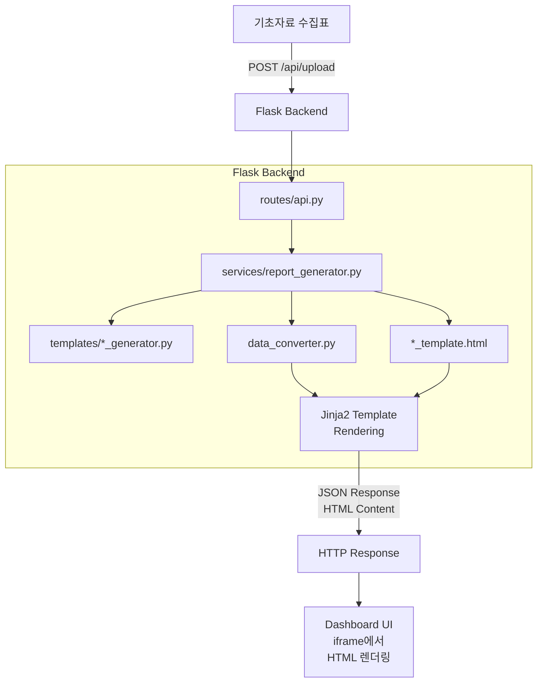
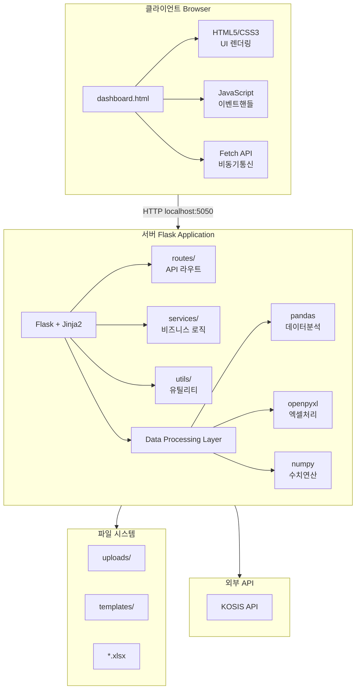

# 📊 지역경제동향 보고서 자동 생성 시스템
## 캡스톤 프로젝트 학습 가이드

> **프레젠테이션 준비를 위한 종합 보고서**  
> 작성일: 2025년 12월 30일

---

## 목차
1. [프로젝트 목표](#1-프로젝트-목표)
2. [프로젝트 파일 구조](#2-프로젝트-파일-구조)
3. [시스템 모듈 및 작업 흐름도](#3-시스템-모듈-및-작업-흐름도)
4. [기술 스택](#4-기술-스택)
5. [시사점 및 개선방안](#5-시사점-및-개선방안)

---

## 1. 프로젝트 목표

### 1.1 프로젝트 배경

국가데이터처(구 통계청)에서는 매 분기마다 **지역경제동향 보고서**를 발간합니다. 이 보고서는 17개 시·도별 경제 현황을 다음과 같은 지표로 분석합니다:

| 부문 | 지표 |
|------|------|
| 생산 | 광공업생산지수, 서비스업생산지수 |
| 소비 | 소매판매액지수 |
| 건설 | 건설수주액 |
| 수출입 | 수출액, 수입액 |
| 물가 | 소비자물가지수 |
| 고용 | 고용률, 실업률 |
| 인구 | 국내인구이동 |

기존에는 이 보고서를 수작업으로 작성해야 했으며, 이는 다음과 같은 문제를 발생시켰습니다:

- **시간 소요**: 50+ 페이지 보고서 작성에 상당한 인력/시간 투입
- **오류 가능성**: 수작업 데이터 입력 시 휴먼 에러 발생
- **일관성 부족**: 매 분기 보고서 형식의 미세한 차이 발생
- **비효율적 검토**: 결측치/이상치 확인의 어려움

### 1.2 프로젝트 목적

**기초자료 수집표(Excel)를 업로드하면 완성된 지역경제동향 보고서를 자동 생성하는 웹 기반 시스템 개발**


### 1.3 핵심 목표

1. **업무 자동화**: 수작업 보고서 작성 시간 90% 이상 단축
2. **품질 향상**: 데이터 오류 및 결측치 자동 검출
3. **표준화**: 일관된 보고서 형식 및 디자인 유지
4. **접근성**: 웹 기반 UI로 누구나 쉽게 사용 가능
5. **유연성**: 보고서 순서 변경, 커스텀 데이터 입력 지원

### 1.4 지원하는 보고서 종류

| 카테고리 | 보고서 수 | 내용 |
|----------|-----------|------|
| **요약** | 9개 | 표지, 목차, 인포그래픽, 요약 페이지들 |
| **부문별** | 10개 | 광공업생산, 서비스업생산, 소비, 건설, 수출, 수입, 물가, 고용률, 실업률, 인구이동 |
| **시도별** | 18개 | 17개 시·도 + 참고_GRDP |
| **통계표** | 13개 | 목차, 10개 지표 통계표, GRDP 참고, 용어정의 |
| **합계** | **50개** | - |

---

## 2. 프로젝트 파일 구조

### 2.1 전체 디렉토리 구조

```
capstone/
│
├── 📄 app.py                      # Flask 애플리케이션 엔트리포인트
├── 📄 dashboard.html              # 메인 대시보드 UI (프론트엔드)
├── 📄 data_converter.py           # 기초자료 → 분석표 변환기
├── 📄 kosis_collector.py          # KOSIS API 데이터 수집기
├── 📄 report_generator.py         # CLI용 보고서 생성기
├── 📄 requirements.txt            # Python 의존성 패키지 목록
├── 📄 README.md                   # 프로젝트 설명 문서
│
├── 📁 config/                     # 설정 모듈
│   ├── __init__.py
│   ├── settings.py               # 경로, 시크릿 키 등 기본 설정
│   └── reports.py                # 보고서 순서 및 정의 상수
│
├── 📁 routes/                     # Flask 라우트 (API 엔드포인트)
│   ├── __init__.py
│   ├── main.py                   # 메인 페이지 라우트
│   ├── api.py                    # 파일 업로드, 생성 API
│   └── preview.py                # 미리보기 생성 API
│
├── 📁 services/                   # 비즈니스 로직 서비스
│   ├── __init__.py
│   ├── report_generator.py       # 보고서 HTML 생성 핵심 로직
│   ├── summary_data.py           # 요약 페이지 데이터 추출
│   └── grdp_service.py           # GRDP 데이터 처리 서비스
│
├── 📁 utils/                      # 유틸리티 함수
│   ├── __init__.py
│   ├── filters.py                # Jinja2 커스텀 필터
│   ├── excel_utils.py            # 엑셀 파일 처리 유틸
│   └── data_utils.py             # 데이터 처리 유틸
│
├── 📁 templates/                  # Jinja2 템플릿 및 Generator
│   ├── *_template.html           # HTML 템플릿 (71개)
│   ├── *_generator.py            # 데이터 추출 모듈 (15개)
│   ├── *_schema.json             # 데이터 스키마 정의 (39개)
│   ├── *_data.json               # 추출된 데이터 캐시
│   └── *_output.html             # 생성된 보고서 결과물
│
├── 📁 uploads/                    # 업로드된 파일 저장소
│   ├── *.xlsx                    # 업로드된 엑셀 파일
│   └── *.html                    # 생성된 최종 문서
│
├── 📁 correct_answer/             # 정답 이미지 (QA 비교용)
│   ├── 부문별/                   # 부문별 보고서 정답 이미지
│   ├── 시도별/                   # 시도별 보고서 정답 이미지
│   ├── 요약/                     # 요약 보고서 정답 이미지
│   └── 통계표/                   # 통계표 정답 이미지
│
└── 📁 VENV/                       # Python 가상환경
```

### 2.2 핵심 파일 상세 설명

#### 📄 `app.py` - 애플리케이션 팩토리
```python
# Flask 앱 생성 및 Blueprint 등록
def create_app():
    app = Flask(__name__)
    register_filters(app)      # Jinja2 필터 등록
    app.register_blueprint(main_bp)     # 메인 페이지
    app.register_blueprint(api_bp)      # API 라우트
    app.register_blueprint(preview_bp)  # 미리보기 API
    return app
```

#### 📄 `data_converter.py` - 데이터 변환 핵심
| 클래스/함수 | 역할 |
|------------|------|
| `DataConverter` | 기초자료 → 분석표 변환 메인 클래스 |
| `SHEET_MAPPING` | 기초자료 시트 → 집계 시트 매핑 |
| `convert_all()` | 모든 시트 일괄 변환 |
| `extract_grdp_data()` | GRDP 데이터 추출 |

#### 📄 `dashboard.html` - 대시보드 UI (3,700+ 라인)
```
┌──────────────────────────────────────────────────────────┐
│ 헤더: 로고, 연도/분기 선택, 설정 버튼                      │
├────────────────┬─────────────────────────────────────────┤
│                │                                          │
│   사이드바      │           미리보기 영역                   │
│   (보고서 목록)  │           (실시간 HTML 렌더링)            │
│                │                                          │
│   • 요약 탭     │   ┌─────────────────────────────────┐   │
│   • 부문별 탭   │   │                                 │   │
│   • 시도별 탭   │   │      보고서 미리보기             │   │
│   • 통계표 탭   │   │                                 │   │
│                │   │                                 │   │
│                │   └─────────────────────────────────┘   │
│                │                                          │
│   [검토완료]    │   [이전] [다음] [미리보기] [전체생성]      │
└────────────────┴─────────────────────────────────────────┘
```

---

## 3. 시스템 모듈 및 작업 흐름도

### 3.1 모듈 목록 및 역할

#### 🔹 프론트엔드 모듈

| 모듈 | 위치 | 역할 |
|------|------|------|
| **Dashboard UI** | `dashboard.html` | 사용자 인터페이스, 보고서 목록/미리보기 |
| **Report Viewer** | 내장 iframe | 생성된 HTML 보고서 렌더링 |
| **Missing Data Modal** | 내장 JavaScript | 결측치 입력 모달 |

#### 🔹 백엔드 모듈 (Flask)

| 모듈 | 위치 | 역할 |
|------|------|------|
| **Main Route** | `routes/main.py` | 대시보드 페이지 서빙 |
| **API Route** | `routes/api.py` | 파일 업로드, 보고서 생성 API |
| **Preview Route** | `routes/preview.py` | 실시간 미리보기 생성 API |

#### 🔹 서비스 모듈 (비즈니스 로직)

| 모듈 | 위치 | 역할 |
|------|------|------|
| **Report Generator** | `services/report_generator.py` | 보고서 HTML 생성 핵심 로직 |
| **Summary Data** | `services/summary_data.py` | 요약 페이지 데이터 추출 |
| **GRDP Service** | `services/grdp_service.py` | GRDP 데이터 처리 |

#### 🔹 데이터 처리 모듈

| 모듈 | 위치 | 역할 |
|------|------|------|
| **Data Converter** | `data_converter.py` | 기초자료 → 분석표 변환 |
| **KOSIS Collector** | `kosis_collector.py` | KOSIS API 데이터 수집 |
| **Excel Utils** | `utils/excel_utils.py` | 엑셀 파일 처리 유틸리티 |

#### 🔹 템플릿 및 Generator 모듈 (templates/ 폴더)

| 유형 | 파일 수 | 역할 |
|------|---------|------|
| **HTML 템플릿** | 71개 | Jinja2 HTML 템플릿 |
| **Generator** | 15개 | 엑셀에서 데이터 추출 |
| **Schema** | 39개 | 데이터 구조 정의 |

### 3.2 전체 프로세스 작업 흐름도


### 3.3 상세 데이터 흐름도



### 3.4 보고서 생성 함수 호출 흐름

```python
# 1. API 요청 수신 (routes/api.py)
@api_bp.route('/generate-preview', methods=['POST'])
def generate_preview():
    # 2. 보고서 설정 조회
    report_config = get_report_config(report_id)
    
    # 3. 보고서 HTML 생성 (services/report_generator.py)
    html_content, error, missing = generate_report_html(
        excel_path, report_config, year, quarter, custom_data
    )
    
    # 4. 내부적으로 Generator 호출
    # └─ templates/mining_manufacturing_generator.py
    #    └─ class 광공업생산Generator
    #       └─ extract_all_data()  # 엑셀에서 데이터 추출
    #       └─ 반환: Python dict
    
    # 5. Jinja2 템플릿 렌더링
    # └─ templates/mining_manufacturing_template.html
    #    └─ Template.render(**data)
    
    # 6. HTML 문자열 반환
    return jsonify({'html': html_content})
```

---

## 4. 기술 스택

### 4.1 기술 스택 개요

| 계층 | 기술 | 버전 |
|------|------|------|
| **Frontend** | HTML5, CSS3, JavaScript (Vanilla) | - |
| **Backend** | Python, Flask | 3.10+, 2.3+ |
| **Template Engine** | Jinja2 | 3.1+ |
| **Data Processing** | pandas, openpyxl, numpy | 2.0+, 3.1+, 1.24+ |
| **External API** | KOSIS Open API | - |
| **Font** | Pretendard, Noto Sans KR | - |

### 4.2 각 기술의 용도와 기능

#### 🔹 Flask (웹 프레임워크)

**용도**: 웹 서버 및 API 엔드포인트 제공

**기능**:
- Blueprint를 통한 모듈화된 라우팅
- 세션 관리 (업로드된 파일 경로, 연도/분기 저장)
- 파일 업로드/다운로드 처리
- JSON API 응답

**구현 목록**:
| 구현 | 파일 | 설명 |
|------|------|------|
| 앱 팩토리 | `app.py` | Flask 앱 생성 및 설정 |
| 메인 라우트 | `routes/main.py` | 대시보드 페이지 |
| API 라우트 | `routes/api.py` | 파일 업로드, 전체 생성 |
| 미리보기 라우트 | `routes/preview.py` | 실시간 미리보기 |

```python
# 예시: Blueprint 등록 (app.py)
from flask import Flask
from routes import main_bp, api_bp, preview_bp

app.register_blueprint(main_bp)
app.register_blueprint(api_bp)
app.register_blueprint(preview_bp)
```

---

#### 🔹 Jinja2 (템플릿 엔진)

**용도**: 동적 HTML 보고서 생성

**기능**:
- Python 딕셔너리를 HTML로 렌더링
- 조건문/반복문 지원 (``, ``)
- 커스텀 필터 적용 (`{{ value|format_value }}`)
- 템플릿 상속 및 include

**구현 목록**:
| 구현 | 파일 | 설명 |
|------|------|------|
| 템플릿 파일 | `templates/*_template.html` | 71개의 HTML 템플릿 |
| 커스텀 필터 | `utils/filters.py` | is_missing, format_value, editable |
| 스키마 파일 | `templates/*_schema.json` | 템플릿 변수 정의 |

```html
<!-- 예시: Jinja2 템플릿 (mining_manufacturing_template.html) -->
<h2>{{ report_info.year }}년 {{ report_info.quarter }}/4분기 광공업생산</h2>

<table>

  <tr>
    <td>{{ region.name }}</td>
    <td>{{ region.growth_rate|format_value("%.1f") }}%</td>
  </tr>

</table>
```

---

#### 🔹 pandas (데이터 분석)

**용도**: 엑셀 데이터 읽기 및 처리

**기능**:
- Excel 파일 읽기 (`pd.read_excel`)
- 데이터프레임 조작 (필터링, 정렬, 그룹화)
- 결측치 처리 (`pd.isna()`)
- 데이터 타입 변환

**구현 목록**:
| 구현 | 파일 | 설명 |
|------|------|------|
| 데이터 추출 | `templates/*_generator.py` | 엑셀에서 보고서 데이터 추출 |
| 요약 데이터 | `services/summary_data.py` | 요약 페이지용 집계 |
| 변환기 | `data_converter.py` | 기초자료 → 분석표 변환 |

```python
# 예시: pandas로 엑셀 데이터 읽기
import pandas as pd

xl = pd.ExcelFile(excel_path)
df = pd.read_excel(xl, sheet_name='A 분석', header=None)

# 지역별 증감률 추출
for i, row in df.iterrows():
    region = row[3]  # 지역명
    growth_rate = row[21]  # 전년동기비 증감률
```

---

#### 🔹 openpyxl (엑셀 처리)

**용도**: 엑셀 파일 읽기/쓰기 (수식 보존)

**기능**:
- 수식이 포함된 엑셀 파일 처리
- 셀 병합 영역 처리
- 새로운 워크북 생성
- 기존 템플릿에 데이터 복사

**구현 목록**:
| 구현 | 파일 | 설명 |
|------|------|------|
| 분석표 생성 | `data_converter.py` | 템플릿 복사 + 데이터 교체 |
| 수식 계산 | `routes/api.py` | 분석 시트 수식 계산 |

```python
# 예시: openpyxl로 수식 보존하며 데이터 복사
import openpyxl

wb = openpyxl.load_workbook(template_path)
ws = wb['A(광공업생산)집계']

# 데이터 복사 (수식은 유지됨)
ws.cell(row=4, column=10).value = 105.2
wb.save(output_path)
```

---

#### 🔹 JavaScript (프론트엔드)

**용도**: 대시보드 UI 인터랙션

**기능**:
- 비동기 API 호출 (fetch)
- 드래그 앤 드롭 파일 업로드
- 실시간 미리보기 업데이트
- 탭/네비게이션 제어
- 결측치 입력 모달

**구현 목록**:
| 구현 | 위치 | 설명 |
|------|------|------|
| 파일 업로드 | `dashboard.html` | 드래그 앤 드롭 + 클릭 |
| 미리보기 | `dashboard.html` | iframe 동적 업데이트 |
| 보고서 탐색 | `dashboard.html` | 이전/다음 버튼 |
| 검토 시스템 | `dashboard.html` | 체크박스 상태 관리 |

```javascript
// 예시: 미리보기 생성 API 호출
async function generatePreview(reportId) {
    const response = await fetch('/api/generate-preview', {
        method: 'POST',
        headers: {'Content-Type': 'application/json'},
        body: JSON.stringify({
            report_id: reportId,
            year: currentYear,
            quarter: currentQuarter
        })
    });
    
    const data = await response.json();
    document.getElementById('preview-iframe').srcdoc = data.html;
}
```

---

#### 🔹 CSS3 (스타일링)

**용도**: 대시보드 UI 디자인

**기능**:
- CSS 변수 기반 다크 테마
- Grid/Flexbox 레이아웃
- 애니메이션 효과 (glow, transition)
- 반응형 디자인

**특징**:
```css
/* 다크 테마 색상 변수 */
:root {
    --bg-primary: #0a0a0f;
    --accent-primary: #6366f1;
    --accent-glow: rgba(99, 102, 241, 0.3);
}

/* 그라데이션 배경 효과 */
.bg-pattern {
    background: 
        radial-gradient(circle at 20% 80%, var(--accent-glow) 0%, transparent 40%),
        radial-gradient(circle at 80% 20%, rgba(139, 92, 246, 0.15) 0%, transparent 40%);
}
```

---

#### 🔹 KOSIS Open API (외부 API)

**용도**: 국가통계포털 데이터 자동 수집

**기능**:
- 통계표 데이터 조회
- JSON 형식 응답 파싱
- 다중 통계표 일괄 수집

**구현 목록**:
| 구현 | 파일 | 설명 |
|------|------|------|
| API 수집기 | `kosis_collector.py` | KOSIS API 호출 클래스 |
| 설정 파일 | `kosis_config.json` | API 엔드포인트 정의 |

```python
# 예시: KOSIS API 호출
class KOSISCollector:
    BASE_URL = "https://kosis.kr/openapi/Param/statisticsParameterData.do"
    
    def fetch_data(self, stat_id):
        url = self._build_request_url(stat_config)
        response = requests.get(url)
        return pd.DataFrame(response.json())
```

---

### 4.3 기술 스택 아키텍처 다이어그램



---

## 5. 시사점 및 개선방안

### 5.1 프로젝트 성과 및 시사점

#### ✅ 성공적으로 달성한 목표

| 항목 | 성과 |
|------|------|
| **업무 자동화** | 50+ 페이지 보고서를 수 분 내 자동 생성 |
| **데이터 품질** | 결측치/이상치 자동 탐지 및 하이라이트 |
| **사용 편의성** | 드래그 앤 드롭 업로드, 실시간 미리보기 |
| **유연성** | 보고서 순서 변경, 커스텀 데이터 입력 지원 |
| **표준화** | 일관된 디자인 및 형식의 보고서 |

#### 📊 기술적 시사점

1. **모듈화된 아키텍처**
   - Generator/Template/Schema 분리로 새 보고서 추가 용이
   - Blueprint 패턴으로 라우트 모듈화
   - 서비스 레이어 분리로 테스트 용이성 확보

2. **데이터 처리 파이프라인**
   - 기초자료 → 분석표 → 보고서의 단계별 처리
   - 수식 보존 방식으로 엑셀 호환성 유지
   - JSON 스키마를 통한 데이터 검증

3. **사용자 경험**
   - 다크 테마 + 그라데이션 배경의 현대적 UI
   - 실시간 미리보기로 즉각적인 피드백
   - 결측치 모달로 데이터 완성도 보장

---

### 5.2 개선방안

#### 🔧 단기 개선 (1~2주)

| 항목 | 현재 상태 | 개선 방안 |
|------|----------|----------|
| **PDF 출력** | HTML → 브라우저 인쇄 | Puppeteer/WeasyPrint 도입 |
| **한글(HWP) 지원** | HTML 복사-붙여넣기 | python-hwp 라이브러리 검토 |
| **차트 이미지** | Chart.js 동적 렌더링 | 서버사이드 이미지 생성 |
| **로딩 상태** | 일부 구현 | 스켈레톤 UI 추가 |

#### 🔧 중기 개선 (1~3개월)

| 항목 | 현재 상태 | 개선 방안 |
|------|----------|----------|
| **테스트 자동화** | 수동 테스트 | pytest + Selenium 도입 |
| **CI/CD** | 미구현 | GitHub Actions 파이프라인 |
| **Docker화** | 로컬 venv | Docker Compose 배포 |
| **사용자 인증** | 없음 | Flask-Login 도입 |

#### 🔧 장기 개선 (3~6개월)

| 항목 | 현재 상태 | 개선 방안 |
|------|----------|----------|
| **데이터베이스** | 파일 기반 | PostgreSQL/SQLite 도입 |
| **버전 관리** | 없음 | 보고서 히스토리 저장 |
| **협업 기능** | 단일 사용자 | 다중 사용자 동시 편집 |
| **AI 통합** | 없음 | 코멘트 자동 생성 (LLM) |

---

### 5.3 코드 품질 개선 제안

#### 1. 타입 힌트 강화
```python
# Before
def generate_report_html(excel_path, report_config, year, quarter):
    pass

# After
def generate_report_html(
    excel_path: str, 
    report_config: Dict[str, Any], 
    year: int, 
    quarter: int
) -> Tuple[Optional[str], Optional[str], List[str]]:
    pass
```

#### 2. 예외 처리 개선
```python
# 커스텀 예외 클래스 도입
class ReportGenerationError(Exception):
    """보고서 생성 중 발생하는 예외"""
    pass

class DataExtractionError(Exception):
    """데이터 추출 중 발생하는 예외"""
    pass
```

#### 3. 로깅 체계화
```python
# 현재: print() 사용
print(f"[DEBUG] 보고서 생성 완료")

# 개선: logging 모듈 사용
import logging
logger = logging.getLogger(__name__)
logger.info("보고서 생성 완료", extra={'report_id': report_id})
```

#### 4. 설정 관리 개선
```python
# 환경별 설정 분리
# config/settings_dev.py
# config/settings_prod.py
# config/settings_test.py
```

---

### 5.4 확장 가능성

#### 🚀 추가 가능한 기능

1. **다국어 지원**
   - 영문 보고서 자동 생성
   - 템플릿 다국어화 (i18n)

2. **대시보드 확장**
   - 시계열 트렌드 차트
   - 지역 간 비교 분석
   - 이상치 자동 탐지 알림

3. **API 공개**
   - REST API 문서화 (Swagger/OpenAPI)
   - 외부 시스템 연동
   - Webhook 알림

4. **모바일 대응**
   - 반응형 대시보드
   - PWA 변환
   - 모바일 앱 (Flutter/React Native)

---

## 부록

### A. 주요 API 엔드포인트

| 메서드 | 엔드포인트 | 설명 |
|--------|-----------|------|
| `GET` | `/` | 대시보드 페이지 |
| `POST` | `/api/upload` | 엑셀 파일 업로드 |
| `POST` | `/api/generate-preview` | 부문별 보고서 미리보기 |
| `POST` | `/api/generate-summary-preview` | 요약 보고서 미리보기 |
| `POST` | `/api/generate-regional-preview` | 시도별 보고서 미리보기 |
| `POST` | `/api/generate-statistics-preview` | 통계표 미리보기 |
| `POST` | `/api/generate-all` | 전체 보고서 일괄 생성 |
| `GET` | `/api/download-analysis` | 분석표 다운로드 |
| `POST` | `/api/export-final` | PDF용 HTML 생성 |
| `POST` | `/api/export-hwp-ready` | 한글 복붙용 HTML 생성 |

### B. 프로젝트 실행 방법

```bash
# 1. 가상환경 활성화
source VENV/bin/activate

# 2. 의존성 설치
pip install -r requirements.txt

# 3. 서버 실행
python app.py

# 4. 브라우저에서 접속
# http://localhost:5050
```

### C. 참고 자료

- [Flask 공식 문서](https://flask.palletsprojects.com/)
- [Jinja2 템플릿 문법](https://jinja.palletsprojects.com/)
- [pandas 사용 가이드](https://pandas.pydata.org/docs/)
- [KOSIS Open API 가이드](https://kosis.kr/openapi/index.do)

---

> **작성자**: 캡스톤 프로젝트 팀  
> **최종 수정**: 2025년 12월 30일  
> **버전**: 1.0

