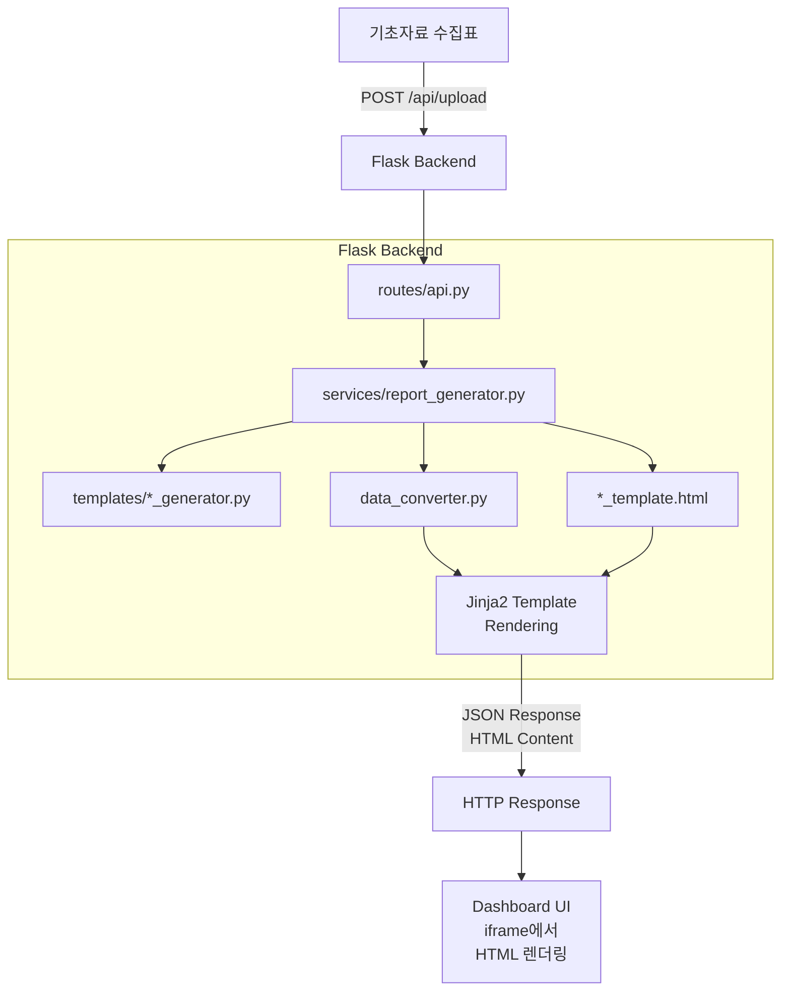

# 📚 지역경제동향 보도자료 자동 생성 시스템
## 종합 학습 가이드

> **프로젝트 학습, 용어 정리, Q&A 대비를 위한 종합 가이드**  
> 작성일: 2025년 12월 30일  
> 최종 수정: 2026년 1월 1일

---

## 📋 목차

1. [프로젝트 학습 가이드](#1-프로젝트-학습-가이드)
2. [용어 사전](#2-용어-사전)
3. [AI 개발 히스토리](#3-ai-개발-히스토리)
4. [프로젝트 진행 상황](#4-프로젝트-진행-상황)
5. [기술 문서](#5-기술-문서)

---

# 1. 프로젝트 학습 가이드

## 1.1 프로젝트 목표

### 프로젝트 배경

국가데이터처(구 통계청)에서는 매 분기마다 **지역경제동향 보도자료**를 발간합니다. 이 보도자료는 17개 시·도별 경제 현황을 다음과 같은 지표로 분석합니다:

| 부문 | 지표 |
|------|------|
| 생산 | 광공업생산지수, 서비스업생산지수 |
| 소비 | 소매판매액지수 |
| 건설 | 건설수주액 |
| 수출입 | 수출액, 수입액 |
| 물가 | 소비자물가지수 |
| 고용 | 고용률, 실업률 |
| 인구 | 국내인구이동 |

기존에는 이 보도자료를 수작업으로 작성해야 했으며, 이는 다음과 같은 문제를 발생시켰습니다:

- **시간 소요**: 50+ 페이지 보도자료 작성에 상당한 인력/시간 투입
- **오류 가능성**: 수작업 데이터 입력 시 휴먼 에러 발생
- **일관성 부족**: 매 분기 보도자료 형식의 미세한 차이 발생
- **비효율적 검토**: 결측치/이상치 확인의 어려움

### 프로젝트 목적

**기초자료 수집표(Excel)를 업로드하면 완성된 지역경제동향 보도자료를 자동 생성하는 웹 기반 시스템 개발**


### 핵심 목표

1. **업무 자동화**: 수작업 보도자료 작성 시간 90% 이상 단축
2. **품질 향상**: 데이터 오류 및 결측치 자동 검출
3. **표준화**: 일관된 보도자료 형식 및 디자인 유지
4. **접근성**: 웹 기반 UI로 누구나 쉽게 사용 가능
5. **유연성**: 보도자료 순서 변경, 커스텀 데이터 입력 지원

### 지원하는 보도자료 종류

| 카테고리 | 보도자료 수 | 내용 |
|----------|-----------|------|
| **요약** | 9개 | 표지, 목차, 인포그래픽, 요약 페이지들 |
| **부문별** | 10개 | 광공업생산, 서비스업생산, 소비, 건설, 수출, 수입, 물가, 고용률, 실업률, 인구이동 |
| **시도별** | 18개 | 17개 시·도 + 참고_GRDP |
| **통계표** | 13개 | 목차, 10개 지표 통계표, GRDP 참고, 용어정의 |
| **합계** | **50개** | - |

## 1.2 프로젝트 파일 구조

### 전체 디렉토리 구조

```
capstone/
│
├── 📄 app.py                      # Flask 애플리케이션 엔트리포인트
├── 📄 dashboard.html              # 메인 대시보드 UI (프론트엔드)
├── 📄 data_converter.py           # 기초자료 → 분석표 변환기
├── 📄 kosis_collector.py          # KOSIS API 데이터 수집기
├── 📄 report_generator.py         # CLI용 보도자료 생성기
├── 📄 requirements.txt            # Python 의존성 패키지 목록
├── 📄 README.md                   # 프로젝트 설명 문서
│
├── 📁 config/                     # 설정 모듈
│   ├── __init__.py
│   ├── settings.py               # 경로, 시크릿 키 등 기본 설정
│   └── reports.py                # 보도자료 순서 및 정의 상수
│
├── 📁 routes/                     # Flask 라우트 (API 엔드포인트)
│   ├── __init__.py
│   ├── main.py                   # 메인 페이지 라우트
│   ├── api.py                    # 파일 업로드, 생성 API
│   └── preview.py                # 미리보기 생성 API
│
├── 📁 services/                   # 비즈니스 로직 서비스
│   ├── __init__.py
│   ├── report_generator.py       # 보도자료 HTML 생성 핵심 로직
│   ├── summary_data.py           # 요약 페이지 데이터 추출
│   └── grdp_service.py           # GRDP 데이터 처리 서비스
│
├── 📁 utils/                      # 유틸리티 함수
│   ├── __init__.py
│   ├── filters.py                # Jinja2 커스텀 필터
│   ├── excel_utils.py            # 엑셀 파일 처리 유틸
│   └── data_utils.py             # 데이터 처리 유틸
│
├── 📁 templates/                  # Jinja2 템플릿 및 Generator
│   ├── *_template.html           # HTML 템플릿 (71개)
│   ├── *_generator.py            # 데이터 추출 모듈 (15개)
│   ├── *_schema.json             # 데이터 스키마 정의 (39개)
│   ├── *_data.json               # 추출된 데이터 캐시
│   └── *_output.html             # 생성된 보도자료 결과물
│
├── 📁 uploads/                    # 업로드된 파일 저장소
│   ├── *.xlsx                    # 업로드된 엑셀 파일
│   └── *.html                    # 생성된 최종 문서
│
├── 📁 correct_answer/             # 정답 이미지 (QA 비교용)
│   ├── 부문별/                   # 부문별 보도자료 정답 이미지
│   ├── 시도별/                   # 시도별 보도자료 정답 이미지
│   ├── 요약/                     # 요약 보도자료 정답 이미지
│   └── 통계표/                   # 통계표 정답 이미지
│
└── 📁 VENV/                       # Python 가상환경
```

## 1.3 시스템 모듈 및 작업 흐름도

### 모듈 목록 및 역할

#### 🔹 프론트엔드 모듈

| 모듈 | 위치 | 역할 |
|------|------|------|
| **Dashboard UI** | `dashboard.html` | 사용자 인터페이스, 보도자료 목록/미리보기 |
| **Report Viewer** | 내장 iframe | 생성된 HTML 보도자료 렌더링 |
| **Missing Data Modal** | 내장 JavaScript | 결측치 입력 모달 |

#### 🔹 백엔드 모듈 (Flask)

| 모듈 | 위치 | 역할 |
|------|------|------|
| **Main Route** | `routes/main.py` | 대시보드 페이지 서빙 |
| **API Route** | `routes/api.py` | 파일 업로드, 보도자료 생성 API |
| **Preview Route** | `routes/preview.py` | 실시간 미리보기 생성 API |

#### 🔹 서비스 모듈 (비즈니스 로직)

| 모듈 | 위치 | 역할 |
|------|------|------|
| **Report Generator** | `services/report_generator.py` | 보도자료 HTML 생성 핵심 로직 |
| **Summary Data** | `services/summary_data.py` | 요약 페이지 데이터 추출 |
| **GRDP Service** | `services/grdp_service.py` | GRDP 데이터 처리 |

#### 🔹 데이터 처리 모듈

| 모듈 | 위치 | 역할 |
|------|------|------|
| **Data Converter** | `data_converter.py` | 기초자료 → 분석표 변환 |
| **KOSIS Collector** | `kosis_collector.py` | KOSIS API 데이터 수집 |
| **Excel Utils** | `utils/excel_utils.py` | 엑셀 파일 처리 유틸리티 |

#### 🔹 템플릿 및 Generator 모듈 (templates/ 폴더)

| 유형 | 파일 수 | 역할 |
|------|---------|------|
| **HTML 템플릿** | 71개 | Jinja2 HTML 템플릿 |
| **Generator** | 15개 | 엑셀에서 데이터 추출 |
| **Schema** | 39개 | 데이터 구조 정의 |

### 전체 프로세스 작업 흐름도


### 상세 데이터 흐름도



## 1.4 기술 스택

### 기술 스택 개요

| 계층 | 기술 | 버전 |
|------|------|------|
| **Frontend** | HTML5, CSS3, JavaScript (Vanilla) | - |
| **Backend** | Python, Flask | 3.10+, 2.3+ |
| **Template Engine** | Jinja2 | 3.1+ |
| **Data Processing** | pandas, openpyxl, numpy | 2.0+, 3.1+, 1.24+ |
| **External API** | KOSIS Open API | - |
| **Font** | Pretendard, Noto Sans KR | - |

### 주요 기술 설명

#### 🔹 Flask (웹 프레임워크)

**용도**: 웹 서버 및 API 엔드포인트 제공

**기능**:
- Blueprint를 통한 모듈화된 라우팅
- 세션 관리 (업로드된 파일 경로, 연도/분기 저장)
- 파일 업로드/다운로드 처리
- JSON API 응답

#### 🔹 Jinja2 (템플릿 엔진)

**용도**: 동적 HTML 보도자료 생성

**기능**:
- Python 딕셔너리를 HTML로 렌더링
- 조건문/반복문 지원 (``, ``)
- 커스텀 필터 적용 (`{{ value|format_value }}`)
- 템플릿 상속 및 include

#### 🔹 pandas (데이터 분석)

**용도**: 엑셀 데이터 읽기 및 처리

**기능**:
- Excel 파일 읽기 (`pd.read_excel`)
- 데이터프레임 조작 (필터링, 정렬, 그룹화)
- 결측치 처리 (`pd.isna()`)
- 데이터 타입 변환

#### 🔹 openpyxl (엑셀 처리)

**용도**: 엑셀 파일 읽기/쓰기 (수식 보존)

**기능**:
- 수식이 포함된 엑셀 파일 처리
- 셀 병합 영역 처리
- 새로운 워크북 생성
- 기존 템플릿에 데이터 복사

## 1.5 시사점 및 개선방안

### 프로젝트 성과 및 시사점

#### ✅ 성공적으로 달성한 목표

| 항목 | 성과 |
|------|------|
| **업무 자동화** | 50+ 페이지 보도자료를 수 분 내 자동 생성 |
| **데이터 품질** | 결측치/이상치 자동 탐지 및 하이라이트 |
| **사용 편의성** | 드래그 앤 드롭 업로드, 실시간 미리보기 |
| **유연성** | 보도자료 순서 변경, 커스텀 데이터 입력 지원 |
| **표준화** | 일관된 디자인 및 형식의 보도자료 |

### 개선방안

#### 🔧 단기 개선 (1~2주)

| 항목 | 현재 상태 | 개선 방안 |
|------|----------|----------|
| **PDF 출력** | HTML → 브라우저 인쇄 | Puppeteer/WeasyPrint 도입 |
| **한글(HWP) 지원** | HTML 복사-붙여넣기 | python-hwp 라이브러리 검토 |
| **차트 이미지** | Chart.js 동적 렌더링 | 서버사이드 이미지 생성 |
| **로딩 상태** | 일부 구현 | 스켈레톤 UI 추가 |

#### 🔧 중기 개선 (1~3개월)

| 항목 | 현재 상태 | 개선 방안 |
|------|----------|----------|
| **테스트 자동화** | 수동 테스트 | pytest + Selenium 도입 |
| **CI/CD** | 미구현 | GitHub Actions 파이프라인 |
| **Docker화** | 로컬 venv | Docker Compose 배포 |
| **사용자 인증** | 없음 | Flask-Login 도입 |

---

# 2. 용어 사전

> 전체 용어 사전은 [GLOSSARY.md](./GLOSSARY.md) 참고

## 2.1 경제/통계 용어

| 용어 | 정의 | 비고 |
|------|------|------|
| **광공업생산지수** (IIP) | 광업과 제조업의 생산 활동 수준을 나타내는 지수 | [한국은행 경제용어](https://www.bok.or.kr/portal/ecEdu/ecWordDicary/search.do?menuNo=200688) |
| **서비스업생산지수** | 서비스업 분야의 생산 활동 수준을 측정하는 지수 | [e-나라지표](https://www.index.go.kr/unity/potal/indicator/IndexInfo.do?clasCd=10&idxCd=F0053) |
| **GRDP** (지역내총생산) | Gross Regional Domestic Product의 약자. 일정 기간 동안 특정 지역 내에서 생산된 모든 최종 재화와 서비스의 시장 가치 합계 | [위키백과 - 지역내총생산](https://ko.wikipedia.org/wiki/지역내총생산) |
| **고용률** | 15세 이상 생산가능인구 중 취업자가 차지하는 비율 | [위키백과 - 고용률](https://ko.wikipedia.org/wiki/고용률) |
| **전년동기비** (YoY) | Year over Year의 약자. 당해 분기를 전년 같은 분기와 비교한 것 | [Investopedia - YoY](https://www.investopedia.com/terms/y/year-over-year.asp) |
| **전분기비** (QoQ) | Quarter over Quarter의 약자. 당해 분기를 직전 분기와 비교한 것 | [Investopedia - QoQ](https://www.investopedia.com/terms/q/quarter-over-quarter.asp) |

## 2.2 기술/프로그래밍 용어

| 용어 | 정의 | 비고 |
|------|------|------|
| **Flask** | Python으로 작성된 마이크로 웹 프레임워크 | [Flask 공식 문서](https://flask.palletsprojects.com/) |
| **Jinja2** | Python용 템플릿 엔진. HTML에 Python 변수와 로직을 삽입하여 동적 웹 페이지를 생성 | [Jinja2 공식 문서](https://jinja.palletsprojects.com/) |
| **pandas** | Python 데이터 분석 라이브러리. DataFrame이라는 자료구조를 사용하여 표 형태의 데이터를 효율적으로 처리 | [pandas 공식 문서](https://pandas.pydata.org/) |
| **openpyxl** | Python에서 Excel 파일(.xlsx)을 읽고 쓰는 라이브러리 | [openpyxl 공식 문서](https://openpyxl.readthedocs.io/) |
| **Blueprint** | Flask에서 애플리케이션을 모듈화하는 패턴 | [Flask Blueprint 문서](https://flask.palletsprojects.com/en/latest/blueprints/) |

## 2.3 데이터/파일 관련 용어

| 용어 | 정의 | 비고 |
|------|------|------|
| **기초자료 수집표** | KOSIS 등에서 수집한 원본 통계 데이터를 담은 엑셀 파일 | 프로젝트 내부 문서 |
| **분석표** | 기초자료를 가공하여 집계 및 분석 수식이 적용된 엑셀 파일 | 프로젝트 내부 문서 |
| **템플릿** | 반복적으로 사용되는 문서의 틀. 이 프로젝트에서는 Jinja2 HTML 템플릿으로 보도자료 형식을 정의 | [위키백과 - 템플릿](https://ko.wikipedia.org/wiki/템플릿) |
| **스키마** | 데이터의 구조와 형식을 정의한 명세서. JSON 스키마 파일은 템플릿에서 사용할 변수 구조를 정의 | [JSON Schema](https://json-schema.org/) |

---

# 3. AI 개발 히스토리

> 이 문서는 Claude AI와의 프롬프트 기반 페어 프로그래밍을 통해 프로젝트를 개발한 과정을 기록합니다.

## 3.1 Phase 1: 프로젝트 시작 (12/11 ~ 12/12)

### 목표
프로젝트 기본 구조 설계 및 요구사항 분석

### 주요 프롬프트
- 프로젝트 초기 설정: Flask 기반 웹 애플리케이션 구조 설계
- 데이터 스키마 설계: 분석표 엑셀 파일 구조를 JSON 스키마로 정의

### 결과물
- 프로젝트 기본 디렉토리 구조
- JSON 스키마 설계 체계 수립
- requirements.txt 작성

## 3.2 Phase 2: 알파 버전 개발 (12/15)

### 목표
핵심 기능 프로토타입 구현 및 데이터 추출 검증

### 주요 프롬프트
- 엑셀 파싱 엔진 구현: pandas와 openpyxl을 사용한 데이터 추출
- 정답 검증 시스템: 생성된 보도자료와 정답 이미지 비교
- 문장 생성 로직: 데이터를 바탕으로 보도자료 문장 자동 생성

### 결과물
- 엑셀 데이터 파싱 엔진 완성
- 정답 데이터와 수치 일치 검증 완료
- 기본 HTML 템플릿 시스템

## 3.3 Phase 3: 웹 애플리케이션 구현 (12/16 ~ 12/17)

### 목표
Flask 기반 웹 대시보드 개발

### 주요 프롬프트
- Flask 앱 구현: 드래그앤드롭 파일 업로드, 미리보기 기능
- 템플릿 모듈화: 각 보도자료별로 템플릿 분리
- 의미 기반 마커 시스템: 위치 기반에서 텍스트 기반으로 전환

### 결과물
- Flask 웹 대시보드 완성
- 드래그 앤 드롭 파일 업로드
- 10개 부문별 보도자료 템플릿 완성
- 의미 기반 마커 시스템 도입

## 3.4 Phase 4: 고도화 및 기능 확장 (12/18 ~ 12/21)

### 목표
스키마 기반 아키텍처 전환 및 순위 시스템 구현

### 주요 프롬프트
- 스키마 기반 아키텍처: 하드코딩된 셀 위치를 JSON 스키마로 전환
- 가중치 기반 순위 시스템: 17개 시도의 경제지표 순위 계산
- 동적 변수 처리: 증감 방향에 따라 다른 텍스트 표시

### 결과물
- JSON 스키마 기반 데이터 추출 시스템
- 가중치 기반 시도별 순위 자동 계산
- 증감 방향 동적 변수 처리
- PDF 출력 기능

## 3.5 Phase 5: 품질 개선 및 안정화 (12/22 ~ 12/23)

### 목표
템플릿 정밀도 향상 및 코드 모듈화

### 주요 프롬프트
- 시트 매핑 변경 대응: 시트명 변경 시 fallback 지원
- 코드 모듈화: app.py를 config, routes, services, utils로 분리
- 실업률 템플릿 구현: 고용률과 반대 순위 정렬

### 결과물
- 10개 부문별 템플릿 완전 구현
- 시도별 순위 동적 계산 시스템
- 코드 모듈화 (config, utils, services, routes)

## 3.6 Phase 6: 대시보드 완성 (12/25)

### 목표
웹 대시보드 기능 완성 및 UX 개선

### 주요 프롬프트
- 4개 탭 구조: 요약/부문별/시도별/통계표 탭 구성
- 결측치 시각화: 노란색 형광펜으로 하이라이트
- 기초자료→분석표 변환: 자동 변환 기능 추가

### 결과물
- 완성된 웹 대시보드 UI
- 4개 탭 구조 (요약/부문별/시도별/통계표)
- 결측치 시각적 표시 (노란색 형광펜)
- 기초자료→분석표 자동 변환

## 3.7 Phase 7: 코드 정리 및 국제화 (12/26)

### 목표
파일명 영문화 및 코드 정리

### 주요 프롬프트
- 템플릿 파일명 영문화: 한글 파일명을 영문으로 변경
- KOSIS GRDP 연동: KOSIS에서 다운로드한 GRDP 데이터 파싱

### 결과물
- 템플릿 파일명 영문화 (71개 파일)
- 인포그래픽 템플릿 추가
- KOSIS GRDP 데이터 연동 모듈

## 3.8 Phase 8: 기능 고도화 및 UX 개선 (12/27 ~ 12/30)

### 목표
이중 프로세스 구조 확립 및 출력 포맷 개선

### 주요 프롬프트
- 이중 프로세스 구조: 기초자료→분석표→보도자료 전체 파이프라인
- 한글 복붙용 HTML: HWPX 대신 복사-붙여넣기 최적화 HTML
- Chart.js 복합 차트: 요약 페이지 막대+점 복합 차트

### 결과물
- **이중 프로세스 구조**: 프로세스 1 (기초자료→분석표), 프로세스 2 (분석표+GRDP→보도자료)
- **한글 복붙용 HTML**: 복사-붙여넣기 최적화 HTML 생성
- **가중치 설정 UI**: 비공개(0) 값 자동 대체 기능
- **자동 미리보기**: 파일 업로드 시 즉시 보도자료 미리보기
- **Chart.js 복합 차트**: 요약 페이지 막대+점 복합 차트

## 3.9 AI 페어 프로그래밍 팁

### 효과적인 프롬프트 작성법

1. **구체적인 요구사항 명시**
   ```
   ❌ "보도자료 생성 기능 만들어줘"
   ✅ "분석표 엑셀의 A 분석 시트에서 5행 3열의 전국 증감률을 읽어서
       '전국의 광공업생산지수는 X% 증가/감소하였다' 형태로 출력해줘"
   ```

2. **예시 데이터 제공**
   ```
   입력 예시: 전국 증감률 = 2.3%
   출력 예시: "전국의 광공업생산지수는 전년동기대비 2.3% 증가하였다."
   ```

3. **단계별 접근**
   - 한 번에 큰 기능을 요청하지 않고 작은 단위로 분할
   - 각 단계별 검증 후 다음 단계 진행

4. **컨텍스트 유지**
   - 이전 대화 내용 참조
   - 기존 코드 구조와 일관성 유지 요청

---

# 4. 프로젝트 진행 상황

## 4.1 프로젝트 개요

| 항목 | 내용 |
|------|------|
| **프로젝트명** | 지역경제동향 보도자료 자동 생성 시스템 |
| **의뢰 기관** | 국가데이터처 (Ministry of Data and Statistics) |
| **개발 기간** | 2025년 12월 11일 ~ 12월 30일 (약 3주) |
| **총 커밋 수** | 130+개 |
| **기술 스택** | Python, Flask, Jinja2, Pandas, OpenPyXL |

## 4.2 개발 타임라인

### Phase 1: 초기 구축 (12/11 ~ 12/12)
- 프로젝트 기본 구조 수립
- 데이터 스키마(JSON) 설계 체계 구축

### Phase 2: 알파 버전 개발 (12/15)
- 엑셀 데이터 파싱 엔진
- 기본 HTML 템플릿 시스템
- 정답 데이터와 수치 일치 검증 완료

### Phase 3: 웹 애플리케이션 구현 (12/16 ~ 12/17)
- Flask 웹 대시보드
- 드래그 앤 드롭 파일 업로드
- 10개 부문별 보도자료 템플릿 완성
- 의미 기반 마커 시스템 (이전 위치 기반에서 전환)

### Phase 4: 고도화 및 기능 확장 (12/18 ~ 12/21)
- JSON 스키마 기반 데이터 추출 시스템
- 가중치 기반 시도별 순위 자동 계산
- 증감 방향 동적 변수 처리
- PDF 출력 기능

### Phase 5: 품질 개선 및 안정화 (12/22 ~ 12/23)
- 10개 부문별 템플릿 완전 구현
- 시도별 순위 동적 계산 시스템
- 코드 모듈화 (config, utils, services, routes)

### Phase 6: 대시보드 완성 (12/25)
- 완성된 웹 대시보드 UI
- 4개 탭 구조 (요약/부문별/시도별/통계표)
- 결측치 시각적 표시 (노란색 형광펜)
- HWPX 파일 내보내기

### Phase 7: 코드 정리 및 국제화 (12/26)
- 템플릿 파일명 영문화 (유지보수성 향상)
- 인포그래픽 템플릿 추가
- KOSIS GRDP 데이터 연동 모듈

### Phase 8: 기능 고도화 및 UX 개선 (12/27 ~ 12/30)
- **이중 프로세스 구조**: 프로세스 1 (기초자료→분석표), 프로세스 2 (분석표+GRDP→보도자료)
- **한글 복붙용 HTML**: HWPX 대신 복사-붙여넣기 최적화 HTML 생성
- **가중치 설정 UI**: 비공개(0) 값 자동 대체 기능
- **자동 미리보기**: 파일 업로드 시 즉시 보도자료 미리보기
- **Chart.js 복합 차트**: 요약 페이지 막대+점 복합 차트

## 4.3 개발 통계

| 항목 | 수량 |
|------|------|
| 총 Git 커밋 | 130+개 |
| HTML 템플릿 | 71개 |
| Python 생성기 | 15개 |
| JSON 스키마 | 39개 |
| API 엔드포인트 | 10+ 개 |
| 지원 보도자료 | 50개 |
| 개발 기간 | 20일 |

## 4.4 주요 기술적 성과

### 1. 스키마 기반 데이터 추출
```
분석표 엑셀 → JSON 스키마 → 템플릿 렌더링 → HTML 출력
```
- 각 보도자료마다 `*_schema.json` 파일로 데이터 매핑 정의
- 시트명, 행/열 위치, 데이터 타입 명세
- 새로운 보도자료 추가 시 스키마만 작성하면 됨

### 2. 가중치 기반 순위 시스템
- 17개 시도의 경제지표를 실시간 분석
- 증감률에 가중치를 적용하여 순위 자동 계산
- 상위/하위 지역 자동 하이라이트

### 3. 결측치 처리 시스템
- 누락된 데이터를 노란색 형광펜으로 시각화
- 사용자가 직접 수정 가능한 `contenteditable` 필드
- 결측치 목록을 모달창으로 한눈에 확인

### 4. 다중 출력 포맷 지원

| 포맷 | 용도 | 구현 방식 |
|------|------|----------|
| HTML | 웹 미리보기 | Jinja2 템플릿 |
| 한글 복붙용 HTML | 한글 문서 붙여넣기 | 테이블 최적화 HTML |
| PDF용 HTML | 인쇄/PDF 저장 | A4 페이지 분할 |
| Excel | 분석표 자동 생성 | OpenPyXL (수식 보존) |

---

# 5. 기술 문서

## 5.1 엑셀 구조 유연성 고도화 전략

### 현재 문제점

하드코딩된 셀 인덱스(`df[21]`, `df.iloc[3]`)를 사용하여 엑셀 구조 변경에 취약합니다.

### 해결 방안

1. **유연한 매핑 설정 시스템**: `config/excel_mappings.json`에 다양한 엑셀 형식 정의
2. **헤더 기반 동적 탐색**: 텍스트 패턴으로 컬럼 자동 탐색
3. **동적 매퍼 모듈**: 설정 파일 기반으로 컬럼 매핑 자동화

### 예상 효과

| 변경 유형 | 현재 | 고도화 후 |
|----------|------|----------|
| 컬럼 순서 변경 | 오류 발생 | 자동 대응 |
| 컬럼 추가/삭제 | 오류 발생 | 자동 대응 |
| 시트 이름 변경 | 오류 발생 | 패턴 매칭으로 인식 |
| 헤더 행 위치 변경 | 오류 발생 | 자동 감지 |

> 자세한 내용은 [EXCEL_FLEXIBILITY_PLAN.md](./EXCEL_FLEXIBILITY_PLAN.md) 참고

## 5.2 광공업생산 보도자료 생성 오류 분석 및 해결

### 문제 요약

**증상**: 분석표 파일을 업로드했을 때 광공업생산 보도자료가 생성되지 않고 오류 발생

**원인**: 
- 엑셀 수식 미계산 문제: 분석 시트가 수식으로만 구성되어 Python에서 읽으면 빈 값
- 기존 코드가 분석 시트에서 데이터를 추출하려 했으나 데이터가 없어 IndexError 발생

### 해결 방법

1. **분석 시트 데이터 유무 확인 로직 추가**: 수식이 계산되지 않았는지 확인
2. **집계 시트에서 직접 증감률 계산**: 원본 데이터가 있는 집계 시트에서 직접 계산

### 교훈

- **엑셀 수식 의존 문제**: Python pandas/openpyxl은 엑셀 수식을 계산하지 않음
- **방어적 프로그래밍**: 데이터가 비어있을 때 `.iloc[0]`이 IndexError 발생
- **폴백(Fallback) 전략**: 주 데이터 소스 실패 시 대체 소스 사용

> 자세한 내용은 [REPORT_GENERATION_FIX.md](./REPORT_GENERATION_FIX.md) 참고

## 5.3 엑셀 구조 및 변환 사이클

### 5.3.1 기초자료 수집표 엑셀 구조

기초자료 수집표는 KOSIS 등에서 수집한 원본 통계 데이터를 담은 엑셀 파일입니다.

#### 시트 구성

기초자료 수집표는 총 **17개 시트**로 구성되어 있으며, 각 시트는 특정 경제 지표의 원본 데이터를 담고 있습니다:

| 시트명 | 설명 | 분석표 매핑 |
|--------|------|------------|
| `광공업생산` | 광업 및 제조업 생산지수 원본 데이터 | `A(광공업생산)집계` |
| `서비스업생산` | 서비스업 생산지수 원본 데이터 | `B(서비스업생산)집계` |
| `소비(소매, 추가)` | 소매판매액지수 원본 데이터 | `C(소비)집계` |
| `고용률` | 고용률 원본 데이터 | `D(고용률)집계` |
| `실업자 수` | 실업률 원본 데이터 | `D(실업)집계` |
| `지출목적별 물가` | 소비자물가지수(지출목적별) 원본 데이터 | `E(지출목적물가)집계` |
| `품목성질별 물가` | 소비자물가지수(품목성질별) 원본 데이터 | `E(품목성질물가)집계` |
| `건설 (공표자료)` | 건설수주액 원본 데이터 | `F'(건설)집계` |
| `수출` | 수출액 원본 데이터 | `G(수출)집계` |
| `수입` | 수입액 원본 데이터 | `H(수입)집계` |
| `시도 간 이동` | 국내인구이동 원본 데이터 | `I(순인구이동)집계` |
| `분기 GRDP` | 지역내총생산(GRDP) 원본 데이터 | `GRDP` 시트 (분석표에 추가) |

#### 열 구조 (예: 광공업생산 시트)

기초자료 수집표의 각 시트는 다음과 같은 열 구조를 가집니다:

```
열 A (0): 지역코드
열 B (1): 지역이름
열 C (2): 분류단계
열 D (3): 가중치 (광공업생산, 서비스업생산만 해당)
열 E (4): 산업코드
열 F (5): 산업이름
열 G (6): 2020년 데이터
열 H (7): 2021년 데이터
...
열 M (12): 2025년 데이터
열 N (13): 2022 2/4 분기 데이터
열 O (14): 2022 3/4 분기 데이터
...
열 Z (25): 2025 2/4 분기 데이터 (최신 분기)
```

**주요 특징:**
- **헤더 행**: 3행(0-based index: 2)에 연도/분기 헤더가 위치
- **메타데이터 열**: 열 0~5 (또는 0~4, 시트에 따라 다름)는 지역, 산업 등 메타데이터
- **연도 데이터**: 당해 제외 최근 5개년 (예: 2025년 2분기 기준 → 2020~2024)
- **분기 데이터**: 최근 13개 분기 (예: 2025년 2분기 기준 → 2022 2/4 ~ 2025 2/4)
- **가중치 열**: 광공업생산과 서비스업생산 시트만 가중치 열(열 D) 포함

#### 시트별 열 구조 차이

```python
# data_converter.py의 SHEET_STRUCTURE 정의 참고
SHEET_STRUCTURE = {
    'A(광공업생산)집계': {
        'raw_meta_cols': 6,      # 기초자료 메타데이터 열 개수 (0~5)
        'raw_weight_col': 3,      # 기초자료 가중치 열 위치 (열 D)
    },
    'C(소비)집계': {
        'raw_meta_cols': 5,      # 메타데이터 열 개수 (0~4, 가중치 없음)
        'raw_weight_col': None,   # 가중치 열 없음
    },
    "F'(건설)집계": {
        'raw_meta_cols': 4,      # 메타데이터 열 개수 (0~3)
        'raw_weight_col': None,
    },
}
```

### 5.3.2 분석표 엑셀 구조

분석표는 기초자료를 가공하여 집계 및 분석 수식이 적용된 엑셀 파일입니다.

#### 시트 구성

분석표는 총 **42개 이상의 시트**로 구성되어 있으며, 각 지표마다 **집계 시트**, **분석 시트**, **참고 시트**로 구성됩니다:

| 지표 | 집계 시트 | 분석 시트 | 참고 시트 |
|------|----------|----------|----------|
| 광공업생산 | `A(광공업생산)집계` | `A 분석` | `A 참고` |
| 서비스업생산 | `B(서비스업생산)집계` | `B 분석` | `B 참고` |
| 소비 | `C(소비)집계` | `C 분석` | `C 참고` |
| 고용률 | `D(고용률)집계` | `D(고용률)분석` | - |
| 실업률 | `D(실업)집계` | `D(실업)분석` | - |
| 물가(지출목적) | `E(지출목적물가)집계` | `E(지출목적물가) 분석` | - |
| 물가(품목성질) | `E(품목성질물가)집계` | `E(품목성질물가)분석` | - |
| 건설 | `F'(건설)집계` | `F'분석` | `F'참고` |
| 수출 | `G(수출)집계` | `G 분석` | - |
| 수입 | `H(수입)집계` | `H 분석` | - |
| 인구이동 | `I(순인구이동)집계` | `I(순인구이동)분석` | - |

**기타 시트:**
- `본청`: 보도자료 메타데이터
- `시도별 현황`: 시도별 요약 데이터
- `지방청 이용자료`: 지방청용 데이터
- `이용관련`: 연도/분기 설정 (K17: 연도, M17: 분기)
- `GRDP`: 지역내총생산 데이터 (변환 과정에서 추가)

#### 집계 시트 열 구조

집계 시트는 기초자료의 원본 데이터를 저장하며, 분석 시트의 수식이 참조하는 데이터 소스입니다.

**예: A(광공업생산)집계 시트**

```
열 A (1): 조회용
열 B (2): 조회준비2
열 C (3): 조회준비1
열 D (4): 지역코드          ← 메타데이터 시작 (meta_start = 4)
열 E (5): 지역이름
열 F (6): 분류단계
열 G (7): 가중치            ← 가중치 열 (weight_col = 7)
열 H (8): 산업코드
열 I (9): 산업이름
열 J (10): 2020년 데이터    ← 연도 데이터 시작 (year_start = 10)
열 K (11): 2021년 데이터
열 L (12): 2022년 데이터
열 M (13): 2023년 데이터
열 N (14): 2024년 데이터
열 O (15): 2022 2/4 분기    ← 분기 데이터 시작 (quarter_start = 15)
열 P (16): 2022 3/4 분기
...
열 AA (27): 2025 2/4 분기
```

**주요 특징:**
- **조회용 컬럼**: 열 1~3은 분석표 전용 조회용 컬럼 (기초자료에는 없음)
- **메타데이터**: 열 4부터 시작 (기초자료의 열 0~5와 매핑)
- **연도 데이터**: 당해 제외 최근 5개년
- **분기 데이터**: 최근 13개 분기
- **가중치**: 광공업생산/서비스업생산만 가중치 열 포함

#### 분석 시트 열 구조

분석 시트는 집계 시트의 데이터를 참조하여 증감률, 기여도 등을 계산하는 수식이 포함된 시트입니다.

**예: A 분석 시트**

```
열 A (1): 참고용
열 B (2): 조회용
열 C (3): 지역코드
열 D (4): 지역이름
열 E (5): 분류단계
열 F (6): 중분류순위
열 G (7): 산업코드
열 H (8): 산업이름
열 I (9): 가중치
열 J (10): 2021년 증감률 (%)
열 K (11): 2022년 증감률 (%)
열 L (12): 2023년 증감률 (%)
열 M (13): 2024년 증감률 (%)
열 N (14): 2023 2/4 분기 증감률 (%)
열 O (15): 2023 3/4 분기 증감률 (%)
...
열 V (22): 2025 2/4 분기 증감률 (%)
열 W (23): 증감
열 X (24): 증감X가중치
열 Y (25): 대분류
열 Z (26): 중분류
열 AA (27): 기여율
열 AB (28): 검증
열 AC (29): 기여도
열 AD (30): 순위
```

**주요 특징:**
- **수식 기반**: 대부분의 셀이 엑셀 수식으로 구성 (예: `='A(광공업생산)집계'!J10`)
- **증감률 계산**: 전년동기비 증감률 = (당분기 - 전년동기) / 전년동기 × 100
- **기여도 계산**: 가중치를 적용한 기여도 계산
- **집계 시트 참조**: 분석 시트의 수식은 집계 시트의 원본 데이터를 참조

#### 시트별 열 구조 차이

```python
# data_converter.py의 SHEET_STRUCTURE 정의
SHEET_STRUCTURE = {
    'A(광공업생산)집계': {
        'meta_start': 4,           # 분석표에서 메타데이터 시작 열 (1-based)
        'raw_meta_cols': 6,        # 기초자료 메타데이터 열 개수
        'year_start': 10,          # 연도 데이터 시작 열
        'quarter_start': 15,       # 분기 데이터 시작 열
        'weight_col': 7,           # 가중치 열 위치
        'raw_weight_col': 3,       # 기초자료 가중치 열 위치
    },
    'C(소비)집계': {
        'meta_start': 3,           # 조회용 컬럼이 적음
        'raw_meta_cols': 5,        # 가중치 열 없음
        'year_start': 8,
        'quarter_start': 13,
        'weight_col': None,        # 가중치 없음
        'raw_weight_col': None,
    },
    "F'(건설)집계": {
        'meta_start': 2,           # 조회용 컬럼이 더 적음
        'raw_meta_cols': 4,
        'year_start': 6,
        'quarter_start': 11,
        'weight_col': None,
        'raw_weight_col': None,
    },
}
```

### 5.3.3 기초자료 → 분석표 → GRDP 시트 추가 사이클

전체 변환 프로세스는 다음과 같은 3단계 사이클로 구성됩니다:


#### 1단계: 기초자료 → 분석표 (데이터 복사)

**목적**: 기초자료 수집표의 원본 데이터를 분석표의 집계 시트에 복사

**프로세스**:

1. **템플릿 복사**: 분석표 템플릿 파일을 복사하여 새 분석표 생성
   ```python
   shutil.copy(template_path, output_path)
   ```

2. **연도/분기 설정**: `이용관련` 시트에 연도/분기 정보 저장
   - K17 셀: 연도 (예: 2025)
   - M17 셀: 분기 (예: 2)

3. **시트별 데이터 복사**: 각 기초자료 시트의 데이터를 해당 집계 시트에 복사
   ```python
   # 시트 매핑
   SHEET_MAPPING = {
       '광공업생산': 'A(광공업생산)집계',
       '서비스업생산': 'B(서비스업생산)집계',
       '소비(소매, 추가)': 'C(소비)집계',
       # ... 기타 시트
   }
   ```

4. **열 매핑**: 기초자료의 열을 분석표의 열로 매핑
   - **메타데이터 열**: 기초자료 열 0~5 → 분석표 열 4~9 (조회용 컬럼 고려)
   - **연도 열**: 당해 제외 최근 5개년만 선택적으로 복사
   - **분기 열**: 최근 13개 분기만 선택적으로 복사
   - **가중치 열**: 광공업생산/서비스업생산만 별도 처리

5. **가중치 처리**: 가중치 설정에 따라 처리
   - `auto`: 기초자료에서 가중치 값 추출
   - `manual`: 사용자가 입력한 가중치 값 사용
   - `empty`: 가중치 열을 공란으로 유지

**코드 예시** (`data_converter.py`):
```python
def _copy_sheet_data(self, raw_xl, raw_sheet, target_ws, weight_settings):
    """기초자료 시트의 데이터를 분석표 집계 시트에 복사"""
    # 1. 기초자료 읽기
    raw_df = pd.read_excel(raw_xl, sheet_name=raw_sheet, header=None)
    
    # 2. 헤더 파싱 (연도/분기 열 인덱스 추출)
    header_mapping = self._parse_raw_header(raw_df, header_row=2)
    
    # 3. 목표 연도/분기 범위 결정
    target_years = self._get_target_years()      # [2020, 2021, 2022, 2023, 2024]
    target_quarters = self._get_target_quarters()  # ['2022 2/4', ..., '2025 2/4']
    
    # 4. 열 매핑 생성
    col_mapping = {}
    # 메타데이터 열 매핑
    for raw_col in range(raw_meta_cols):
        col_mapping[raw_col] = target_col_idx
        target_col_idx += 1
    
    # 연도 열 매핑
    for i, year in enumerate(target_years):
        if year in header_mapping['years']:
            raw_col = header_mapping['years'][year]
            col_mapping[raw_col] = target_year_start_col + i
    
    # 분기 열 매핑
    for i, q_key in enumerate(target_quarters):
        if q_key in header_mapping['quarters']:
            raw_col = header_mapping['quarters'][q_key]
            col_mapping[raw_col] = target_quarter_start_col + i
    
    # 5. 데이터 복사
    for row_idx in range(len(raw_df)):
        for raw_col, target_col in col_mapping.items():
            value = raw_df.iloc[row_idx, raw_col]
            target_ws.cell(row=row_idx + 1, column=target_col).value = value
```

#### 2단계: 분석 시트 수식 계산

**목적**: 집계 시트의 데이터를 기반으로 분석 시트의 수식을 계산하여 값으로 변환

**프로세스**:

1. **수식 감지**: 분석 시트에서 수식이 있는 셀 찾기 (셀 값이 `=`로 시작)
   ```python
   if cell.value and isinstance(cell.value, str) and cell.value.startswith('='):
       # 수식 처리
   ```

2. **집계 시트 참조 파싱**: 수식에서 집계 시트 참조 추출
   - 패턴: `='시트이름'!셀주소` (예: `='A(광공업생산)집계'!J10`)
   ```python
   match = re.match(r"^='?([^'!]+)'?!([A-Z]+)(\d+)$", formula)
   ref_sheet = match.group(1)      # 'A(광공업생산)집계'
   ref_col_letter = match.group(2) # 'J'
   ref_row = int(match.group(3))   # 10
   ```

3. **값 가져오기**: 집계 시트에서 참조된 셀의 값 가져오기
   ```python
   ref_value = aggregate_cache[ref_sheet].get((ref_row, ref_col))
   ```

4. **수식 계산**: 간단한 수식은 직접 계산, 복잡한 수식은 라이브러리 사용
   - **openpyxl 직접 계산**: 시트 간 참조 수식만 처리 (가장 빠름)
   - **formulas 라이브러리**: 복잡한 수식 지원 (순수 Python)
   - **xlwings**: Excel 앱 사용 (fallback, 느림)

5. **값 저장**: 계산된 값을 셀에 저장 (수식 대신 값으로 대체)

**코드 예시** (`services/excel_processor.py`):
```python
def _try_openpyxl_calculation(excel_path, output_path):
    """openpyxl을 사용하여 시트 간 참조 수식 계산"""
    wb = openpyxl.load_workbook(output_path, data_only=False)
    
    # 집계 시트 데이터 캐싱
    wb_data = openpyxl.load_workbook(output_path, data_only=True)
    aggregate_cache = {}
    for aggregate_sheet in required_aggregate_sheets:
        ws_agg = wb_data[aggregate_sheet]
        sheet_data = {}
        for row in ws_agg.iter_rows():
            for cell in row:
                if cell.value is not None:
                    sheet_data[(cell.row, cell.column)] = cell.value
        aggregate_cache[aggregate_sheet] = sheet_data
    
    # 분석 시트의 수식을 값으로 대체
    for analysis_sheet, aggregate_sheet in analysis_aggregate_mapping.items():
        ws_analysis = wb[analysis_sheet]
        agg_data = aggregate_cache[aggregate_sheet]
        
        for row in ws_analysis.iter_rows():
            for cell in row:
                if cell.value and str(cell.value).startswith('='):
                    # 집계 시트 참조 파싱
                    match = re.match(r"^='?([^'!]+)'?!([A-Z]+)(\d+)$", str(cell.value))
                    if match:
                        ref_sheet = match.group(1)
                        ref_col_letter = match.group(2)
                        ref_row = int(match.group(3))
                        ref_col = col_letter_to_number(ref_col_letter)
                        
                        # 집계 시트에서 값 가져오기
                        if ref_sheet in aggregate_cache:
                            ref_value = aggregate_cache[ref_sheet].get((ref_row, ref_col))
                            if ref_value is not None:
                                cell.value = ref_value  # 수식을 값으로 대체
```

#### 3단계: GRDP 시트 추가

**목적**: 분석표에 지역내총생산(GRDP) 데이터를 담은 시트 추가

**프로세스**:

1. **기존 GRDP 시트 삭제**: 기존에 GRDP 시트가 있으면 삭제
   ```python
   grdp_sheet_names = ['GRDP', 'I GRDP', '분기 GRDP']
   for sheet_name in grdp_sheet_names:
       if sheet_name in wb.sheetnames:
           del wb[sheet_name]
   ```

2. **새 GRDP 시트 생성**: 마지막 시트로 `GRDP` 시트 생성
   ```python
   ws = wb.create_sheet('GRDP')
   ```

3. **GRDP 데이터 복사**: 두 가지 방법 중 선택
   - **방법 1**: 기초자료의 `분기 GRDP` 시트에서 데이터 추출
     ```python
     if '분기 GRDP' in raw_xl.sheet_names:
         df = pd.read_excel(raw_xl, sheet_name='분기 GRDP', header=None)
         # 데이터 복사
     ```
   - **방법 2**: KOSIS에서 다운로드한 GRDP 엑셀 파일에서 데이터 복사
     ```python
     if grdp_file_path and Path(grdp_file_path).exists():
         self._copy_grdp_from_file(ws, grdp_file_path)
     ```

4. **기본값 생성**: GRDP 데이터가 없으면 기본값으로 시트 생성
   ```python
     def _create_default_grdp_sheet(self, ws):
         ws['A1'] = '지역별 경제활동별 성장률'
         ws['A3'] = '지역별'
         ws['B3'] = '경제활동별'
         ws['C3'] = f'{self.year}.{self.quarter}/4'
         
         # 지역별 데이터 행 생성
         for region in regions:
             ws.cell(row=row, column=1, value=region)
             ws.cell(row=row, column=2, value='지역내총생산(시장가격)')
             ws.cell(row=row, column=3, value=0.0)
   ```

**코드 예시** (`data_converter.py`):
```python
def add_grdp_sheet(self, analysis_path, grdp_file_path=None):
    """분석표에 GRDP 시트 추가 (마지막 시트로)"""
    wb = openpyxl.load_workbook(analysis_path)
    
    # 기존 GRDP 시트 삭제
    for sheet_name in ['GRDP', 'I GRDP', '분기 GRDP']:
        if sheet_name in wb.sheetnames:
            del wb[sheet_name]
    
    # 새 GRDP 시트 생성
    ws = wb.create_sheet('GRDP')
    
    if grdp_file_path and Path(grdp_file_path).exists():
        # GRDP 파일에서 데이터 복사
        self._copy_grdp_from_file(ws, grdp_file_path)
    else:
        # 기본값으로 GRDP 시트 생성
        self._create_default_grdp_sheet(ws)
    
    wb.save(analysis_path)
    wb.close()
```

#### 전체 사이클 통합

**실행 순서** (`data_converter.py`의 `convert_all` 메서드):

```python
def convert_all(self, output_path=None, weight_settings=None):
    """분석표 생성 (템플릿 복사 + 집계 시트 데이터 교체)"""
    # 1. 템플릿 파일 복사
    shutil.copy(self.template_path, output_path)
    
    # 2. 복사된 파일 열기
    wb = openpyxl.load_workbook(output_path)
    
    # 3. 이용관련 시트에서 연도/분기 설정
    ws_config = wb['이용관련']
    ws_config.cell(row=17, column=11).value = self.year    # K17: 연도
    ws_config.cell(row=17, column=13).value = self.quarter # M17: 분기
    
    # 4. 기초자료 열기
    raw_xl = pd.ExcelFile(self.raw_excel_path)
    
    # 5. 각 집계 시트에 데이터 복사 (1단계)
    for raw_sheet, target_sheet in self.SHEET_MAPPING.items():
        if raw_sheet in raw_xl.sheet_names and target_sheet in wb.sheetnames:
            self._copy_sheet_data(raw_xl, raw_sheet, wb[target_sheet], weight_settings)
    
    # 6. 저장
    wb.save(output_path)
    wb.close()
    
    # 7. 수식 계산 및 값으로 저장 (2단계)
    self._calculate_formulas_in_file(output_path)
    
    # 8. GRDP 시트 추가 (3단계 - 별도 호출)
    # self.add_grdp_sheet(output_path, grdp_file_path)
    
    return output_path
```

**사용 예시**:
```python
# 1. 변환기 생성
converter = DataConverter(raw_excel_path, template_path)

# 2. 분석표 생성 (1단계 + 2단계)
analysis_path = converter.convert_all(
    output_path="분석표_2025년_2분기_자동생성.xlsx",
    weight_settings={
        'mining': {'mode': 'auto'},
        'service': {'mode': 'auto'}
    }
)

# 3. GRDP 시트 추가 (3단계)
converter.add_grdp_sheet(analysis_path, grdp_file_path="grdp_data.xlsx")
```

---

## 부록

### A. 주요 API 엔드포인트

| 메서드 | 엔드포인트 | 설명 |
|--------|-----------|------|
| `GET` | `/` | 대시보드 페이지 |
| `POST` | `/api/upload` | 엑셀 파일 업로드 |
| `POST` | `/api/generate-preview` | 부문별 보도자료 미리보기 |
| `POST` | `/api/generate-summary-preview` | 요약 보도자료 미리보기 |
| `POST` | `/api/generate-regional-preview` | 시도별 보도자료 미리보기 |
| `POST` | `/api/generate-statistics-preview` | 통계표 미리보기 |
| `POST` | `/api/generate-all` | 전체 보도자료 일괄 생성 |
| `GET` | `/api/download-analysis` | 분석표 다운로드 |
| `POST` | `/api/export-final` | PDF용 HTML 생성 |
| `POST` | `/api/export-hwp-ready` | 한글 복붙용 HTML 생성 |

### B. 프로젝트 실행 방법

```bash
# 1. 가상환경 활성화
source VENV/bin/activate

# 2. 의존성 설치
pip install -r requirements.txt

# 3. 서버 실행
python app.py

# 4. 브라우저에서 접속
# http://localhost:5050
```

### C. 참고 자료

- [Flask 공식 문서](https://flask.palletsprojects.com/)
- [Jinja2 템플릿 문법](https://jinja.palletsprojects.com/)
- [pandas 사용 가이드](https://pandas.pydata.org/docs/)
- [KOSIS Open API 가이드](https://kosis.kr/openapi/index.do)

---

> **작성자**: 캡스톤 프로젝트 팀  
> **최종 수정**: 2026년 1월 1일  
> **버전**: 2.0
