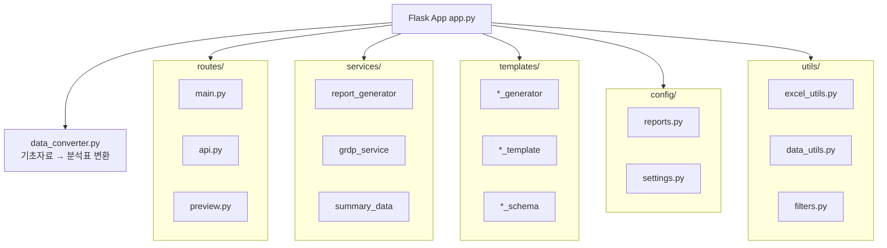
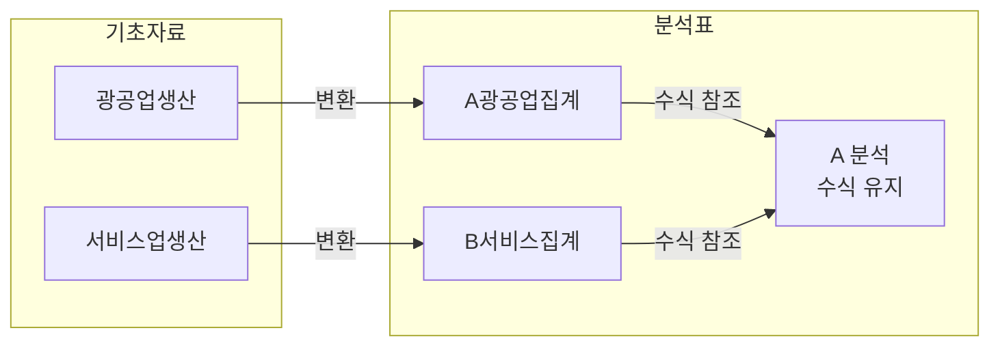
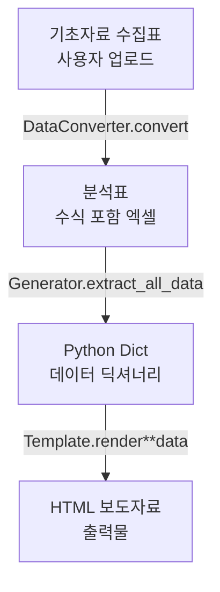

# 📦 모듈별 역할 및 구현 방법 설명

발표 시 "이 모듈은 뭘 하는 거야?", "어떻게 구현했어?" 질문에 대비합니다.

---

## 🏗️ 전체 아키텍처 개요



---

## 1. app.py (진입점)

### 역할
- Flask 애플리케이션 **팩토리 패턴**으로 생성
- Blueprint 등록 (main, api, preview)
- Jinja2 커스텀 필터 등록

### 구현 방식
```python
def create_app():
    app = Flask(__name__)
    register_filters(app)           # 커스텀 필터 등록
    app.register_blueprint(main_bp) # 라우트 모듈화
    return app
```

### 질문 대비
> **Q: 왜 팩토리 패턴?**  
> A: 테스트 시 다른 설정으로 앱을 생성할 수 있고, 순환 import 문제를 방지합니다.

---

## 2. config/ (설정 모듈)

### 2.1 config/reports.py

#### 역할
- **50개 보도자료 정의**: 요약(9개) + 부문별(10개) + 시도별(18개) + 통계표(13개)
- 각 보도자료의 id, name, generator, template, icon, category 명시

#### 구현 방식
```python
SECTOR_REPORTS = [
    {
        'id': 'manufacturing',
        'name': '광공업생산',
        'sheet': 'A 분석',                    # 엑셀 시트명
        'generator': 'mining_manufacturing_generator.py',  # 데이터 추출기
        'template': 'mining_manufacturing_template.html',  # HTML 템플릿
        'icon': '🏭',
        'category': 'production'
    },
    # ... 50개
]
```

#### 질문 대비
> **Q: 왜 코드가 아니라 딕셔너리로 관리해?**  
> A: 새 보도자료 추가 시 이 파일만 수정하면 됩니다. 코드 변경 없이 확장 가능합니다.

---

### 2.2 config/settings.py

#### 역할
- 경로 설정 (BASE_DIR, TEMPLATES_DIR, UPLOAD_FOLDER)
- 상수 정의 (SECRET_KEY, MAX_CONTENT_LENGTH)

---

## 3. routes/ (라우트 모듈)

### 3.1 routes/main.py

#### 역할
- 메인 대시보드 페이지 (`/`)
- 파일 다운로드/뷰어 (`/uploads/<filename>`)

#### 핵심 기능
```python
@main_bp.route('/')
def index():
    return render_template('dashboard.html', reports=REPORT_ORDER)
```

---

### 3.2 routes/api.py ⭐ (핵심)

#### 역할
- 엑셀 파일 업로드 (`/api/upload`)
- 보도자료 생성 및 다운로드 (`/api/generate-all`, `/api/download-html`)
- 분석표 수식 계산

#### 핵심 로직: 업로드 프로세스
```
1. 파일 업로드
2. 파일 유형 감지 (기초자료 vs 분석표)
3. 기초자료면 → DataConverter로 분석표 변환
4. 분석표 → 보도자료 생성 준비 완료
```

#### 구현 방식
```python
@api_bp.route('/upload', methods=['POST'])
def upload_excel():
    file_type = detect_file_type(filepath)  # 자동 감지
    if file_type == 'raw':
        converter = DataConverter(filepath)
        analysis_path = converter.convert()  # 분석표 생성
    # session에 경로 저장
```

---

### 3.3 routes/preview.py

#### 역할
- 개별 보도자료 미리보기 (`/api/generate-preview`)
- 요약/시도별/통계표 미리보기

#### 핵심 로직
```python
@preview_bp.route('/generate-preview', methods=['POST'])
def generate_preview():
    report_config = find_report_by_id(report_id)
    html_content = generate_report_html(excel_path, report_config, ...)
    return jsonify({'html': html_content, 'missing_fields': missing})
```

---

## 4. services/ (비즈니스 로직)

### 4.1 services/report_generator.py ⭐ (핵심)

#### 역할
- Generator 모듈 **동적 로드**
- 데이터 추출 → 템플릿 렌더링 → HTML 생성
- 결측치 확인 및 반환

#### 핵심 로직
```python
def generate_report_html(excel_path, report_config, year, quarter):
    # 1. Generator 모듈 동적 로드
    module = load_generator_module(report_config['generator'])
    
    # 2. 데이터 추출 (3가지 방식 시도)
    if hasattr(module, 'generate_report_data'):
        data = module.generate_report_data(excel_path)
    elif hasattr(module, 'generate_report'):
        data = module.generate_report(excel_path, template_path, output_path)
    elif generator_class:
        generator = generator_class(excel_path)
        data = generator.extract_all_data()
    
    # 3. 템플릿 렌더링
    template = Template(template_content)
    html_content = template.render(**data)
    
    return html_content, error, missing_fields
```

#### 질문 대비
> **Q: 왜 3가지 방식?**  
> A: Generator마다 인터페이스가 다릅니다 (클래스/함수). 호환성을 위해 여러 방식을 시도합니다.

---

### 4.2 services/grdp_service.py

#### 역할
- GRDP(지역내총생산) 데이터 처리
- KOSIS 파일 파싱
- 기본 GRDP 데이터 제공

---

### 4.3 services/summary_data.py

#### 역할
- 요약 보도자료용 데이터 집계
- 부문별 데이터 → 요약 페이지 데이터 변환

---

## 5. templates/ (템플릿 & Generator)

### 5.1 *_generator.py (데이터 추출기)

#### 역할
- 엑셀 시트에서 데이터 추출
- 데이터 변환 및 정규화
- 스키마에 맞는 딕셔너리 반환

#### 구현 방식 (광공업생산 예시)
```python
class 광공업생산Generator:
    INDUSTRY_NAME_MAP = {...}  # 업종명 매핑
    REGION_GROUPS = {...}      # 지역 그룹
    
    def __init__(self, excel_path):
        self.excel_path = excel_path
    
    def load_data(self):
        xl = pd.ExcelFile(self.excel_path)
        self.df_analysis = pd.read_excel(xl, sheet_name='A 분석')
    
    def extract_nationwide_data(self):
        # 전국 데이터 추출 로직
    
    def extract_regional_data(self):
        # 시도별 데이터 추출 로직
    
    def extract_all_data(self):
        return {
            'nationwide_data': self.extract_nationwide_data(),
            'regional_data': self.extract_regional_data(),
            'summary_table': self.extract_summary_table()
        }
```

---

### 5.2 *_schema.json (데이터 스키마)

#### 역할
- 보도자료 데이터 **구조 문서화**
- 필수 필드 및 타입 정의
- 예시 값 제공 (기본값)

#### 구현 방식
```json
{
  "type": "object",
  "required": ["report_info", "nationwide_data", "regional_data"],
  "properties": {
    "nationwide_data": {
      "properties": {
        "growth_rate": {"type": "number", "example": 2.1}
      }
    }
  },
  "excel_column_mapping": {
    "지역이름": 3,
    "산업이름": 7,
    "기여도": 28
  }
}
```

---

### 5.3 *_template.html (HTML 템플릿)

#### 역할
- Jinja2 문법으로 동적 HTML 생성
- 데이터 바인딩
- 결측치 하이라이트

#### 구현 방식
```html
<div class="report-container">
  <h2>{{ report_info.year }}년 {{ report_info.quarter }}분기 광공업생산</h2>
  
  <p>전국 광공업생산은 {{ nationwide_data.growth_rate | format_value }}% 
     증가감소</p>
  
  <table>
    
    <tr>
      <td>{{ region.name }}</td>
      <td>{{ region.growth_rate | format_value }}</td>
    </tr>
    
  </table>
</div>
```

---

## 6. utils/ (유틸리티)

### 6.1 utils/excel_utils.py

#### 역할
- Generator 모듈 **동적 로드**
- 엑셀에서 연도/분기 추출
- 파일 유형 감지 (기초자료 vs 분석표)

#### 핵심 함수
```python
def load_generator_module(generator_name):
    """importlib으로 동적 모듈 로드"""
    spec = importlib.util.spec_from_file_location(name, path)
    module = importlib.util.module_from_spec(spec)
    spec.loader.exec_module(module)
    return module

def detect_file_type(filepath):
    """시트명으로 파일 유형 판단"""
    # '광공업생산' 시트 있으면 → 기초자료
    # 'A 분석' 시트 있으면 → 분석표
```

---

### 6.2 utils/filters.py

#### 역할
- Jinja2 커스텀 필터 정의
- 결측치 표시 (`is_missing`)
- 값 포맷팅 (`format_value`)

#### 핵심 함수
```python
def is_missing(value):
    """결측치 여부 확인"""
    if value is None or value in ['', '-', 'N/A']:
        return True
    return False

def format_value(value, format_str="%.1f", placeholder="[  ]"):
    """결측치면 노란 플레이스홀더 표시"""
    if is_missing(value):
        return '<span class="editable-placeholder">[  ]</span>'
    return format_str % float(value)
```

---

### 6.3 utils/data_utils.py

#### 역할
- 결측치 필드 목록 반환
- 중첩 경로에서 값 추출

---

## 7. data_converter.py ⭐ (핵심)

### 역할
- **기초자료 수집표 → 분석표 변환**
- 템플릿 복사 + 데이터 삽입
- 수식 보존

### 구현 방식
```python
class DataConverter:
    SHEET_MAPPING = {
        '광공업생산': 'A(광공업생산)집계',
        '서비스업생산': 'B(서비스업생산)집계',
        # ...
    }
    
    def convert(self, output_path):
        # 1. 템플릿 복사
        shutil.copy(self.template_path, output_path)
        
        # 2. 각 시트별 데이터 복사
        for raw_sheet, target_sheet in self.SHEET_MAPPING.items():
            self._copy_sheet_data(raw_sheet, target_sheet)
        
        # 3. 분석 시트 수식은 유지 → 엑셀에서 자동 계산
```

### 핵심 로직


### 질문 대비
> **Q: 왜 집계 시트에 복사하고 분석 시트는 건드리지 않아?**  
> A: 분석 시트에는 집계 시트를 참조하는 수식이 있습니다. 집계 시트에 데이터를 넣으면 분석 시트는 자동으로 계산됩니다.

---

## 📊 데이터 흐름 요약



---

## 🎯 핵심 모듈 한 줄 설명

| 모듈 | 한 줄 설명 |
|------|----------|
| `app.py` | Flask 앱 진입점, Blueprint 등록 |
| `config/reports.py` | 50개 보도자료 정의 (id, generator, template) |
| `routes/api.py` | 업로드, 생성, 다운로드 API |
| `routes/preview.py` | 개별 보도자료 미리보기 API |
| `services/report_generator.py` | Generator 호출 → 템플릿 렌더링 |
| `templates/*_generator.py` | 엑셀 → 딕셔너리 데이터 추출 |
| `templates/*_schema.json` | 데이터 구조 문서화/기본값 |
| `templates/*_template.html` | Jinja2 HTML 템플릿 |
| `data_converter.py` | 기초자료 → 분석표 변환 |
| `utils/excel_utils.py` | 동적 모듈 로드, 파일 유형 감지 |
| `utils/filters.py` | 결측치 표시, 값 포맷팅 필터 |

---

## 💡 발표 시 강조 포인트

1. **관심사 분리**: 라우트/서비스/유틸 분리로 유지보수 용이
2. **동적 로드**: `importlib`으로 Generator 동적 로드 → 새 보도자료 추가 시 코드 수정 불필요
3. **수식 보존**: 분석표의 엑셀 수식을 유지하여 데이터 정합성 확보
4. **스키마 기반**: 데이터 구조 문서화로 개발/유지보수 효율화

---

*마지막 업데이트: 2025년 12월*


